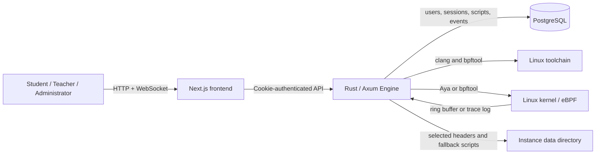
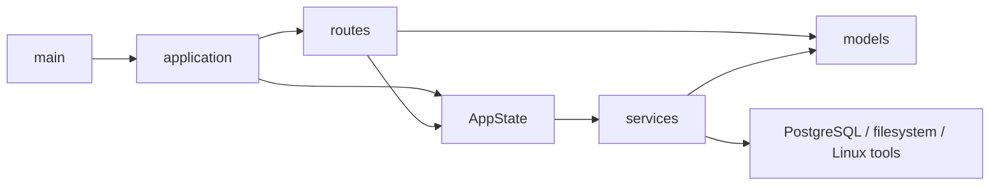
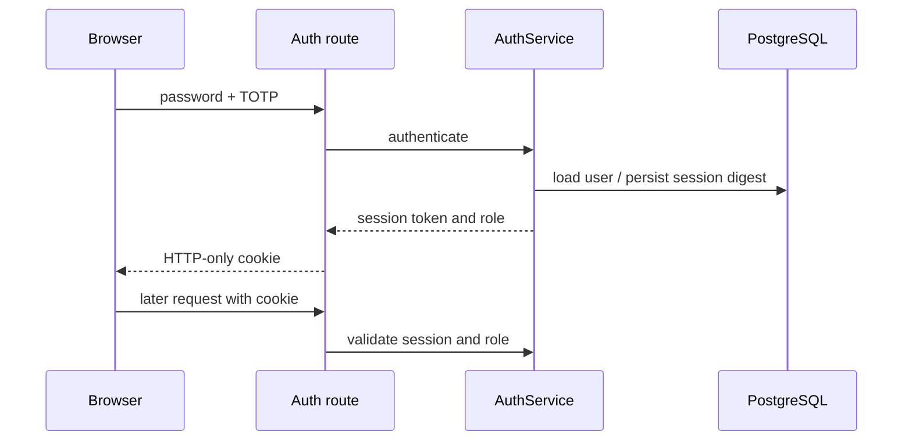
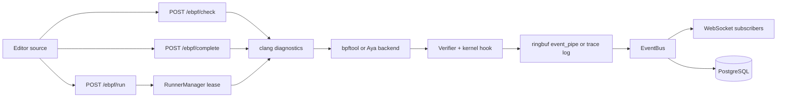

# System Architecture

This document describes the runtime boundaries, code ownership, data flows, and extension rules of
Cyanrex Lab. It is the architecture source of truth for maintainers. The project is a self-hosted
eBPF teaching system intended for a trusted workstation, classroom machine, or protected LAN.

## 1. System Context



The browser is the control plane. It never performs privileged kernel work itself. The Engine is
the execution plane and owns authentication, authorization, compilation, loading, attachment,
event delivery, and persistence. PostgreSQL stores durable application data. The Linux toolchain
and kernel form a privileged sandbox boundary.

## 2. Repository Boundaries

| Path | Responsibility | Source of truth |
|---|---|---|
| `frontend/` | Next.js pages, UI state, editor integration, localization | Browser application |
| `engine/` | Axum API, application services, persistence, eBPF runtime | Server behavior |
| `docs/` | English and Chinese teaching and operations material | Course documents |
| `frontend/public/course/` | Build-time copy of `docs/` | Generated by `npm run sync:course` |
| `docker/` | Docker and distribution topology | Container deployment |
| `scripts/` | Launch, package, audit, quality, and benchmark automation | Operator workflows |
| `modules/` | Example module packages and contracts | Teaching examples |
| `sdk-js/` | Typed browser and Node.js client for the Engine HTTP API | Optional integration surface |

The current `modules/` directories are examples; the Engine does not dynamically discover them.
Module lifecycle state is currently maintained by `ModuleManager` in memory.

## 3. Frontend Architecture

The frontend follows four practical layers:

```text
pages/                    Route-level screens and orchestration
src/components/           Shared visual and navigation components
src/features/ebpf/        eBPF editor feature state and workflows
src/features/runner/      Runner Agent inventory and administrator operations
src/features/settings/    Settings metrics polling, hotspot analysis, and panels
src/config/               Runtime endpoints and product-level settings
src/i18n/                 Locale catalogs and language context
src/utils/                Pure analyzers, security helpers, and page-state helpers
```

Important rules:

- Route pages compose features and issue user-triggered requests; kernel logic stays in the Engine.
- `src/config/runtime.ts` is the only place that defines the default Engine URL and HTTP-to-WebSocket
  conversion. New pages must use it instead of reading `NEXT_PUBLIC_ENGINE_URL` directly.
- The frontend Content Security Policy derives its validated HTTP(S) `connect-src` origin from the
  same `NEXT_PUBLIC_ENGINE_URL`, so non-default self-hosted Engine addresses remain reachable.
- Authentication uses an HTTP-only session cookie. Browser requests that need a session use
  `credentials: "include"`.
- `SidebarLayout` is the client-side navigation and route visibility gate. It improves the user
  experience, but the Engine remains the authoritative authorization boundary.
- eBPF editing behavior belongs in `src/features/ebpf/`; route markup belongs in `pages/ebpf.tsx`.
- Settings metrics and Agent operations stay in their feature modules; `pages/settings.tsx` only
  coordinates event/compiler settings and composes the administrator panels.
- `docs/` is authoritative. `frontend/public/course/` is synchronized for builds whose Docker
  context cannot access the repository-level documentation directory.

## 4. Engine Architecture

The Engine is organized as a small layered application:

```text
main.rs           Process startup and TCP listener
lib.rs            Public module surface and compatibility re-exports
application.rs    HTTP router, CORS, and access-tier composition
state.rs          Dependency construction and shared AppState
metrics.rs        In-process compiler/check metrics
config.rs         Environment-backed process and instance configuration
routes/           HTTP/WebSocket transport handlers and guards
models/           Request/response and domain data structures
services/         Authentication, eBPF, events, scripts, modules, and headers
migrations/       PostgreSQL schema templates
```

Dependency direction is:



`AppState` is the composition root shared by Axum handlers. It wires service instances together but
does not contain route declarations or infrastructure algorithms. Route handlers translate HTTP
input and output; reusable behavior belongs in services.

### Route access tiers

`application.rs` groups routes by their authoritative server-side policy:

| Tier | Typical endpoints | Enforcement |
|---|---|---|
| Public | `/health`, `/auth/login`, `/auth/me` | No session required |
| Public state change | `/auth/logout` | CSRF origin check |
| Authenticated | `/ebpf/*`, `/events*`, `/scripts*`, `/learning/labs` | Session plus CSRF for state changes |
| Teacher or admin | module/header reads, `/learning/teacher/overview` | Role guard |
| Admin | module changes, compiler settings, command dispatch | Admin role guard |

When adding an endpoint, place it in exactly one tier. UI visibility is never a substitute for the
corresponding Engine guard.

### Service ownership

| Service | Owns |
|---|---|
| `AuthService` | Users, password hashes, TOTP, login throttling, session lifecycle, role mapping |
| `EbpfLoader` | clang checks/completion, caches, loading, attachment tracking, Aya sessions |
| `EventBus` | Per-user event buffers, unread counters, broadcast, retention, async persistence |
| `ScriptStore` | Per-user script CRUD and database/file fallback |
| `LearningStore` | Lab attempts, automated acceptance, progress aggregation, database/file fallback |
| `CHeaderModule` | Trusted header catalog, checksum validation, selection metadata |
| `EnvironmentChecker` | Runtime/kernel/toolchain readiness report |
| `ModuleManager` | In-memory teaching module lifecycle state |
| `CommandDispatcher` | Translation of administrative commands to services |

Large service implementations may use private submodules or `include!` fragments, but callers must
continue to depend on the public service type rather than internal files.

## 5. Main Data Flows

### Authentication



Raw session tokens are sent only to the browser cookie. Durable session records store a SHA-256
digest. Passwords use Argon2, with legacy verification retained only for migration compatibility.

### eBPF execution



Compilation-only checks never load code. Run requests compile and load only after authentication
and validation. The `bpftool` backend provides the broad compatibility path; Aya currently covers
the supported tracepoint path.

`RunnerManager` gives every run a unique lease, enforces global and per-user capacity, and releases
the lease on success, failure, timeout, or task cancellation. `GET /runner/status` shows a user the
current capacity; the admin-only `GET /runner/overview` also lists active lease owners and deadlines.
The local runner reports `isolation=shared_kernel` deliberately: its quotas are resource controls,
not a security boundary. Workspaces and bpffs pins are separated by instance plus a hashed user
namespace, and transient compile files are removed when a run scope ends.

Routes submit a `RunnerExecutionRequest` through the `RunnerDriver` interface instead of calling the
loader directly. `LocalProcessRunnerDriver` owns the existing `EbpfLoader` path. A future VM or
remote-container driver must implement the same execution contract and provide truthful mode and
isolation descriptors. Unknown `CYANREX_RUNNER_MODE` values fail Engine startup; there is no implicit
fallback to privileged local execution.

Runner mode is configured with `CYANREX_RUNNER_MODE` (currently `local_process`). Limits use
`CYANREX_RUNNER_MAX_CONCURRENT` (default `2`),
`CYANREX_RUNNER_MAX_PER_USER` (default `1`), and `CYANREX_RUNNER_TIMEOUT_SECS` (default `45`, allowed
range `5`–`300`). Changing the mode label alone must never imply stronger isolation.

### Runner Agent control plane v1

An optional in-memory Agent registry connects remote VM or container compiler nodes without making
remote execution implicit. `POST /runner/agent/register` records protocol version, truthful isolation type,
capacity, capabilities, and labels. `POST /runner/agent/heartbeat` updates health and free capacity;
after the configured TTL a node is reported as `offline`, then removed after the retention window.
`GET /runner/agents` exposes the inventory to administrators only and reports whether the control
plane is enabled. The Settings page combines it with `GET /runner/jobs` into a 10-second polling
operations panel; it does not render source or job output. Registry state is intentionally
ephemeral and is rebuilt after an Engine restart. Registration bodies are capped at 64 KiB and the
registry holds at most 256 nodes.

The endpoints are disabled unless `CYANREX_RUNNER_AGENT_TOKEN` contains at least 32 characters.
Agents send it as a Bearer token only when registering. Registration returns a distinct 256-bit
credential once and re-registering rotates it. TTL defaults to 30 seconds, retention to 300 seconds,
and signed-request freshness to 60 seconds through `CYANREX_RUNNER_AGENT_TTL_SECS`,
`CYANREX_RUNNER_AGENT_RETENTION_SECS`, and
`CYANREX_RUNNER_AGENT_SIGNATURE_WINDOW_SECS`.

Registration example:

```bash
curl -sS -X POST http://127.0.0.1:8080/runner/agent/register \
  -H "Authorization: Bearer $CYANREX_RUNNER_AGENT_TOKEN" \
  -H 'Content-Type: application/json' \
  -d '{
    "agent_id":"lab-vm-01",
    "protocol_version":1,
    "agent_version":"0.2.9",
    "isolation":"virtual_machine",
    "max_concurrent":2,
    "capabilities":["bpftool","btf","ringbuf"],
    "labels":{"room":"a","arch":"x86_64"}
  }'
```

The registration response includes `credential` and `signature_scheme=hmac-sha256-v1`; it is sent
with `Cache-Control: no-store`. All later Agent requests carry these headers:

- `X-Cyanrex-Agent-Id`
- `X-Cyanrex-Agent-Timestamp` — current Unix seconds
- `X-Cyanrex-Agent-Nonce` — a fresh 16–64 character identifier
- `X-Cyanrex-Agent-Signature` — lowercase hexadecimal HMAC-SHA256

The HMAC key is the issued credential string. Its canonical UTF-8 input is:

```text
CYANREX-RUNNER-V1\n
POST\n
/runner/agent/heartbeat\n
lab-vm-01\n
<unix-seconds>\n
<nonce>\n
<lowercase-hex-sha256-of-exact-body>
```

The same signature format protects `POST /runner/agent/heartbeat`,
`POST /runner/agent/jobs/claim`, `POST /runner/agent/jobs/sync`, and
`POST /runner/agent/jobs/result`. The body bytes used for hashing must exactly match the transmitted
body. A signature outside the freshness window, a changed body, or a reused nonce returns `401`.

Administrators can submit a bounded probe with `POST /runner/jobs/probe`, an explicit compile-only
job with `POST /runner/jobs/compile-check`, request cancellation, and inspect `GET /runner/jobs`.
A healthy Agent claims work according to capacity and capability, receives a 256-bit lease and
deadline, checks cancellation, then posts a bounded result. The in-memory queue holds at most 512
jobs and retains terminal records for 15 minutes. Compile source is delivered only in the signed
claim response and is represented only by byte count in inventory.

Authenticated editor users can discover a sanitized eligible subset through
`GET /ebpf/check/backends`. An explicitly selected Agent uses the asynchronous
`POST /ebpf/check/remote`, status GET, and cancellation endpoints. The queue binds these jobs to the
session username, hides them from other users, and permits two active remote checks per user. Local
checking is the default; an unavailable selected Agent produces an error instead of silently falling
back. `/ebpf/run` stays local.

The standalone `cyanrex-runner-agent` binary implements this protocol for Linux, WSL2, and
unprivileged containers. It uses a Rustls HTTPS client, disables redirects and environment proxies,
keeps the issued credential in memory, and automatically re-registers after Engine state loss. The
probe reads `/proc/sys/kernel/osrelease`. Optional compile mode invokes only Clang with fixed
arguments and resource limits; it never uses a shell, loads eBPF, or returns an object. Both client
and server reject compile capability on `shared_kernel`. See the [Runner Agent Guide](runner-agent.md).

Packaging includes the same Agent binary and an opt-in `runner-agent` Compose profile. A dedicated
manager prepares its private bootstrap Secret and starts the hardened, unprivileged compiler
container. A companion smoke test authenticates as the configured administrator, discovers the
sanitized backend, submits a user-owned compile job, polls it, and verifies the normalized result.

An Agent must register again after Engine restart or after its record is removed. Registration with
the same ID replaces the old record. The endpoints return `401` for bad credentials, `503` when the
control plane is disabled, `400` for invalid metadata/capacity, `404` for an unknown heartbeat, and
`413` for an oversized body.

Source breakpoints add line-preserving `bpf_printk` probes before compilation. The API returns a
per-run debug session identifier plus instrumented and rejected source lines. Matching trace-log
records become `ebpf.debug_breakpoint_hit` events; markers from other debug sessions are discarded.
If the instrumented source fails compilation, the loader retries the untouched source so debugging
cannot turn an otherwise compilable lab into a hard failure. These probes observe execution but do
not pause the kernel program. For tracepoint debugging, if bpftool can load but cannot attach the
program, the run removes the inactive pin and retries through Aya.

### Persistence and fallback

PostgreSQL is the preferred durable store for users, sessions, events, event settings, scripts, and learning attempts.
If enabled with `CYANREX_DB_FALLBACK`, individual services can degrade independently:

- authentication falls back to process memory;
- events fall back to bounded per-user memory;
- scripts fall back to per-instance JSON files under `CYANREX_DATA_DIR`;
- learning attempts fall back to per-instance JSON files under `CYANREX_DATA_DIR`;
- downloaded C headers and their selection metadata remain filesystem-backed.

Fallback keeps a lab usable during a database outage, but memory-backed users, sessions, and events
do not survive an Engine restart. Production-like classroom runs should monitor PostgreSQL health.

## 6. Deployment Topology

| Mode | Frontend | Engine | Database | Kernel observed |
|---|---|---|---|---|
| Docker | Container | Privileged container | Container | Linux host or Docker VM |
| WSL2 | Native Node process | Native privileged process | Docker | WSL2 kernel |
| Native Linux | Native Node process | Native privileged process | Docker | Native Linux kernel |

`start.sh` is the supported entry point for all modes. `CYANREX_INSTANCE_ID` namespaces local data,
Compose resources, locks, and default volume names. Multiple instances must also use distinct
frontend, Engine, and PostgreSQL host ports.

The Engine container uses elevated kernel capabilities, host PID visibility, bpffs, tracefs, and
kernel module mounts. Treat it as a privileged teaching sandbox:

- bind services to loopback by default;
- use an SSH tunnel or TLS reverse proxy for remote access;
- explicitly configure CORS origins for LAN access;
- never accept code from untrusted or anonymous users;
- do not place unrelated workloads in the same privileged runtime.

## 7. Extension Rules

Use these ownership rules when adding functionality:

1. Add wire/domain structures to `engine/src/models/`.
2. Put reusable behavior and external-system access in `engine/src/services/`.
3. Keep route handlers limited to extraction, authorization context, validation, and response mapping.
4. Register the endpoint in the correct access-tier function in `application.rs`.
5. Add route regression tests in `engine/tests/routes_tdd/` before changing behavior.
6. Put frontend feature orchestration under `src/features/<feature>/` when a page grows beyond simple
   presentation.
7. Add user-visible text to the English catalog first, then provide the supported translations.
8. Update both architecture and operator documentation when a trust boundary or deployment topology
   changes.
9. Regenerate the OpenAPI document and update its component schemas when a route or wire model
   changes.

Maintained source files must stay within 600 lines and documentation files within 2000 lines. Split
by responsibility before reaching the limit. The CI gate verifies file length, Rust formatting and
tests, frontend builds, permission regressions, the security audit, and a real installation smoke
test performed from a newly built and extracted offline distribution archive.

## 8. Intentional Limitations

- The system targets trusted self-hosted teaching environments, not public multi-tenant hosting.
- The Engine is one process; in-memory attachment, module, and fallback state is not shared between
  replicas.
- PostgreSQL is shared infrastructure, but horizontal Engine scaling requires explicit ownership and
  coordination for eBPF attachments before it is safe.
- `sdk-js` remains hand-maintained, while the generated OpenAPI 3.1 document and CI drift checks
  enforce route coverage. Request/response types are not yet generated from that schema, so an
  independently versioned public compatibility policy is still pending.
- `modules/` is an example boundary rather than a dynamic plugin runtime.

These are architectural constraints, not hidden guarantees. A change that removes one should include
the coordination model, security review, migration path, and regression coverage.
