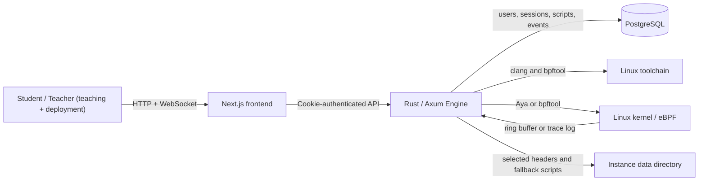
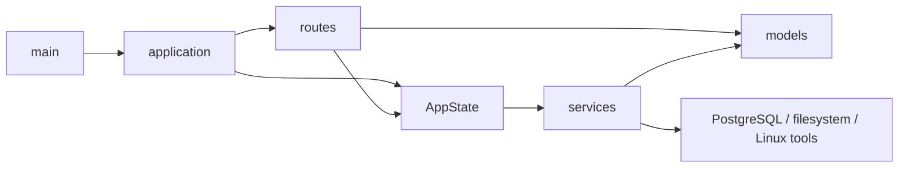
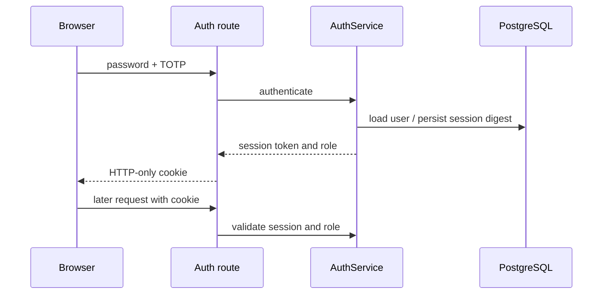
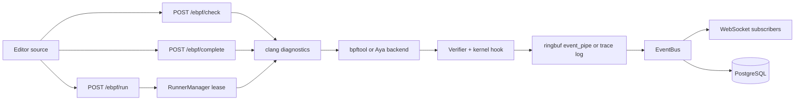

# System Architecture

Cyanrex Lab is evolving from an eBPF teaching application into a self-hosted collaboration platform
for people, future AI participants and computing resources. Tasks and their content are the organizing
model; eBPF teaching is the first implemented domain, not a mandatory shape for every future task.
The deployment scope remains trusted workstations and protected LANs, not public multi-tenant hosting.

This document is the maintainer's source of truth for current composition, ownership and trust
boundaries. The platform direction is not a claim that the migration is complete: the live teaching
application, explicitly composed backend preparation, and local task-payload editor are separate paths.
AI participants, general task execution and multi-person platform review are not implemented.
For the target design see [next architecture](../zh-CN/next-architecture.md); for navigation across
implemented and missing links see the [platform network](platform-network.md), [project status](project-status.md)
and [testing guide](testing-guide.md).

### What is connected today

| Layer | Implemented behavior | Boundary still open |
|---|---|---|
| Live teaching application | Browser authentication, eBPF editing/check/run, learning records and teacher feedback, events, deployment operations | Still uses the existing AuthService, AppState and teaching stores; no generic Task HTTP workflow |
| Shared domain contract | Exact-version TaskCatalog and typed rule dispatch; the teaching facade uses the built-in eBPF teaching pack | No dynamic provider loading, general scheduler or automatic typed-evidence adapter |
| Explicit backend preparation | Durable identity/Session commands and private Task, Artifact and Review operations, with database regression coverage | Not constructed by AppState, not exposed through public routes, not an existing-data migration |
| Local task-payload editor | A Task draft owns optional text items and 14 local language profiles; JSON import/export | No server Task/Artifact save, durable browser recovery, LSP process or execution |
| Target platform | Human/AI/compute collaboration, domain-independent workflows and isolated execution | Design direction only where no implemented boundary is stated |

Source release 0.5.0 includes C2-K through C2-N content preparation and local navigation/filename fixes.
The Session input, Review, catalogue and Draft replacement slices and local payload editor were included
in 0.4.9; C2-A through C2-F were first included in 0.4.8. Source inclusion is not deployment.
The detailed decision records retain their own dates and verification evidence; they are not a
statement that every described path is live.

## 1. System Context

The following topology is the running teaching application, not the target platform deployment.


```mermaid
flowchart LR
    U["Student / Teacher (teaching + deployment)"] -->|HTTP + WebSocket| F["Next.js frontend"]
    F -->|Cookie-authenticated API| E["Rust / Axum Engine"]
    E -->|users, sessions, scripts, events| P[(PostgreSQL)]
    E -->|clang and bpftool| T["Linux toolchain"]
    E -->|Aya or bpftool| K["Linux kernel / eBPF"]
    K -->|ring buffer or trace log| E
    E -->|selected headers and fallback scripts| D["Instance data directory"]
```

The browser is a control interface; it never performs privileged kernel work itself. Control and
execution are not isolated services: the same Engine process owns authentication, authorization,
compilation, loading, attachment, event delivery and persistence. PostgreSQL stores durable application
data. The Linux toolchain and kernel form a privileged execution boundary, not a multi-student
security sandbox. Rust module separation and new permission models do not remove this process risk.

### Three paths during the transition

| Path | Current sequence | Not implied by this path |
|---|---|---|
| Teaching runtime | `/ebpf` → existing HTTP guards and AppState → Runner/loader → learning records and EventBus | A generic Task, Artifact, Review or durable Run is not created automatically |
| Backend preparation | Trusted explicit composition → DurableAuthSource and identity registry → private stores and atomic outboxes | No public API, startup installation, live auth replacement or event delivery service |
| Local payload editing | `/tasks/new` or `/editor` → TaskDraftWorkspace → selected text editor → local JSON export | Local IDs/revisions are not server references; no publish, replacement or execution request is sent |

Only the teaching rule path currently crosses into the shared TaskCatalog. The future browser save
adapter must bridge local content to Session-authorized Artifact publication and then Task input
replacement; the execution adapter must separately bridge a durable Task to a Run. Neither connection
can be inferred from the fact that their individual types or backend methods exist.

[C2-K content metadata](task-content-manifest.md), included in 0.5.0, describes title, display labels and exact
Artifact pins independently from the local draft. Its pure verifier checks supplied snapshots only;
it is not persistence, current-Session authorization or the missing browser adapter.

[C2-L content storage](task-content-store.md), also included in 0.5.0, persists Task/manifest/outbox in a separate
schema 3 namespace. Its trusted handle does not expose the old schema 2 write paths; neither format
adopts the other. [C2-M](session-task-content.md) separately composes it with current-Session and
Artifact-text verification in one transaction; the live/browser connection remains absent.

[C2-N](task-content-http.md) adds a separately constructed HTTP router over those commands, with a
dedicated Session cookie, fixed trusted Origin and bounded request admission. It is not mounted in
`build_router` or advertised by the live OpenAPI/SDK. Login issuance, deployment composition, content
publication and browser saving remain separate; no legacy Session becomes platform authority.

### Teacher authority and personal use

The teacher is the instance's teaching and deployment authority: classroom review, module/header
management, compiler settings, Runner Agent operations, and the management terminal use the same
teacher session. There is no separate administrator role to switch into. In personal use, the seeded
deployment account is already the teacher and can also perform the labs; no registration or classroom
mode switch is required. Authentication and consequential-action confirmations still apply.

The default username `admin` and `CYANREX_ADMIN_*` credential settings remain for existing deployments;
login/session responses now identify that account as `teacher`. Both configured teacher names and the
legacy administrator allowlist confer the same full authority. Public registration cannot claim those
reserved names or choose a role. The seeded deployment teacher cannot delete itself through the account
API. See the [teacher guide](teacher-guide.md) for provisioning, upgrade review and remaining limits.

Authority belongs to this Engine's server configuration, never a browser flag or a remote Agent's claim.
A personal teacher on a student-owned instance is not thereby a teacher on another classroom instance.
Teacher-owned control and trusted assessment remain the [LAN target](classroom-isolation.md); the
separate unprivileged control service and managed VM lifecycle are not implemented by this role change.

### Connection entry points (0.3.7)

Teacher deployment uses native `cyanrex-release ssh plan/apply` from the teacher workstation to a
pre-installed Linux offline package. Student entry uses a teacher-published `/join` link and the minimal
Engine `/.well-known/cyanrex-classroom` descriptor. Discovery is not authentication: teacher-issued
student-name-bound invitations, confirmed HTTPS origins, independent join protocol/capability checks,
and normal password/TOTP login are separate steps. `ClassroomService` owns optional configuration and
bounded ephemeral invitation digests; `AuthService` remains the account/session authority.

SSH credentials stay with the OS client, never in the Engine/browser. No new Runner or privileged
execution mode is created. Automatic multicast discovery, package upload, independent control service
and VM lifecycle remain pending. See [Classroom Connection](classroom-connection.md) for deployment,
version compatibility, enrollment failure semantics and limitations.

## 2. Repository Boundaries

| Path | Responsibility | Source of truth |
|---|---|---|
| `frontend/` | Next.js pages, UI state, editor integration, localization | Browser application |
| `engine/` | Axum API, application services, persistence, eBPF runtime | Server behavior |
| `docs/` | Bilingual platform, architecture, teaching and operations documentation | Maintained documentation source |
| `frontend/public/course/` | Build-time copy of `docs/` | Generated by `npm run sync:course` |
| `docker/` | Docker and distribution topology | Container deployment |
| `scripts/` | Launch, package, audit, quality, and benchmark automation | Operator workflows |
| `modules/` | Versioned module manifests, catalog entries, and protocol boundary | Module catalog contract |
| `sdk-js/` | Typed browser and Node.js client for the Engine HTTP API | Optional integration surface |

Direct child directories containing a valid v1 `module.json` are discovered when the Engine starts.
`ModuleManager` rejects malformed, oversized, duplicate, or directory-mismatched manifests and keeps
their start/stop control state in memory. Discovery never loads a library, launches a process, or
executes module-directory files.

The platform-specific source boundaries are more precise than the top-level directory names:

| Source area | Responsibility and dependency boundary |
|---|---|
| `engine/src/models/collaboration/` | Domain-neutral identity, exact references, Task/Artifact/Review contracts and business-event envelope; decoding is not authorization |
| `engine/src/services/task_catalog.rs` | Immutable definition registration, exact lookup and typed assessment dispatch; no discovery, scheduling or permissions |
| `engine/src/domain_packs/ebpf_teaching/` | Lab definitions, source evidence and eBPF assessment rules; teaching assumptions stay here |
| `engine/src/services/learning_catalog.rs` | Compatibility facade from live teaching operations to the shared catalogue |
| `engine/src/services/collaboration_identity_store/` | Explicit identity binding, workspace membership, deployment policy and audit storage |
| `engine/src/services/auth_service/durable_source/` | Separate durable account/session source and transaction-owned command authorization |
| `engine/src/services/{task_store,artifact_store,review_store}/` | Explicit private work storage; direct APIs require a trusted caller, Session adapters provide authorization |
| `frontend/src/features/tasks/` | Local draft ownership, payload revisions and import/export; not a durable Task store |
| `frontend/src/features/editor/` | Controlled text models and local language services; no task policy or execution authority |

The declarative `modules/` catalogue, a built-in TaskProvider, and a Runner Agent are three different
extension boundaries. Discovering a module does not install a provider; registering either does not
authorize code execution or create an AI participant.

## 3. Frontend Architecture

The frontend follows four practical layers:

```text
pages/                    Route-level screens and orchestration
src/components/           Shared visual and navigation components
src/features/ebpf/        eBPF editor feature state and workflows
src/features/tasks/       Local task drafts and their optional text payloads
src/features/editor/      Controlled text-content editing and local language services
src/features/runner/      Runner Agent inventory and teacher deployment operations
src/features/settings/    Verified settings forms, requests, metrics polling and panels
src/config/               Runtime endpoints and product-level settings
src/i18n/                 Locale catalogs and language context
src/utils/                Pure analyzers, security helpers, and page-state helpers
```

Important rules:

- Route pages compose features and issue user-triggered requests; kernel logic stays in the Engine.
- `src/config/runtime.ts` is the only place that defines the default Engine URL and HTTP-to-WebSocket
  conversion. New pages must use it instead of reading `NEXT_PUBLIC_ENGINE_URL` directly.
- The frontend Content Security Policy derives its validated HTTP(S) `connect-src` origin from the
  same `NEXT_PUBLIC_ENGINE_URL`, so non-default self-hosted Engine addresses remain reachable.
- Authentication uses an HTTP-only session cookie. Browser requests that need a session use
  `credentials: "include"`.
- `SidebarLayout` is the client-side navigation and route visibility gate. It improves the user
  experience, but the Engine remains the authoritative authorization boundary.
- eBPF editing behavior belongs in `src/features/ebpf/`; route markup belongs in `pages/ebpf.tsx`.
- `/tasks/new` owns a task draft and optional payload items; `/editor` is a compatibility entry to
  the same container. The controlled editor has 14 local language profiles and does not depend on
  task type or the eBPF controller. The sidebar login gate remains; language tools confer no execution
  authority, and server Task/Artifact saving is not connected.
- `useConfirmedAction` owns target-bound UI confirmations, keyboard focus and duplicate-click guards.
  Navigation discards pending confirmations and late local file imports, but cannot undo a dispatched
  Engine mutation. Lab navigation preserves drafts; loading a template is a separate reviewed action.
- Settings metrics and Agent operations stay in their feature modules; `pages/settings.tsx` only
  coordinates event/compiler settings and composes the teacher deployment panels.
- `docs/` is authoritative. `frontend/public/course/` is synchronized for builds whose Docker
  context cannot access the repository-level documentation directory.

The [task payload editor](editor.md), included in 0.4.9, keeps all accepted content in its parent task draft.
Selecting an item or changing language replaces the displayed model, retaining content but not undo
history. Expected item revisions, task generations and target-bound confirmations reject obsolete
callbacks. Reconciliation does not produce another edit. Text items are bounded to 256 KiB each,
with up to 32 items and an 8 MiB strict JSON import/export limit. Local draft IDs are not server
Task/Artifact identities. Backend preparation supports immutable publication and authorized reference
replacement, but the editor is not connected. Downloads do not prove a disk write, and there is no autosave or reliable navigation
recovery. Bundled workers use local assets without external schemas, packages or LSP transport.
Custom providers check model identity/language and release registrations on disposal. JS/TS defaults
and workers remain shared: forced module detection is not a security sandbox or multi-workspace isolation.

`useSettingsForm` owns settings read generations, reviewed drafts and ordered event/compiler writes.
`settingsRequest` validates exact response shapes and acknowledgements, uses private credentialed
requests and bounds header/body waiting (10 seconds per read, 20 per write). Cached drafts never establish
server state. Navigation aborts browser waiting and invalidates late responses, not admitted Engine work.
An unconfirmed or partial save locks editing until explicit reload; compiler-unavailable reads permit
clearly labeled event-only saves. Reload never retries a write, and discarding an edited draft requires
confirmation. The two writes remain non-transactional. Metrics/Agent transport is separate from the form.
See [bug hunt 13](functional-network-bug-hunt-13.md).

Performance metrics reads now reuse the bounded private request transport and validate both operation
snapshots before hotspot rendering. Each mounted Engine/navigation generation owns one active read;
the next automatic read waits ten seconds after completion, while headers/body have a ten-second deadline.
Background failures are visible: the last successful sample is retained as stale, without current-health
labels/colors. Metrics feedback stays in its own panel and is not cleared by a settings save; metrics
refresh does not wait for unrelated settings reads. Language changes translate feedback without refetching.
Counters and their displayed sums must be nonnegative safe integers; fractional latency is allowed within
the finite safe-number range. Independently sampled Engine counters are not treated as an atomic snapshot.
This is frontend isolation, not Runner transport hardening; see [bug hunt 14](functional-network-bug-hunt-14.md).

Runner administration now validates both inventory responses before publishing the pair (not a server
transaction). Each Engine/navigation generation owns reads, actions and completion-delayed polling.
Private requests reuse the 10-second read / 20-second write deadlines, including response bodies.
Failed reads retain a labeled, read-only inventory. Both probe and cancellation need explicit confirmation;
dispatch rechecks current inventory, reviewed identity/state and Agent expiry using Engine-relative time.
Refreshes block dispatch and polling pauses during writes. Only matching job DTOs acknowledge actions;
an acknowledged write stays confirmed even if read-back fails. An uncertain write requires an explicit
verified refresh before another action; background reads cannot unlock it. Navigation/unmount abort browser
waiting, not server work. Existing teacher authorization, Agent signatures and queue semantics are unchanged.
See [bug hunt 15](functional-network-bug-hunt-15.md).

Inline compiler diagnostics keep a bounded, eight-second cache within one editor mount, keyed by the
exact Engine URL, target, source and header context. Editors do not share pending requests or cancellation
ownership. Input changes hide stale markers during debounce; cancelled continuations cannot publish UI
or cache results. `compilerCheck.ts` owns transport and complete-request deadlines (20 seconds local,
35 seconds remote including submission). Terminal cancellation/expiry means unavailable, not compiler
issues. Remote cleanup is best effort, never rollback or automatic local fallback. This is browser
lifecycle isolation, not detection of an HttpOnly session changed elsewhere or server authorization.
See [the third chain-guided bug hunt](functional-network-bug-hunt-03.md) for reproduction and limits.

eBPF semantic language providers belong to their owning editor and current C model; disposal unregisters all
six providers. `semanticCompletion.ts` holds an independent five-second/18-entry exact cache and a
ten-second complete-request deadline. Model versions, cursor requests, language changes and header refreshes invalidate
obsolete continuations; failures keep static snippets, without running code or switching to an Agent.
Language changes also clear the cache; switching away from C and back cannot revive a pending result.
`useSelectedHeaders` owns latest-wins ten-second metadata reads and an explicit refresh revision, including
unchanged filenames. Failure preserves a clearly labelled last-successful list, not an empty selection.
`useHeaderInjectionCheck` uses the existing local-only 20-second transport, blocks duplicate dispatch,
and discards results after code/context changes or unmount. Both checks and completion still obtain
session ownership and selected headers from Engine; browser metadata is not an atomic compile snapshot.
Authenticated students may read selected metadata, while only teachers change header selection/downloads.
See [bug hunt 04](functional-network-bug-hunt-04.md); marker updates now target the owned editor model.

`useRuntimeActions` owns a synchronous run/detach admission guard, navigation cancellation and result
epochs bound to the draft, lab and runtime settings. Editing invalidates output, not already dispatched
kernel work. `runtimeRequest.ts` validates responses and bounds browser waiting including body reads
to 330 seconds for mutations; this is not a server transaction deadline or rollback guarantee. Normal
compiler/validation reports remain reports; transport uncertainty keeps the confirmation's failure view.
`useAttachmentInventory` independently reconciles owner-scoped inventory with latest-wins 20-second
reads. Failed reads retain a visibly stale list; only a valid empty response means no listed attachments.
Run completion does not await these supplementary reads. Detach needs explicit `clean: true`, and verified
removal retires the result's pin/debug session. See [bug hunt 05](functional-network-bug-hunt-05.md).

Breakpoint observations are keyed by Engine, debug session and the run report's normalized instrumented
line set. Changes hide old hits/gap status in the first render, before effects reset the subscription.
Only matching kernel breakpoint events on declared positive integer lines are displayed. Editor glyphs,
keyboard handlers and cleanup belong to a captured editor/model, not whichever editor a shared ref later
points at. Invalid hit lines cannot be clamped by Monaco into a misleading highlight. F9/gutter changes
prepare the next explicit run; clearing requested breakpoints does not uninstall existing probes.
Shared event recovery uses private non-redirecting snapshot reads and marks malformed live frames as
possible gaps without reconnecting just for those frames. The trace parser rejects zero and numeric
prefixes such as `47abc`. These are integrity/display checks, not event-source authentication or new
kernel isolation. See [bug hunt 06](functional-network-bug-hunt-06.md).

Event history now belongs to a filter/navigation/revision scope through `useEventHistory`: mismatched
rows are hidden before effects run, invalid date/filter input never widens the query, and a one-second
display tick ages relative windows without network traffic. `useEventActions` bounds export/deletion
waiting to 20 seconds including body consumption, rejects redirects and discards obsolete callbacks.
Deletion keeps the reviewed absolute cutoff and needs exact `ok: true` plus a nonnegative integer count.
`useEventReadAcknowledgement` serializes and debounces the existing all-owner acknowledgement, cancelling
old filter work and requiring manual retry after failure. `useUnreadEvents` polls four seconds after
completion, with a ten-second deadline and explicit unavailable state. Confirmed acknowledgements/deletion
invalidate older badge reads. None of this changes Engine authentication, event wire format, persistence,
or the lack of event IDs; see [bug hunt 07](functional-network-bug-hunt-07.md).

## 4. Engine Architecture

The Engine is organized as a small layered application:

```text
main.rs           Process startup and TCP listener
lib.rs            Public module surface and compatibility re-exports
application.rs    HTTP router, CORS, and access-tier composition
state.rs          Dependency construction and shared AppState
metrics.rs        In-process compiler/check metrics
config.rs         Environment-backed process and instance configuration
routes/           HTTP/WebSocket transport handlers and guards
models/           Request/response and domain data structures
services/         Live services plus explicitly composed platform preparation
domain_packs/     Built-in task definitions and domain-specific evidence/rules
migrations/       PostgreSQL schema templates
```

Dependency direction is:


```mermaid
flowchart LR
    M["main"] --> A["application"]
    A --> R["routes"]
    A --> S["AppState"]
    R --> S
    R --> DTO["models"]
    S --> SV["services"]
    SV --> DTO
    SV --> DB["PostgreSQL / filesystem / Linux tools"]
```

`AppState` is the composition root shared by Axum handlers. It wires service instances together but
does not contain route declarations or infrastructure algorithms. Route handlers translate HTTP
input and output; reusable behavior belongs in services. Its current fields do not include
DurableAuthSource, CollaborationIdentityStore, TaskStore, ArtifactStore or ReviewStore. Importable Rust
services and successful integration fixtures are not evidence that startup or HTTP routes use them.

### Route access tiers

`application.rs` groups routes by their authoritative server-side policy:

| Tier | Typical endpoints | Enforcement |
|---|---|---|
| Public | `/health`, `/auth/login`, `/auth/me` | No session required |
| Public state change | `/auth/logout` | CSRF origin check |
| Authenticated | `/ebpf/*`, `/events*`, `/scripts*`, `/learning/labs` | Session plus CSRF for state changes |
| Teacher (legacy `staff` tier) | module/header reads, `/learning/teacher/overview` | Teacher role guard |
| Teacher deployment (legacy `admin` tier) | module changes, compiler settings, command dispatch, Runner management | Same teacher role guard |

When adding an endpoint, place it in exactly one tier. UI visibility is never a substitute for the
corresponding Engine guard.

`staff`/`admin` remain stable API/SDK access-category identifiers, not two different levels of teacher
authority. OpenAPI's `x-cyanrex-roles` lists `admin` (legacy compatibility) and `teacher` for both.

### Service ownership

| Service | Owns |
|---|---|
| `AuthService` | Users, password hashes, TOTP, login throttling, session lifecycle, role mapping |
| `EbpfLoader` | clang checks/completion, caches, loading, attachment tracking, Aya sessions |
| `EventBus` | Per-user history and live queues, shared lazy event JSON, unread counters, retention, async persistence; legacy global subscription API |
| `ScriptStore` | Per-user script CRUD and database/file fallback |
| `LearningStore` | Lab attempts, shared local snapshots, bounded recent selection, single-pass progress aggregation, database/file fallback |
| `CHeaderModule` | Trusted header catalog, checksum validation, selection metadata |
| `EnvironmentChecker` | Runtime/kernel/toolchain readiness report |
| `ModuleManager` | Versioned manifest discovery, catalog validation, and in-memory lifecycle state |
| `CommandDispatcher` | Translation of administrative commands to services |

Large service implementations may use private submodules or `include!` fragments, but callers must
continue to depend on the public service type rather than internal files.

## 5. Main Data Flows

### Platform work and authorization

The explicit preparation layer separates work from content, judgment and execution:

| Object | Meaning | Must not be mistaken for |
|---|---|---|
| TaskDefinition | Exact package/task version with separately pinned evidence schema and assessment policy | A scheduler, installed plugin or permission |
| TaskSnapshot | Owned work item, optional frozen definition, exact input references, status and expected revision | Source code, a kernel job or an accepted result |
| ArtifactRevision | Immutable bytes plus owner, type, lineage, exact revision ID and digest | A floating latest file, proof of safe execution or permission based on equal hashes |
| ReviewRecord | Revision-bound human/rule judgment, target/evidence pins and immutable amendment history | Automatic Task acceptance, cross-user access or verified evidence merely because it decodes |
| Run | Future durable execution identity, distinct from work status | An implemented general execution store; current Runner leases/jobs remain teaching runtime state |
| EventEnvelope and outbox | Business-state event contract and atomic store-side records | EventBus telemetry, a delivery service or exactly-once execution |

The supported Task states are Draft, Ready, InProgress, Blocked, InReview and Cancelled. There is no
Accepted/Done state. Cancelling a Task does not cancel a Runner lease, detach a program or clean files.
A rule's Passed result and a human's Approved review also do not advance a Task automatically.

Current Session adapters resolve the live account incarnation, identity binding, active workspace
membership and audited policy inside one source-owned database transaction. They derive the owner
from that verified context, not from a client Principal or role name. Their private work APIs do not
allow a teacher or workspace manager to access another owner's Tasks/Artifacts/Reviews by default.
Instance deployment authority is separate from workspace membership. Namespace identity, current
Session validity and affected records are checked again before commit; a timeout does not establish
rollback or permission to retry blindly. See [Session commands](collaboration-session-commands.md).

Task input commands verify exact owned Artifact references before and after the Task/outbox write.
Task locks precede Artifact locks, with a consistent order across references. The manual input adapter
requires 1–32 inputs; the catalogue adapter permits 0–32, including valid Artifact namespace metadata
for zero inputs. Catalogue admission compares the complete frozen definition, but neither converts
bytes into typed evidence nor invokes the provider's assessment policy.

Changing content is a two-step operation: publish a new immutable Artifact revision, then replace a
Draft Task's references using its expected revision. Replacement checks the old and new references,
including removed inputs, and preserves the Task identity, definition and earlier content/reviews.
Stale revisions, unchanged input lists and non-Draft changes fail explicitly. Publication and
replacement are separate transactions: failure of the second does not undo the first, authorize file
deletion or imply that a retry is safe. The browser does not call this sequence yet.

The stores are PostgreSQL-only and fail closed; they do not inherit the live teaching services'
memory/file fallback. Their schema installation is explicit and limited to empty namespaces.
The current Task storage schema is **2**, while core contract schema remains **1**; existing Task
schema 1 is rejected, not upgraded. Do not apply a fresh-install template to a live namespace or
relabel old metadata to bypass the check. The prepared auth source/identity lifecycle, local
`cyanrex-provision` tool and read-only reconciler also do not migrate or replace live authentication.

### Resuming a learning submission

Learning Center links to the editor using only a lab ID and attempt ID. The editor reads
`GET /learning/attempt?attempt_id=...`, which binds the lookup to the authenticated session owner,
including for staff. The response contains one original submission and current teacher feedback with
`Cache-Control: no-store`; missing/other-owner records share `404`, invalid IDs use `400`, and storage
errors use `500`. The active PostgreSQL lookup binds both owner and ID and does not silently fall back on
a failed query. Local loading uses the existing snapshot path; no record, feedback or schema format changes.

The editor previews the record without replacing the current draft. Explicit confirmation restores source
and lab/template context and clears old output/breakpoints, but does not run, attach or detach code. A later
manual run records a new attempt through the existing execution path. Target-keyed UI state, cancellation
and lab/attempt matching reject stale responses; lab templates are never loaded automatically on navigation.
The [student guide](student-guide.md) describes keep/retry behavior and unavailable-template limitations.

### Authentication


```mermaid
sequenceDiagram
    participant B as Browser
    participant R as Auth route
    participant A as AuthService
    participant P as PostgreSQL
    B->>R: password + TOTP
    R->>A: authenticate
    A->>P: load user / persist session digest
    A-->>R: session token and role
    R-->>B: HTTP-only cookie
    B->>R: later request with cookie
    R->>A: validate session and role
```

Raw session tokens are sent only to the browser cookie. Durable session records store a SHA-256
digest. Passwords use Argon2, with legacy verification retained only for migration compatibility.

### eBPF execution


```mermaid
flowchart LR
    C["Editor source"] --> V["POST /ebpf/check"]
    C --> X["POST /ebpf/complete"]
    C --> R["POST /ebpf/run"]
    V --> CL["clang diagnostics"]
    X --> CL
    R --> RM["RunnerManager lease"]
    RM --> CL
    CL --> L["bpftool or Aya backend"]
    L --> K["Verifier + kernel hook"]
    K --> O["ringbuf event_pipe or trace log"]
    O --> EB["EventBus"]
    EB --> WS["WebSocket subscribers"]
    EB --> P[(PostgreSQL)]
```

Compilation-only checks never load code. Run requests compile and load only after authentication
and validation. The `bpftool` backend provides the broad compatibility path; Aya currently covers
the supported tracepoint path.

`RunnerManager` gives every run a unique lease, enforces global and per-user capacity, and releases
the lease on success, failure, timeout, or task cancellation. `GET /runner/status` shows a user the
current capacity; the teacher-only `GET /runner/overview` also lists active lease owners and deadlines.
The local runner reports `isolation=shared_kernel` deliberately: its quotas are resource controls,
not a security boundary. Workspaces and bpffs pins are separated by instance plus a hashed user
namespace, and transient compile files are removed when a run scope ends.

Run requests submit a `RunnerExecutionRequest` through `RunnerDriver`; the manager checks that the
request owner matches its lease owner before dispatch. Attachment inventory and detach also use the
selected driver, including cleanup before an Aya debug retry. The driver owns detach verification in
its execution environment; inventory/detach have bounded deadlines and do not require a live execution
capacity lease. Unavailable backends never produce a successful empty local inventory or local detach.
`LocalProcessRunnerDriver` retains the existing `EbpfLoader` path and shared-kernel behavior.

Compiler checks and semantic completion also use the selected driver, carrying the session owner,
source, selected-header metadata, and cursor position. Each Runner manager permits two checks and three
completions independently of execution leases. Their complete driver calls are capped at 15 and 8 seconds
respectively, or the configured Runner timeout if shorter. Capacity exhaustion returns `429`; unsupported
or unavailable drivers return `503`, and timeouts return `408`, without a local fallback. Diagnostic
responses retain their existing HTTP/JSON contract; unknown cache status is not counted as a miss.
Cancellation releases both the permit and in-flight metrics. The local adapter scopes cache entries to
the owner and uses private, drop-cleaned compiler source workspaces.

The boundary is still incomplete: attach verification, event streaming, environment discovery, and
compiler settings retain local paths. Selected-header metadata still contains local paths; remote
drivers will need validated header bundles rather than treating those paths as guest-accessible files.
Future isolated drivers must cover that entire lifecycle and
provide truthful descriptors. Unknown `CYANREX_RUNNER_MODE` values fail Engine startup; there is no
implicit fallback to privileged local execution. See the [Linux desktop/LAN target](classroom-isolation.md)
for the environment ownership and VM recovery requirements; VM execution is not enabled yet.

Runner mode is configured with `CYANREX_RUNNER_MODE` (currently `local_process`). Limits use
`CYANREX_RUNNER_MAX_CONCURRENT` (default `2`),
`CYANREX_RUNNER_MAX_PER_USER` (default `1`), and `CYANREX_RUNNER_TIMEOUT_SECS` (default `45`, allowed
range `5`–`300`). Changing the mode label alone must never imply stronger isolation.

### Runner Agent control plane v1

An optional in-memory Agent registry connects remote VM or container compiler nodes without making
remote execution implicit. `POST /runner/agent/register` records protocol version, truthful isolation type,
capacity, capabilities, and labels. `POST /runner/agent/heartbeat` updates health and free capacity;
after the configured TTL a node is reported as `offline`, then removed after the retention window.
`GET /runner/agents` exposes the inventory to teachers only and reports whether the control
plane is enabled. The Settings page combines it with `GET /runner/jobs` into a 10-second polling
operations panel; it does not render source or job output. Registry state is intentionally
ephemeral and is rebuilt after an Engine restart. Registration bodies are capped at 64 KiB and the
registry holds at most 256 nodes.

The endpoints are disabled unless `CYANREX_RUNNER_AGENT_TOKEN` contains at least 32 characters.
Agents send it as a Bearer token only when registering. Registration returns a distinct 256-bit
credential once and re-registering rotates it. TTL defaults to 30 seconds, retention to 300 seconds,
and signed-request freshness to 60 seconds through `CYANREX_RUNNER_AGENT_TTL_SECS`,
`CYANREX_RUNNER_AGENT_RETENTION_SECS`, and
`CYANREX_RUNNER_AGENT_SIGNATURE_WINDOW_SECS`.

Registration example:

```bash
curl -sS -X POST http://127.0.0.1:8080/runner/agent/register \
  -H "Authorization: Bearer $CYANREX_RUNNER_AGENT_TOKEN" \
  -H 'Content-Type: application/json' \
  -d '{
    "agent_id":"lab-vm-01",
    "protocol_version":1,
    "agent_version":"0.3.7",
    "isolation":"virtual_machine",
    "max_concurrent":2,
    "capabilities":["bpftool","btf","ringbuf"],
    "labels":{"room":"a","arch":"x86_64"}
  }'
```

The registration response includes `credential` and `signature_scheme=hmac-sha256-v1`; it is sent
with `Cache-Control: no-store`. All later Agent requests carry these headers:

- `X-Cyanrex-Agent-Id`
- `X-Cyanrex-Agent-Timestamp` — current Unix seconds
- `X-Cyanrex-Agent-Nonce` — a fresh 16–64 character identifier
- `X-Cyanrex-Agent-Signature` — lowercase hexadecimal HMAC-SHA256

The HMAC key is the issued credential string. Its canonical UTF-8 input is:

```text
CYANREX-RUNNER-V1\n
POST\n
/runner/agent/heartbeat\n
lab-vm-01\n
<unix-seconds>\n
<nonce>\n
<lowercase-hex-sha256-of-exact-body>
```

The same signature format protects `POST /runner/agent/heartbeat`,
`POST /runner/agent/jobs/claim`, `POST /runner/agent/jobs/sync`, and
`POST /runner/agent/jobs/result`. The body bytes used for hashing must exactly match the transmitted
body. A signature outside the freshness window, a changed body, or a reused nonce returns `401`.

Teachers can submit a bounded probe with `POST /runner/jobs/probe`, an explicit compile-only
job with `POST /runner/jobs/compile-check`, request cancellation, and inspect `GET /runner/jobs`.
A healthy Agent claims work according to capacity and capability, receives a 256-bit lease and
deadline, checks cancellation, then posts a bounded result. The in-memory queue holds at most 512
jobs and retains terminal records for 15 minutes. Compile source is delivered only in the signed
claim response and is represented only by byte count in inventory.

Authenticated editor users can discover a sanitized eligible subset through
`GET /ebpf/check/backends`. An explicitly selected Agent uses the asynchronous
`POST /ebpf/check/remote`, status GET, and cancellation endpoints. The queue binds these jobs to the
session username, hides them from other users, and permits two active remote checks per user. Local
checking is the default; an unavailable selected Agent produces an error instead of silently falling
back. `/ebpf/run` stays local.

User-owned checks have a 35-second unclaimed queue window, reaped on the next queue interaction;
expiration drops source and releases per-user active quota without changing claimed execution deadlines.
Staff-managed unowned jobs retain their queue/cancel policy. Agent claim admission counts outstanding
leases once against reported active-plus-free capacity, preserving reserved capacity. A pre-execution
sync that reports a lost lease prevents execution/result submission; the Agent keeps polling. Its response
decoder enforces the 640 KiB body cap incrementally, including responses without a length header.
Neither these limits nor lease checks add remote loading or continuous execution-time cancellation.

The standalone `cyanrex-runner-agent` binary implements this protocol for Linux, WSL2, and
unprivileged containers. It uses a Rustls HTTPS client, disables redirects and environment proxies,
keeps the issued credential in memory, and automatically re-registers after Engine state loss. The
probe reads `/proc/sys/kernel/osrelease`. Optional compile mode invokes only Clang with fixed
arguments and resource limits; it never uses a shell, loads eBPF, or returns an object. Both client
and server reject compile capability on `shared_kernel`. See the [Runner Agent Guide](runner-agent.md).

Packaging includes the same Agent binary and an opt-in `runner-agent` Compose profile. A dedicated
manager prepares its private bootstrap Secret and starts the hardened, unprivileged compiler
container. A companion smoke test authenticates as the configured deployment teacher, discovers the
sanitized backend, submits a user-owned compile job, polls it, and verifies the normalized result.

An Agent must register again after Engine restart or after its record is removed. Registration with
the same ID replaces the old record. The endpoints return `401` for bad credentials, `503` when the
control plane is disabled, `400` for invalid metadata/capacity, `404` for an unknown heartbeat, and
`413` for an oversized body.

Source breakpoints add line-preserving `bpf_printk` probes before compilation. The API returns a
per-run debug session identifier plus instrumented and rejected source lines. Matching trace-log
records become `ebpf.debug_breakpoint_hit` events; markers from other debug sessions are discarded.
If the instrumented source fails compilation, the loader retries the untouched source so debugging
cannot turn an otherwise compilable lab into a hard failure. These probes observe execution but do
not pause the kernel program. For tracepoint debugging, if bpftool can load but cannot attach the
program, the run removes the inactive pin and retries through Aya.

### Persistence and fallback

PostgreSQL is the preferred durable store for users, sessions, events, event settings, scripts, and learning attempts.
If enabled with `CYANREX_DB_FALLBACK`, individual services can degrade independently:

- account/session reads, registration and login can fall back to process memory;
- events fall back to bounded per-user memory;
- scripts fall back to per-instance JSON files under `CYANREX_DATA_DIR`;
- learning run writes retain a per-instance JSON fallback under `CYANREX_DATA_DIR`; read failures follow the explicit policy below;
- downloaded C headers and their selection metadata remain filesystem-backed.

Fallback keeps a lab usable during a database outage, but memory-backed users, sessions, and events
do not survive an Engine restart. Production-like classroom runs should monitor PostgreSQL health.

Configured durable authentication does not acknowledge memory-only logout, password changes or account
deletion. Unconfirmed storage writes return `503` and retain the cookie; account/session deletion is
transactional. These operations remain blocked after a read failure latches auth DB fallback until
storage is restored and Engine restarted. Explicit memory-only instances retain volatile behavior.
See the [security guide](security.md#sessions-and-database-outages) for retry and revocation limits.

A login admitted against active SQL inserts its session and rechecks the verified credential snapshot
within one transaction before cache/cookie publication. It cannot silently change to a memory-only
write if SQL fails or the account is deleted/recreated during login. Prior fallback remains volatile.

Local scripts keep their JSON array format. Cloned stores share writer admission across cold load,
private same-directory temporary file creation, flush/atomic rename and cache publication. Cancelled
admitted requests finish this sequence; queued cancellation changes nothing. Only missing files
initialize empty; corrupt, unreadable or foreign-owner snapshots are not overwritten or cached as empty.
New Unix files/directories use 0600/0700. This is not fsync durability or cross-process locking.

Event deletion retains nonmatches in place without replacing SQL rows from the bounded cache.
History/unread updates share one lock order; surviving read flags are preserved. HTTP deletion rejects
invalid values, unknown keys and invalid time ranges before mutation; SQL and memory share one frozen
cutoff. No filters explicitly means delete all for the session owner.

Event publications and mutations now share per-owner admission. A mutation waits for a barrier in the
existing 2,048-slot persistence queue before SQL work; later publications for that owner wait until cache
publication. Other owners retain independent admission. Settings plus retention trim, and replacement,
use SQL transactions; batch/replacement inserts bind native JSON. Equal timestamps keep publication
order and SQL pages break ties by row ID. The private replacement API rejects foreign-owner records.
Memory settings/history/unread changes acquire all locks before editing; late cold settings reads cannot
overwrite a newer cached policy. Deletion/settings/replacement invalidate cached DropNew capacity.

Queued mutation cancellation changes nothing; an admitted SQL mutation finishes its sequence even if
the caller leaves. Barriers and selected schema/settings/mutation storage stages have ten-second waiting
limits, not one whole-request deadline or proof that SQL was rolled back. Full/closed queues, failed
barriers and storage deadlines latch the existing volatile fallback until restart, with a warning instead
of spawning bypass writers. HTTP reads use the explicit failure policy below; legacy infallible service
snapshot/unread helpers retain best-effort fallback for existing callers and benchmarks.
This is single-Engine ordering, not cross-process locking, crash recovery, durable replay, or a new durable
HTTP acknowledgement in those legacy helpers. HTTP mutations now follow the confirmation policy below.
See [bug hunt 08](functional-network-bug-hunt-08.md).

Cold DropNew admission reads the owner's SQL count before publication, then tracks durable plus locally
accepted pending rows separately from the writer's expiring SQL count cache. Deletion/settings/replacement
invalidate both counters after their barrier; cancelled admission cannot reserve a slot. A count failure
uses the existing latched volatile fallback. The writer drops its own producer handle so the last external
producer's drop permits healthy queued work to drain and the task to exit while the runtime lives. This is
not process-shutdown draining, a write deadline, crash recovery or coordination with external SQL writers.
See [bug hunt 09](functional-network-bug-hunt-09.md).

HTTP history, JSON/CSV export and unread reads distinguish explicit memory-only mode from configured
storage. Schema/query/row-decoding failure or ten seconds of read waiting returns generic no-store `503`,
without latching persistence off or substituting memory. Previously latched storage fallback and invalid
configured URLs also return `503`; restoring SQL alone cannot reconcile volatile events. History SELECT
plans are not retained across reads so repaired column types can be queried again. Other SQL statement
caches and publication fallback are unchanged by this read policy. Invalid query fields,
formats and checked time ranges return no-store `400`; successful response formats and session ownership
are unchanged. Reads still do not flush pending publications. See [bug hunt 10](functional-network-bug-hunt-10.md).

HTTP mark-read/deletion now use fallible confirmation, separate from legacy best-effort Rust helpers.
Configured storage must confirm SQL before success; failed barriers, invalid configuration, previous
fallback and unconfirmed writes return generic no-store `503`. Definite query/schema errors preserve
memory and remain retryable. A ten-second cooperative service wait includes owner admission; admitted
SQL work continues holding that admission through cache publication even after the caller leaves.
Expiry/cancellation is not rollback: verify state before an explicit retry. Existing barrier/storage
deadlines can still latch fallback, requiring storage repair and restart without automatic reconciliation.
Explicit memory-only mutation stays volatile, with all deletion cache locks acquired before editing.
Success shapes, owner/CSRF enforcement and delete-all scope remain; deletion extraction/validation errors
are now no-store JSON `400`. No process-crash, cross-Engine or exactly-once guarantee is added.
See [bug hunt 11](functional-network-bug-hunt-11.md).

HTTP retention settings now share these fallible read/confirmation boundaries. GET queries configured
storage fresh without writing the runtime policy cache; absent rows use the valid 500/DropOldest default,
but invalid stored limits/policies, decode failures and unavailable storage return private `503`. Reads
remain retryable and bounded to ten seconds. POST confirms policy plus trim in one transaction, then
publishes all local settings/history/unread/capacity state under owner admission. Its ten-second caller
deadline or cancellation is not rollback; admitted work may finish later. Definite SQL failures preserve
memory. Existing 50..50000 request clamping, success schemas, ownership and CSRF remain; JSON/type/body-limit
errors retain their HTTP statuses but use generic no-store JSON. Legacy runtime policy caching/fallback
and external-writer coherence are unchanged. See [bug hunt 12](functional-network-bug-hunt-12.md).

Local learning records use shared immutable snapshots: reads avoid cloning all source, appends share
unchanged records, and feedback replaces only the edited record. First-load I/O, UTF-8 validation and
decoding run on a blocking worker holding the same admission lock as commits; cancellation after dispatch
does not discard successful initialization. Only a missing file is initialized as empty; other errors
remain retryable. Loading still holds the full input string and all decoded records. Recent selection is bounded before
copying response payloads; progress aggregates in one pass. A blocking worker streams the complete JSON
file through a 64 KiB buffer, flushes, renames and publishes memory while retaining writer admission even
after request cancellation. This is not fsync, crash recovery or cross-process coordination. There is no new
SQL projection, HTTP pagination contract or retention policy.

History, progress and teacher reads now propagate local load or selected-PostgreSQL schema/query failures
as generic `500` responses, not empty/zero projections; successful reads and storage failures are no-store.
A selected SQL read does not silently switch to stale local state or disable its pool. The existing
run-record write fallback remains. Local commits exclusively create random same-directory temporary files,
with 0600/0700 for new Unix files/directories, and attempt temporary cleanup after failures. Existing parent
permissions are not changed; data paths still require trusted ownership. See [Learning Record Storage](learning-storage.md).

### Event stream recovery

`/ws/events` retains raw per-owner Event JSON frames. Its handshake uses session authentication and
the Origin/Referer policy even though it is a GET. The route subscribes before finishing the upgrade,
selects a bounded queue by the session owner, closes with `1013` on that owner's lag, and bounds socket sends.
Connections for one owner share immutable events and lazy JSON; the last subscription removes the queue.
Other owners cannot evict that queue's events, but aggregate memory grows with active owners and payloads;
shared process resources are not isolated. The legacy global service subscription API remains available.
Both browser consumers share a bounded
reconnect/snapshot controller; data gaps stay visible after recovery. This is a recent-history view,
not a durable or exactly-once replay protocol. See [Event Stream Recovery](event-stream.md) for deadlines,
client migration, snapshot races, and the limits of recovery from asynchronous persistence.

## 6. Deployment Topology

| Mode | Frontend | Engine | Database | Kernel observed |
|---|---|---|---|---|
| Docker | Container | Privileged container | Container | Linux host or Docker VM |
| WSL2 | Native Node process | Native privileged process | Docker | WSL2 kernel |
| Native Linux | Native Node process | Native privileged process | Docker | Native Linux kernel |

`start.sh` is the supported entry point for all modes. `CYANREX_INSTANCE_ID` namespaces local data,
Compose resources, locks, and default volume names. Multiple instances must also use distinct
frontend, Engine, and PostgreSQL host ports.

The Engine container uses elevated kernel capabilities, host PID visibility, bpffs, tracefs, and
kernel module mounts. Treat it as a privileged teaching sandbox:

- bind services to loopback by default;
- use an SSH tunnel or TLS reverse proxy for remote access;
- explicitly configure CORS origins for LAN access;
- never accept code from untrusted or anonymous users;
- do not place unrelated workloads in the same privileged runtime.

### Multi-student LAN target

Linux desktops with hardware virtualization are the planning baseline; a dedicated classroom server
is optional. The target separates an unprivileged teaching control service from exclusive student VMs,
which may run on student desktops or managed virtualization hosts. A VM is retained for the experiment,
then rebuilt before another user receives it. This is a planned topology, not an isolation guarantee of
the current local Engine. Details and implementation gaps are in [Classroom Isolation](classroom-isolation.md).

## 7. Extension Rules

Use these ownership rules when adding functionality:

1. Add wire/domain structures to `engine/src/models/`.
2. Put reusable behavior and external-system access in `engine/src/services/`.
3. Keep route handlers limited to extraction, authorization context, validation, and response mapping.
4. Register the endpoint in the correct access-tier function in `application.rs`.
5. Add route regression tests in `engine/tests/routes_tdd/` before changing behavior.
6. Put frontend feature orchestration under `src/features/<feature>/` when a page grows beyond simple
   presentation.
7. Add user-visible text to the English catalog first, then provide the supported translations.
8. Update both architecture and operator documentation when a trust boundary or deployment topology
   changes.
9. Regenerate the OpenAPI document and update its component schemas when a route or wire model
   changes.
10. Keep task-type assumptions, evidence parsing and rules in `domain_packs/`; prove shared changes
    with a non-teaching fixture. An editor language or file extension must not choose a task policy
    or execution permission implicitly.
11. Compose private platform operations through current Session authorization, not a trusted-store
    API supplied with browser ownership. Preserve namespace pins, lock ordering, post-write checks
    and the final authorization check on the same transaction.
12. Keep Task changes, Artifact publication, Review and execution separate. An explicit adapter and
    failure contract are required before connecting them; do not add dual writers or silently adopt
    legacy data, orphaned content or unknown schema versions.

Maintained source files must stay within 600 lines and documentation files within 2000 lines. Split
by responsibility before reaching the limit. The CI gate verifies file length, Rust formatting and
tests, frontend builds, permission regressions, the security audit, and a real installation smoke
test performed from a newly built and extracted offline distribution archive.

## 8. Intentional Limitations

- The platform direction remains trusted self-hosted/LAN collaboration; the deployed runtime is still
  a teaching application, not public multi-tenant hosting.
- AI participation, generic durable Run scheduling, cross-user platform review, Task acceptance and
  outbox delivery are not implemented. Contract names and private integration tests do not provide them.
- Browser payload saving and live authentication/storage cutover remain disconnected. Existing data,
  writer fencing, lifecycle recovery and a verified migration/rollback plan are prerequisites to cutover.
- The Engine is one process; in-memory attachment, module, and fallback state is not shared between
  replicas.
- PostgreSQL is shared infrastructure, but horizontal Engine scaling requires explicit ownership and
  coordination for eBPF attachments before it is safe.
- `sdk-js` retains a stable hand-designed namespaced surface and adds generated operationId calls for
  all non-Agent operations. Public wire models, operation inputs/responses, and runtime access/transport
  metadata are generated from OpenAPI; CI rejects route, access, coverage, and generated-code drift.
  A frozen pre-1.0 baseline also rejects breaking input/output changes, and package-consumer smoke
  coverage verifies artifact shape. A 77-member additive namespace baseline and documented deprecation
  window protect the hand-designed facade; registry publication and long-term support ownership remain pending.
- `modules/` is a versioned, dynamically discovered catalog, not an executable plugin runtime;
  start/stop is single-process control state and unknown names are rejected.

These are architectural constraints, not hidden guarantees. A change that removes one should include
the coordination model, security review, migration path, and regression coverage.

## 9. Decision and implementation guides

Use these records for the detailed contracts and historical test evidence behind the current model.
They complement this architecture; an accepted preparation slice is not a deployed feature.

| Topic | Detailed records |
|---|---|
| Baseline and identity | [Foundation and legacy mapping](collaboration-foundation.md), [identity registry](collaboration-identity-store.md), [membership and deployment policy](collaboration-access-store.md) |
| Audited authority | [Policy audit](collaboration-policy-audit.md), [identity binding and retirement](collaboration-identity-lifecycle.md) |
| Session lifecycle | [Durable auth source](collaboration-auth-source.md), [Session commands](collaboration-session-commands.md), [account deletion](collaboration-account-deletion.md), [password rotation](collaboration-password-change.md) |
| Explicit provisioning | [Empty-namespace bootstrap](collaboration-bootstrap.md), [local provisioning tool](collaboration-provisioning.md), [read-only reconciliation](collaboration-reconciliation.md) |
| Domain independence | [Task catalogue and eBPF adapter](task-domain-boundary.md) |
| Work storage | [Task store](task-instance-store.md), [immutable Artifact revisions](artifact-revision-store.md), [Review history](review-record-store.md) |
| Private Session operations | [Manual Tasks](session-task-commands.md), [Artifacts](session-artifact-commands.md), [Task inputs](session-task-inputs.md), [human Reviews](session-review-commands.md) |
| Definition and content revisions | [Catalogue-backed Tasks](session-catalog-tasks.md), [Draft input replacement](session-task-revisions.md) |
| User-facing content editing | [Local task payload editor](editor.md) |
