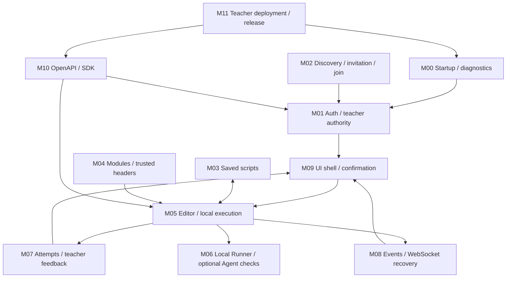
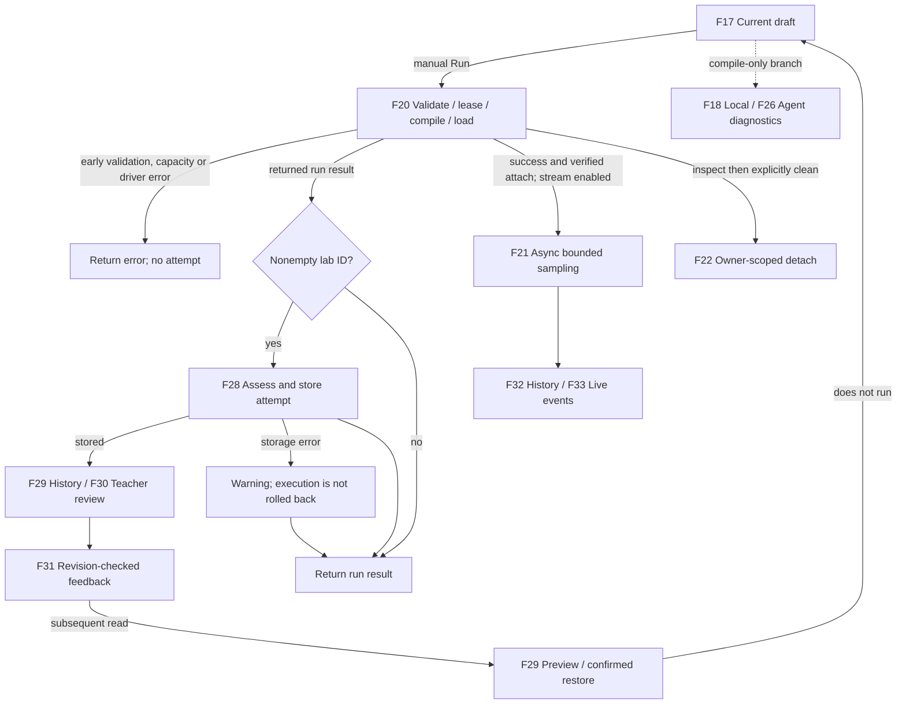

# Current functional network

[简体中文](../zh-CN/functional-network.md) · [Machine-readable inventory](../functional-network.json)

Snapshot: **2026-09-13 · 0.3.8 · main@c26a529**. Full source commit: `c26a529aecc0ab64d0a1743be10972e5d8ac137b`.

This is a **source snapshot**, not a new acceptance report. It enumerates finite user-visible functional workflows and direct handoffs/dependencies, not every internal function, possible execution trace, installed instance or live LAN node.

Follow-ups: [01 — learning and persistence](functional-network-bug-hunt-01.md) ·
[02 — Runner/Agent lifecycle](functional-network-bug-hunt-02.md) ·
[03 — browser compiler diagnostics](functional-network-bug-hunt-03.md) ·
[04 — completion and manual header checks](functional-network-bug-hunt-04.md) ·
[05 — manual run and attachment cleanup](functional-network-bug-hunt-05.md) ·
[06 — debug sessions and event recovery](functional-network-bug-hunt-06.md). The inventory/fingerprints remain the
pre-hunt baseline; drift checks report later learning, Runner/Agent, browser and quality-gate changes. Per-pass results
are not all-workflow acceptance.

The teacher is the teaching and deployment authority; solo mode seeds its own teacher. `admin` is a compatibility alias, and the `staff`/`admin` route groups both require teacher authority. A teacher on one instance does not inherit teacher rights on another.

**Inventory: 12 modules / 40 workflows / 69 directed connections / 16 pages / 68 API / 48 templates / 5 labs / 2 loadable module manifests.**

Each API has exactly one primary workflow; shared use is expressed through connections and page mappings. The JavaScript SDK covers 63 operations; the other five are the Agent protocol. The snapshot fingerprints 135 explicitly referenced source/evidence files, not the entire repository. All workflow verification labels mean source-enumerated, not dynamically exercised in this round.

## 1. Network overview



Source links are repository-relative. Mermaid diagrams are readable in a Mermaid-capable Markdown viewer; the current in-app course renderer shows their code rather than rendering a graph.

### Local run and its non-atomic branches



Record creation and live event streaming are separate effects. A compile/load failure that reaches the recording stage may create a failed attempt; early validation/quota/driver failures do not. A run without a lab ID creates no learning attempt. Later teacher feedback requires a new read, not a dedicated push.

## 2. Enumerated functional workflows

Module IDs intentionally reuse the existing [test-network taxonomy](testing-network.md); F IDs identify product workflows rather than test cases. Source links below and the JSON source manifest make each entry traceable.

### M00 · Foundation and diagnostics

#### F01 · Start and health

Chain: launcher → config validation → AppState → routes → health.

Boundary / failure branch: Invalid mode/catalog/config fails startup; health is not proof of kernel readiness.

Source: [start.sh](../../start.sh) · [src/state.rs](../../engine/src/state.rs) · [src/application.rs](../../engine/src/application.rs) · [routes/health.rs](../../engine/src/routes/health.rs)

#### F02 · Environment readiness

Chain: helper → environment tools/kernel checks + user Runner status → report.

Boundary / failure branch: Read-only diagnostics; no automatic installation or privilege repair.

Source: [pages/helper.tsx](../../frontend/pages/helper.tsx) · [routes/helper.rs](../../engine/src/routes/helper.rs) · [services/environment_checker.rs](../../engine/src/services/environment_checker.rs)

#### F03 · Compiler strategy and metrics

Chain: settings → resident/on-demand mode + check/completion metrics → bounded polling.

Boundary / failure branch: Compiler setting is instance-wide runtime state; metrics are not full distributed tracing.

Source: [pages/settings.tsx](../../frontend/pages/settings.tsx) · [routes/settings.rs](../../engine/src/routes/settings.rs) · [src/metrics.rs](../../engine/src/metrics.rs)

### M01 · Identity and account lifecycle

#### F04 · Self-registration

Chain: register form → server policy/password validation → AuthService → TOTP enrollment.

Boundary / failure branch: Policy-gated; cannot select teacher authority or obtain a login session from registration.

Source: [pages/register.tsx](../../frontend/pages/register.tsx) · [routes/auth.rs](../../engine/src/routes/auth.rs) · [auth_service/service.inc.rs](../../engine/src/services/auth_service/service.inc.rs)

#### F05 · TOTP bootstrap

Chain: OTP setup → bootstrap policy → password verification → QR/secret.

Boundary / failure branch: Opt-in bootstrap, not arbitrary credential reset; sensitive response must not enter this inventory.

Source: [pages/otp-setup.tsx](../../frontend/pages/otp-setup.tsx) · [routes/auth.rs](../../engine/src/routes/auth.rs)

#### F06 · Login and session authority

Chain: password + TOTP → throttle/verification → session persistence → cookie → me/route guard.

Boundary / failure branch: Teacher role is server-owned, including solo default teacher; active-SQL login needs confirmed session insertion before cookie publication.

Source: [routes/auth.rs](../../engine/src/routes/auth.rs) · [routes/auth_session.rs](../../engine/src/routes/auth_session.rs) · [auth_service/sessions.inc.rs](../../engine/src/services/auth_service/sessions.inc.rs)

#### F07 · Logout

Chain: logout → Origin policy → revoke session → clear cookie → login page.

Boundary / failure branch: Unconfirmed storage mutation must not report success; logout does not detach kernel programs.

Source: [utils/authSession.ts](../../frontend/src/utils/authSession.ts) · [routes/auth.rs](../../engine/src/routes/auth.rs) · [auth_service/sessions.inc.rs](../../engine/src/services/auth_service/sessions.inc.rs)

#### F08 · Change password

Chain: account confirmation → current password + OTP → conditional durable credential update → cache.

Boundary / failure branch: Storage failure fails closed for the mutation; changing a password currently does not revoke existing sessions.

Source: [pages/account.tsx](../../frontend/pages/account.tsx) · [auth_service/account_mutations.inc.rs](../../engine/src/services/auth_service/account_mutations.inc.rs)

#### F09 · Delete account

Chain: destructive confirmation → password + OTP → delete account and sessions → clear cookie.

Boundary / failure branch: Default teacher/last-account deletion is rejected. Deleting auth data is not a cross-service purge of scripts, attempts, events or kernel attachments.

Source: [pages/account.tsx](../../frontend/pages/account.tsx) · [routes/auth.rs](../../engine/src/routes/auth.rs) · [auth_service/account_mutations.inc.rs](../../engine/src/services/auth_service/account_mutations.inc.rs)

### M02 · Classroom connection

#### F10 · Discover and confirm teacher

Chain: teacher link → well-known document → origin/classroom/protocol/capability checks → confirmation.

Boundary / failure branch: Opt-in discovery; no LAN scan/mDNS. Non-loopback enrollment requires HTTPS at the browser boundary.

Source: [pages/join.tsx](../../frontend/pages/join.tsx) · [classroom/connection.js](../../frontend/src/features/classroom/connection.js) · [routes/classroom.rs](../../engine/src/routes/classroom.rs)

#### F11 · Issue and revoke invitation

Chain: teaching page → named student invitation → one-time token → list/revoke.

Boundary / failure branch: Short-lived in-memory invitation digests; reserved teacher names rejected; revocation does not revoke existing accounts/sessions.

Source: [classroom/InvitationPanel.tsx](../../frontend/src/features/classroom/InvitationPanel.tsx) · [routes/classroom.rs](../../engine/src/routes/classroom.rs) · [services/classroom.rs](../../engine/src/services/classroom.rs)

#### F12 · Enroll student

Chain: confirmed identity + invitation + username/password → redeem → account creation → save TOTP → normal login.

Boundary / failure branch: Invitation is consumed before registration; conflict/failure does not restore it. No auto-login, role promotion, Agent enrollment or transactional rollback across both services.

Source: [pages/join.tsx](../../frontend/pages/join.tsx) · [routes/classroom.rs](../../engine/src/routes/classroom.rs) · [services/classroom.rs](../../engine/src/services/classroom.rs)

### M03 · Saved scripts

#### F13 · Saved script lifecycle

Chain: editor → list/save/delete → owner-bound ScriptStore → SQL or local JSON → explicit draft load.

Boundary / failure branch: Save is not execution. Local persistence completes before cache publication; corrupt snapshots are not overwritten.

Source: [ebpf/useEbpfPageController.ts](../../frontend/src/features/ebpf/useEbpfPageController.ts) · [routes/scripts.rs](../../engine/src/routes/scripts.rs) · [services/script_store.rs](../../engine/src/services/script_store.rs) · [script_store/local.rs](../../engine/src/services/script_store/local.rs)

### M04 · Module and header management

#### F14 · Module catalog and lifecycle

Chain: startup manifest discovery → module inventory → start/stop state.

Boundary / failure branch: Two bundled manifests; lifecycle only changes in-memory state, not process execution or eBPF authorization.

Source: [routes/modules.rs](../../engine/src/routes/modules.rs) · [services/module_manager.rs](../../engine/src/services/module_manager.rs) · [modules/README.md](../../modules/README.md)

#### F15 · Structured terminal commands

Chain: terminal parser → typed command → dispatcher → module action or editor navigation.

Boundary / failure branch: Not a shell; run_experiment returns an editor path and does not run code.

Source: [pages/terminal.tsx](../../frontend/pages/terminal.tsx) · [terminal/command.ts](../../frontend/src/features/terminal/command.ts) · [services/command_dispatcher.rs](../../engine/src/services/command_dispatcher.rs)

#### F16 · Trusted C headers

Chain: catalog → verified download/select/delete → selected metadata → local check/completion/run injection.

Boundary / failure branch: Allowlisted artifact and digest verification precede publication; selection is shared within an instance, not automatically transferred to remote Agents.

Source: [pages/modules.tsx](../../frontend/pages/modules.tsx) · [routes/c_headers.rs](../../engine/src/routes/c_headers.rs) · [services/c_header_module.rs](../../engine/src/services/c_header_module.rs) · [ebpf_loader/compiler_workspace.rs](../../engine/src/services/ebpf_loader/compiler_workspace.rs)

### M05 · Editor and local eBPF pipeline

#### F17 · Templates, imports and editor drafts

Chain: 48-template catalog/local file/session draft → preview or selection → confirmed replacement → editor.

Boundary / failure branch: Changing lab/template/source never implicitly runs code; late imports and unconfirmed navigation are guarded.

Source: [ebpf/useEbpfSafetyActions.ts](../../frontend/src/features/ebpf/useEbpfSafetyActions.ts) · [ebpf/useEbpfPageController.ts](../../frontend/src/features/ebpf/useEbpfPageController.ts) · [utils/pageState.ts](../../frontend/src/utils/pageState.ts) · [ebpf/template_catalog.inc.rs](../../engine/src/routes/ebpf/template_catalog.inc.rs)

#### F18 · Local compile-only diagnostics

Chain: editor debounce/manual check → source validation → Runner check permit/driver → clang → diagnostics.

Boundary / failure branch: No kernel load; check capacity, timeout and unavailable backend are explicit. Local static hints are advisory.

Source: [ebpf/useCompilerDiagnostics.ts](../../frontend/src/features/ebpf/useCompilerDiagnostics.ts) · [ebpf/check.inc.rs](../../engine/src/routes/ebpf/check.inc.rs) · [services/runner_manager.rs](../../engine/src/services/runner_manager.rs) · [ebpf_loader/check.inc.rs](../../engine/src/services/ebpf_loader/check.inc.rs)

#### F19 · Semantic completion

Chain: Monaco cursor/source → completion permit/driver → clang suggestions → editor.

Boundary / failure branch: Separate bounded completion capacity; remote diagnostics selection does not relocate semantic completion.

Source: [utils/cEbpfIntelligence.ts](../../frontend/src/utils/cEbpfIntelligence.ts) · [ebpf/completion.inc.rs](../../engine/src/routes/ebpf/completion.inc.rs) · [ebpf_loader/completion.inc.rs](../../engine/src/services/ebpf_loader/completion.inc.rs)

#### F20 · Local kernel execution

Chain: manual run → source validation → owner lease → compile → bpftool/Aya load → attach verification → result.

Boundary / failure branch: Linux shared kernel; compile success, load success and verified attachment are distinct. Some program types need a separate attach target.

Source: [ebpf/handlers.inc.rs](../../engine/src/routes/ebpf/handlers.inc.rs) · [services/runner_driver.rs](../../engine/src/services/runner_driver.rs) · [ebpf_loader/core.inc.rs](../../engine/src/services/ebpf_loader/core.inc.rs) · [ebpf_loader/aya.inc.rs](../../engine/src/services/ebpf_loader/aya.inc.rs)

#### F21 · Debug probes and kernel samples

Chain: optional debug lines → instrumentation → verified attach → trace/ringbuf sampler → EventBus → breakpoint/event view.

Boundary / failure branch: Trace probes do not pause the kernel. An eligible bpftool tracepoint run with an unsupported attach outcome may trigger a guarded Aya retry; sampling is bounded and asynchronous.

Source: [ebpf_loader/debug.inc.rs](../../engine/src/services/ebpf_loader/debug.inc.rs) · [ebpf/stream.inc.rs](../../engine/src/routes/ebpf/stream.inc.rs) · [ebpf/ringbuf.inc.rs](../../engine/src/routes/ebpf/ringbuf.inc.rs) · [ebpf/useBreakpointHitStream.ts](../../frontend/src/features/ebpf/useBreakpointHitStream.ts)

#### F22 · Attachment inventory and detach

Chain: refresh owner inventory → inspect exact pin/details → confirm detach → driver cleanup/verification.

Boundary / failure branch: Independent of active run capacity; wrong-owner or unavailable-driver requests cannot become a successful local cleanup.

Source: [ebpf/detachTarget.ts](../../frontend/src/features/ebpf/detachTarget.ts) · [ebpf/attachments.inc.rs](../../engine/src/routes/ebpf/attachments.inc.rs) · [services/runner_driver.rs](../../engine/src/services/runner_driver.rs)

### M06 · Runner and Agent jobs

#### F23 · Runner capacity and ownership

Chain: status/overview → global and per-user lease accounting → owner-checked driver dispatch → RAII release.

Boundary / failure branch: local_process is current execution mode. Quotas are resource controls, not isolation; lease release does not mean kernel detach.

Source: [routes/runner.rs](../../engine/src/routes/runner.rs) · [services/runner_manager.rs](../../engine/src/services/runner_manager.rs) · [services/runner_driver.rs](../../engine/src/services/runner_driver.rs)

#### F24 · Agent registration and liveness

Chain: bootstrap bearer → register/rotate credential → HMAC heartbeat → healthy/stale registry → inventory.

Boundary / failure branch: Off unless configured; timestamp, nonce, identity and body binding reject replay. Agent identity is not a browser teacher session.

Source: [routes/runner_agent.rs](../../engine/src/routes/runner_agent.rs) · [services/runner_agent_registry.rs](../../engine/src/services/runner_agent_registry.rs) · [services/runner_agent_authenticator.rs](../../engine/src/services/runner_agent_authenticator.rs) · [services/runner_agent_client.rs](../../engine/src/services/runner_agent_client.rs)

#### F25 · Agent job lifecycle

Chain: teacher probe/compile submission → queue → signed claim + lease → isolated executor → sync/result or cancel/expire.

Boundary / failure branch: In-memory jobs; lease identity rejects stale results; compile jobs return reports, never kernel-load or executable objects.

Source: [routes/runner_job.rs](../../engine/src/routes/runner_job.rs) · [services/runner_job_queue.rs](../../engine/src/services/runner_job_queue.rs) · [services/runner_agent_executor.rs](../../engine/src/services/runner_agent_executor.rs) · [bin/cyanrex-runner-agent.rs](../../engine/src/bin/cyanrex-runner-agent.rs)

#### F26 · Remote compile diagnostics

Chain: eligible backend selection → owner-bound job submission → Agent compile report → poll/diagnostics/cancel.

Boundary / failure branch: Healthy non-shared_kernel clang_check Agents only. No remote run, remote completion, automatic header replication or silent local retry.

Source: [ebpf/useCompileBackends.ts](../../frontend/src/features/ebpf/useCompileBackends.ts) · [ebpf/useCompilerDiagnostics.ts](../../frontend/src/features/ebpf/useCompilerDiagnostics.ts) · [ebpf/remote_check.inc.rs](../../engine/src/routes/ebpf/remote_check.inc.rs)

### M07 · Learning and teacher feedback

#### F27 · Course and lab navigation

Chain: learning center → five lab definitions/progress + localized Markdown → explicit editor handoff.

Boundary / failure branch: Course files are static public assets; navigation alone neither loads a template nor runs a lab.

Source: [learn/index.tsx](../../frontend/pages/learn/index.tsx) · [learn/[...slug].tsx](../../frontend/pages/learn/[...slug].tsx) · [services/learning_catalog.rs](../../engine/src/services/learning_catalog.rs) · [scripts/sync-course-docs.mjs](../../frontend/scripts/sync-course-docs.mjs)

#### F28 · Assess and record run

Chain: returned run result + lab/source/attach evidence → structural assessment → LearningStore → learning event.

Boundary / failure branch: Only runs reaching record_learning_run with a lab ID are recorded. Validation/quota/driver early exits skip it; persistence error logs a warning without reverting execution.

Source: [ebpf/learning.inc.rs](../../engine/src/routes/ebpf/learning.inc.rs) · [services/learning_catalog.rs](../../engine/src/services/learning_catalog.rs) · [learning_store/attempt.rs](../../engine/src/services/learning_store/attempt.rs) · [services/learning_source.rs](../../engine/src/services/learning_source.rs)

#### F29 · Attempt history and resume

Chain: history → owner-bound attempt lookup → source/feedback preview → confirmed draft restore → optional new manual run.

Boundary / failure branch: Other-owner/missing records share 404; history restore never runs or detaches; SQL read failure is not replaced with stale local success.

Source: [learning/AttemptResumePanel.tsx](../../frontend/src/features/learning/AttemptResumePanel.tsx) · [learning/resumeAttempt.ts](../../frontend/src/features/learning/resumeAttempt.ts) · [routes/learning.rs](../../engine/src/routes/learning.rs) · [learning_store/queries.rs](../../engine/src/services/learning_store/queries.rs)

#### F30 · Teacher review

Chain: learning snapshots → student-filtered overview → selected student recent attempts → review.

Boundary / failure branch: Separate teacher API; ordinary student endpoints remain owner-bound even for teachers. Overview is not a full account directory.

Source: [pages/teaching.tsx](../../frontend/pages/teaching.tsx) · [routes/learning.rs](../../engine/src/routes/learning.rs) · [learning_store/queries.rs](../../engine/src/services/learning_store/queries.rs)

#### F31 · Revision-safe teacher feedback

Chain: review draft + expected revision → feedback CAS → persistent revision → student reads current feedback.

Boundary / failure branch: 409 on conflicting revision; no silent overwrite. Student visibility uses subsequent reads, not a dedicated feedback push channel.

Source: [learning/TeacherFeedback.tsx](../../frontend/src/features/learning/TeacherFeedback.tsx) · [routes/learning.rs](../../engine/src/routes/learning.rs) · [learning_store/feedback.rs](../../engine/src/services/learning_store/feedback.rs)

### M08 · Events and recovery

#### F32 · Event history and export

Chain: owner/category/severity/time filters → bounded event query → view or JSON/CSV export.

Boundary / failure branch: SQL and bounded memory are distinct storage paths; exported history is not a complete durable execution audit.

Source: [pages/events.tsx](../../frontend/pages/events.tsx) · [routes/events.rs](../../engine/src/routes/events.rs) · [services/event_bus_filter.rs](../../engine/src/services/event_bus_filter.rs) · [services/event_bus_db.rs](../../engine/src/services/event_bus_db.rs)

#### F33 · Live event delivery and recovery

Chain: EventBus fanout → session/Origin-checked WebSocket → overlap-safe snapshot recovery/backoff.

Boundary / failure branch: Lag closes with 1013 and slow sends are bounded; recovery is best-effort within retained history, not durable replay or exactly-once delivery.

Source: [events/stream.rs](../../engine/src/routes/events/stream.rs) · [event_bus/subscriptions.rs](../../engine/src/services/event_bus/subscriptions.rs) · [events/eventStream.ts](../../frontend/src/features/events/eventStream.ts)

#### F34 · Unread state

Chain: publish/read flags → unread count → sidebar badge → mark read.

Boundary / failure branch: Owner-scoped; marking read does not delete retained events.

Source: [components/SidebarLayout.tsx](../../frontend/src/components/SidebarLayout.tsx) · [routes/events.rs](../../engine/src/routes/events.rs) · [services/event_bus.rs](../../engine/src/services/event_bus.rs)

#### F35 · Scoped event deletion

Chain: review exact filter scope → destructive confirmation → strict filter parse → delete matches → refresh.

Boundary / failure branch: Invalid filters reject 400 instead of widening to delete-all; nonmatches and their read flags remain.

Source: [events/deleteScope.ts](../../frontend/src/features/events/deleteScope.ts) · [pages/events.tsx](../../frontend/pages/events.tsx) · [routes/events.rs](../../engine/src/routes/events.rs) · [event_bus/deletion.rs](../../engine/src/services/event_bus/deletion.rs)

#### F36 · Event retention policy

Chain: read/update owner max records + drop_oldest/drop_new → retention policy → later history/publish behavior.

Boundary / failure branch: UI settings page is teacher-only, while this API is authenticated per-user; memory retention is bounded, not archival storage.

Source: [pages/settings.tsx](../../frontend/pages/settings.tsx) · [routes/settings.rs](../../engine/src/routes/settings.rs) · [services/event_bus_policy.rs](../../engine/src/services/event_bus_policy.rs)

### M09 · UI shell and operation safety

#### F37 · Navigation, confirmation and local state

Chain: session-aware shell → role-visible navigation → target-bound confirmation → request → local draft/filter/locale state.

Boundary / failure branch: Client controls supplement server guards; navigation can clear unconfirmed actions but cannot undo already dispatched work. Dashboard currently shows guidance, not live health polling.

Source: [components/SidebarLayout.tsx](../../frontend/src/components/SidebarLayout.tsx) · [components/useConfirmedAction.tsx](../../frontend/src/components/useConfirmedAction.tsx) · [utils/pageState.ts](../../frontend/src/utils/pageState.ts) · [i18n/context.tsx](../../frontend/src/i18n/context.tsx) · [pages/dashboard.tsx](../../frontend/pages/dashboard.tsx)

### M10 · API contract and SDK

#### F38 · API contract and SDK consumers

Chain: Axum routes/access → OpenAPI → generated types/63 operations → SDK cookie/Origin/errors → Engine.

Boundary / failure branch: 68 API operations include five Agent endpoints outside the SDK; frontend fetch hooks are separate consumers, not necessarily SDK calls.

Source: [scripts/openapi-contract.mjs](../../scripts/openapi-contract.mjs) · [openapi/openapi.json](../../engine/openapi/openapi.json) · [src/index.ts](../../sdk-js/src/index.ts) · [generated/operations.ts](../../sdk-js/src/generated/operations.ts)

### M11 · Deployment and release tooling

#### F39 · Reviewed SSH deployment

Chain: SSH plan → review exact target/host key → apply → verify preinstalled package → allowed remote action.

Boundary / failure branch: Current SSH flow manages an already installed Linux offline package; no package upload, bare-host bootstrap or automatic TLS provisioning.

Source: [cyanrex-release/ssh_cli.rs](../../engine/src/bin/cyanrex-release/ssh_cli.rs) · [en/classroom-connection.md](../../docs/en/classroom-connection.md)

#### F40 · Build, acceptance and release evidence

Chain: quality/contracts → offline package → metadata/checksum validation → safe extraction/install smoke → candidate-bound kernel evidence.

Boundary / failure branch: Checksums bind bytes, not publisher identity. CI definitions or past reports do not prove a current deployment or new kernel acceptance run.

Source: [scripts/quality-gate.sh](../../scripts/quality-gate.sh) · [scripts/package-distribution.sh](../../scripts/package-distribution.sh) · [cyanrex-release/candidate.rs](../../engine/src/bin/cyanrex-release/candidate.rs) · [cyanrex-release/package.rs](../../engine/src/bin/cyanrex-release/package.rs) · [workflows/release-validation.yml](../../.github/workflows/release-validation.yml)

## 3. Direct connections between workflows

Edges describe a relation, not an automatic sequence. `manual-handoff`, `conditional-*`, `confirmation` and `read-model` must not be interpreted as an unconditional call. Authentication and UI safety are cross-cutting; the API table records the full route access inventory.

| ID | From → to | Relation | Transferred state / condition |
|---|---|---|---|
| E01 | F40 → F39 | prerequisite | verified preinstalled package |
| E02 | F39 → F01 | control | reviewed up/down/status action |
| E03 | F01 → F06 | initialization | seed local teacher and initialize auth |
| E04 | F01 → F14 | initialization | validate and discover manifests |
| E05 | F01 → F24 | initialization | optional Agent registry configuration |
| E06 | F01 → F10 | initialization | optional classroom descriptor configuration |
| E07 | F02 → F23 | read | user capacity in readiness report |
| E08 | F02 → F20 | advisory | readiness report informs a later manual run |
| E09 | F11 → F10 | handoff | teacher publishes invitation entry link |
| E10 | F10 → F12 | prerequisite | confirmed teacher identity and compatible protocol |
| E11 | F11 → F12 | authorization | student-bound one-time invitation |
| E12 | F12 → F06 | manual-handoff | save enrollment TOTP then log in |
| E13 | F04 → F06 | manual-handoff | save registration TOTP then log in |
| E14 | F05 → F06 | manual-handoff | bootstrap TOTP then log in |
| E15 | F06 → F37 | authorization | server session and role feed UI shell |
| E16 | F37 → F07 | control | logout with pending/error guards |
| E17 | F37 → F08 | confirmation | review password change |
| E18 | F37 → F09 | confirmation | review account deletion |
| E19 | F27 → F17 | manual-handoff | lab context, explicitly chosen template |
| E20 | F13 → F17 | manual-handoff | load a selected saved script |
| E21 | F29 → F17 | manual-handoff | restore reviewed historical source |
| E22 | F17 → F13 | write | explicit save/delete action |
| E23 | F17 → F18 | request | debounced or manual local diagnostics |
| E24 | F17 → F19 | request | cursor-triggered semantic completion |
| E25 | F17 → F26 | conditional-request | diagnostics on an explicitly selected Agent |
| E26 | F17 → F20 | manual-handoff | explicit Run action; check does not trigger run |
| E27 | F16 → F18 | dependency | selected headers into local diagnostics |
| E28 | F16 → F19 | dependency | selected headers into local completion |
| E29 | F16 → F20 | dependency | selected headers into local compile/load |
| E30 | F03 → F18 | configuration | resident diagnostic cache strategy |
| E31 | F03 → F19 | configuration | resident completion cache strategy |
| E32 | F18 → F03 | observation | check timing/cache/rejection counters |
| E33 | F19 → F03 | observation | completion timing/cache/rejection counters |
| E34 | F18 → F23 | admission | separate check permits and driver deadline |
| E35 | F19 → F23 | admission | separate completion permits and driver deadline |
| E36 | F20 → F23 | admission | owner-bound execution lease |
| E37 | F22 → F23 | dependency | same selected driver without an execution lease |
| E38 | F20 → F21 | conditional-async | verified attach plus enabled debug/stream |
| E39 | F20 → F22 | state | attachments become inspectable; cleanup is explicit |
| E40 | F20 → F28 | conditional-write | lab ID and run reaches recording stage |
| E41 | F20 → F32 | publication | platform lifecycle events |
| E42 | F21 → F32 | publication | kernel/debug samples in retained history |
| E43 | F21 → F33 | publication | live owner-scoped samples |
| E44 | F28 → F32 | publication | learning attempted/completed event after store success |
| E45 | F28 → F27 | read-model | attempts contribute to lab progress |
| E46 | F28 → F29 | read-model | persisted attempts available for history |
| E47 | F28 → F30 | read-model | student attempts contribute to teacher overview |
| E48 | F30 → F31 | manual-handoff | selected student attempt and expected revision |
| E49 | F31 → F29 | read-model | current feedback on subsequent history reads |
| E50 | F24 → F25 | authorization | Agent identity, capability and freshness |
| E51 | F24 → F26 | discovery | eligible healthy remote compiler list |
| E52 | F26 → F25 | request | owner-scoped compile job, no remote run |
| E53 | F25 → F26 | result | terminal compiler report or failure/cancellation |
| E54 | F33 → F32 | recovery | snapshot fetch on reconnect/lag |
| E55 | F32 → F34 | control | event page marks visible stream/history read |
| E56 | F33 → F34 | control | live arrival updates read/badge workflow |
| E57 | F35 → F32 | mutation | remove matching history and refresh view |
| E58 | F35 → F34 | mutation | reconcile unread state without altering nonmatches |
| E59 | F36 → F32 | configuration | retention/overflow affects retained history |
| E60 | F36 → F34 | configuration | retained records affect unread count |
| E61 | F37 → F35 | confirmation | freeze reviewed deletion scope |
| E62 | F37 → F22 | confirmation | freeze exact reviewed attachment targets |
| E63 | F37 → F13 | confirmation | guard destructive script actions |
| E64 | F15 → F14 | dispatch | typed list/start/stop module commands |
| E65 | F15 → F17 | manual-handoff | run_experiment only navigates to editor |
| E66 | F38 → F06 | client | SDK cookie/Origin/session transport |
| E67 | F38 → F20 | client | SDK run call uses the same guarded API |
| E68 | F38 → F33 | client | SDK constructs an authenticated WebSocket URL |
| E69 | F40 → F38 | verification | route/OpenAPI/SDK drift and consumer checks |


## 4. Persistence and lifetime boundaries

### D01 · Authentication

F04, F05, F06, F07, F08, F09, F12 → PostgreSQL users/sessions; intentional in-memory configuration/fallback.

Raw session token stays in HttpOnly cookie, SQL stores its digest. Active-SQL login needs confirmed insertion; configured durable account mutations reject unconfirmed writes. Existing fallback is not cross-process revocation coordination.

Source: [auth_service/service.inc.rs](../../engine/src/services/auth_service/service.inc.rs) · [auth_service/sessions.inc.rs](../../engine/src/services/auth_service/sessions.inc.rs) · [auth_service/account_mutations.inc.rs](../../engine/src/services/auth_service/account_mutations.inc.rs)

### D02 · Scripts

F13 → PostgreSQL user_scripts or instance-local private JSON.

Owner-bound operations; local admission → load → private temp/write/rename → publish cache. No cross-process file locking or crash-durability guarantee from rename alone.

Source: [services/script_store.rs](../../engine/src/services/script_store.rs) · [script_store/local.rs](../../engine/src/services/script_store/local.rs)

### D03 · Attempts and feedback

F27, F28, F29, F30, F31 → PostgreSQL learning_attempts or local shared JSON snapshots.

Serialized local writes and feedback revisions coordinate one process. Attempt persistence, kernel effects and event publication are not one transaction.

Source: [services/learning_store.rs](../../engine/src/services/learning_store.rs) · [learning_store/persistence.rs](../../engine/src/services/learning_store/persistence.rs) · [learning_store/feedback.rs](../../engine/src/services/learning_store/feedback.rs)

### D04 · Event history and unread

F20, F21, F28, F32, F33, F34, F35, F36 → Bounded per-owner memory, subscriptions, PostgreSQL event_records/event_user_settings through persistence worker.

Live publication is not an SQL-commit acknowledgement. Overflow, lag, deletion and retention bound history; current inventory does not prove queue/restart/failover consistency.

Source: [services/event_bus.rs](../../engine/src/services/event_bus.rs) · [services/event_bus_db.rs](../../engine/src/services/event_bus_db.rs) · [event_bus/event_bus_schema.rs](../../engine/src/services/event_bus/event_bus_schema.rs) · [event_bus/subscriptions.rs](../../engine/src/services/event_bus/subscriptions.rs)

### D05 · Headers and compilation files

F16, F18, F19, F20 → Trusted downloads/selection metadata; transient owner/instance workspaces.

Verified headers are instance-shared. Local workspaces/cache and an Agent's isolated compile filesystem are different environments.

Source: [services/c_header_module.rs](../../engine/src/services/c_header_module.rs) · [ebpf_loader/compiler_workspace.rs](../../engine/src/services/ebpf_loader/compiler_workspace.rs) · [services/runner_agent_executor.rs](../../engine/src/services/runner_agent_executor.rs)

### D06 · Ephemeral control state

F03, F10, F11, F14, F23, F24, F25, F26 → In-process invitations, module status, Runner leases, Agent credentials/nonces/jobs, compiler mode/cache and metrics.

Restart is not durable recovery of these control objects; no multi-Engine scheduler/registry coordination is implemented.

Source: [src/state.rs](../../engine/src/state.rs) · [services/classroom.rs](../../engine/src/services/classroom.rs) · [services/runner_agent_registry.rs](../../engine/src/services/runner_agent_registry.rs) · [services/runner_job_queue.rs](../../engine/src/services/runner_job_queue.rs) · [services/module_manager.rs](../../engine/src/services/module_manager.rs)

### D07 · Browser state

F17, F29, F37 → sessionStorage drafts/filters/reports; localStorage locale; HttpOnly session cookie managed separately.

Browser cache is not a server-side submission or secret vault; a confirmed restore replaces the current draft but does not execute it.

Source: [utils/pageState.ts](../../frontend/src/utils/pageState.ts) · [i18n/context.tsx](../../frontend/src/i18n/context.tsx) · [learning/AttemptResumePanel.tsx](../../frontend/src/features/learning/AttemptResumePanel.tsx)

### D08 · Kernel resources

F20, F21, F22, F23 → Local Linux kernel, bpffs owner/instance pins, Aya-held links/maps.

Successful HTTP return, sampling timeout, lease release, logout and module stop are not equivalent to explicit detach. Namespaces/quotas do not create separate kernels.

Source: [services/ebpf_loader.rs](../../engine/src/services/ebpf_loader.rs) · [ebpf_loader/attach.inc.rs](../../engine/src/services/ebpf_loader/attach.inc.rs) · [ebpf_loader/aya.inc.rs](../../engine/src/services/ebpf_loader/aya.inc.rs) · [ebpf/attachments.inc.rs](../../engine/src/routes/ebpf/attachments.inc.rs)

## 5. All frontend page entries

The 16 entries exclude `_app.tsx` and framework-generated 404/error pages. Every SidebarLayout page additionally shares F06/F07/F34/F37. Static course assets are public even though the course-reading UI requires a session. `/dashboard` is presently a guidance page; `/modules` is the C-header UI, while module lifecycle is exposed through Terminal/API.

| Page / source | UI access | Feature workflows |
|---|---|---|
| [`/account`](../../frontend/pages/account.tsx) | authenticated | F08, F09 |
| [`/dashboard`](../../frontend/pages/dashboard.tsx) | authenticated | F37 |
| [`/ebpf`](../../frontend/pages/ebpf.tsx) | authenticated | F13, F16, F17, F18, F19, F20, F21, F22, F26, F29 |
| [`/events`](../../frontend/pages/events.tsx) | authenticated | F32, F33, F34, F35 |
| [`/helper`](../../frontend/pages/helper.tsx) | authenticated | F02, F23 |
| [`/`](../../frontend/pages/index.tsx) | public | F37 |
| [`/join`](../../frontend/pages/join.tsx) | public | F10, F12 |
| [`/learn/[...slug]`](../../frontend/pages/learn/[...slug].tsx) | authenticated | F27 |
| [`/learn`](../../frontend/pages/learn/index.tsx) | authenticated | F27, F29 |
| [`/login`](../../frontend/pages/login.tsx) | public | F06 |
| [`/modules`](../../frontend/pages/modules.tsx) | teacher | F16 |
| [`/otp-setup`](../../frontend/pages/otp-setup.tsx) | public | F05 |
| [`/register`](../../frontend/pages/register.tsx) | public | F04 |
| [`/settings`](../../frontend/pages/settings.tsx) | teacher | F03, F24, F25, F36 |
| [`/teaching`](../../frontend/pages/teaching.tsx) | teacher | F11, F30, F31 |
| [`/terminal`](../../frontend/pages/terminal.tsx) | teacher | F14, F15 |


## 6. All Engine API operations

Access labels below are the exact router/OpenAPI labels. `staff` and `admin` both mean teacher authority, not separate ranks. `authenticated` writes require Origin/Referer CSRF checks; WebSocket GET also checks Origin. `optional-session-csrf` does not require login but does require the CSRF policy. Agent bootstrap uses a separate bearer credential; the other four Agent operations use signed requests. Public registration/bootstrap remain policy-gated. CORS is not authentication.

| Operation | Router access | Primary workflow |
|---|---|---|
| `GET /` | public | F01 |
| `GET /.well-known/cyanrex-classroom` | public | F10 |
| `GET /auth/me` | public | F06 |
| `GET /classroom/invitations` | admin | F11 |
| `GET /ebpf/attachments` | authenticated | F22 |
| `GET /ebpf/attachments/details` | authenticated | F22 |
| `GET /ebpf/check/backends` | authenticated | F26 |
| `GET /ebpf/check/remote` | authenticated | F26 |
| `GET /ebpf/templates` | authenticated | F17 |
| `GET /events` | authenticated | F32 |
| `GET /events/export` | authenticated | F32 |
| `GET /events/unread-count` | authenticated | F34 |
| `GET /health` | public | F01 |
| `GET /helper/environment` | authenticated | F02 |
| `GET /learning/attempt` | authenticated | F29 |
| `GET /learning/attempts` | authenticated | F29 |
| `GET /learning/labs` | authenticated | F27 |
| `GET /learning/teacher/attempts` | staff | F30 |
| `GET /learning/teacher/overview` | staff | F30 |
| `GET /modules` | staff | F14 |
| `GET /modules/c-headers/catalog` | staff | F16 |
| `GET /modules/c-headers/selected-metadata` | authenticated | F16 |
| `GET /openapi.json` | public | F38 |
| `GET /runner/agents` | admin | F24 |
| `GET /runner/jobs` | admin | F25 |
| `GET /runner/overview` | admin | F23 |
| `GET /runner/status` | authenticated | F23 |
| `GET /scripts` | authenticated | F13 |
| `GET /settings/compiler` | admin | F03 |
| `GET /settings/events` | authenticated | F36 |
| `GET /settings/performance` | admin | F03 |
| `GET /ws/events` | authenticated | F33 |
| `POST /auth/delete` | authenticated | F09 |
| `POST /auth/login` | public | F06 |
| `POST /auth/logout` | optional-session-csrf | F07 |
| `POST /auth/password/change` | authenticated | F08 |
| `POST /auth/register` | public | F04 |
| `POST /auth/totp/bootstrap` | public | F05 |
| `POST /classroom/invitations` | admin | F11 |
| `POST /classroom/invitations/revoke` | admin | F11 |
| `POST /classroom/join` | optional-session-csrf | F12 |
| `POST /command` | admin | F15 |
| `POST /ebpf/check` | authenticated | F18 |
| `POST /ebpf/check/remote` | authenticated | F26 |
| `POST /ebpf/check/remote/cancel` | authenticated | F26 |
| `POST /ebpf/complete` | authenticated | F19 |
| `POST /ebpf/detach` | authenticated | F22 |
| `POST /ebpf/run` | authenticated | F20 |
| `POST /events/delete` | authenticated | F35 |
| `POST /events/mark-read` | authenticated | F34 |
| `POST /learning/teacher/feedback` | staff | F31 |
| `POST /modules/c-headers/delete` | admin | F16 |
| `POST /modules/c-headers/download` | admin | F16 |
| `POST /modules/c-headers/select` | admin | F16 |
| `POST /modules/start` | admin | F14 |
| `POST /modules/stop` | admin | F14 |
| `POST /runner/agent/heartbeat` | runner-agent-signed | F24 |
| `POST /runner/agent/jobs/claim` | runner-agent-signed | F25 |
| `POST /runner/agent/jobs/result` | runner-agent-signed | F25 |
| `POST /runner/agent/jobs/sync` | runner-agent-signed | F25 |
| `POST /runner/agent/register` | runner-agent-bootstrap | F24 |
| `POST /runner/jobs/cancel` | admin | F25 |
| `POST /runner/jobs/compile-check` | admin | F25 |
| `POST /runner/jobs/probe` | admin | F25 |
| `POST /scripts/delete` | authenticated | F13 |
| `POST /scripts/save` | authenticated | F13 |
| `POST /settings/compiler` | admin | F03 |
| `POST /settings/events` | authenticated | F36 |


Authority sources: [application.rs](../../engine/src/application.rs), [auth_session.rs](../../engine/src/routes/auth_session.rs), [OpenAPI](../../engine/openapi/openapi.json). HEAD/OPTIONS protocol handling, static files and Next.js framework routes are not additional enumerated Engine operations.

## 7. Bundled catalogs

These are bundled-source catalogs, not a query of a running Engine. An instance may select a different module directory or have different available headers/Agents. Module manifest versions are independent of the project release version.

### Modules

| Manifest | Version | Declared capabilities |
|---|---|---|
| [module-ebpf](../../modules/module-ebpf/module.json) | 0.3.1 | `ebpf.attach`, `ebpf.detach`, `ebpf.events` |
| [module-network](../../modules/module-network/module.json) | 0.3.1 | `network.events`, `event.publish` |


[module-protocol](../../modules/module-protocol/README.md) is documentation-only and is not discovered without a manifest. Catalog lifecycle does not spawn module processes.

### Labs

| ID | Required template | Requires verified attach |
|---|---|---|
| [01-first-program](labs/01-first-program.md) | `xdp-pass` | No |
| [02-trace-execve](labs/02-trace-execve.md) | `tracepoint-sys-enter` | Yes |
| [03-map-counter](labs/03-map-counter.md) | `ringbuf-hi-freq-sampler` | Yes |
| [04-ring-buffer](labs/04-ring-buffer.md) | `ringbuf-skeleton` | Yes |
| [05-verifier-debugging](labs/05-verifier-debugging.md) | No fixed template | No |


### All 48 templates

[templates.inc.rs](../../engine/src/routes/ebpf/templates.inc.rs)

`xdp-pass` · `tracepoint-sys-enter` · `tracepoint-execve-counter` · `kprobe-openat-counter` · `kprobe-openat-argv` · `kretprobe-openat-ret` · `kprobe-connect-counter` · `kretprobe-connect-ret` · `ringbuf-skeleton` · `xdp-packet-counter` · `xdp-tcp4-counter` · `xdp-icmp-pass-scope` · `ringbuf-hi-freq-sampler` · `ringbuf-syscall-beacon` · `ringbuf-process-beacon`

[templates_learning.inc.rs](../../engine/src/routes/ebpf/templates_learning.inc.rs)

`xdp-ipv4-protocol-meter` · `xdp-large-packet-counter` · `kprobe-openat-by-uid` · `kretprobe-read-latency-beacon` · `ringbuf-openat-latency-beacon` · `xdp-dns-udp4-meter` · `xdp-ipv4-frag-sampler` · `kprobe-sendto-bytes-band` · `kretprobe-connect-latency-beacon` · `tracepoint-openat-sample-beacon`

[templates_learning_plus.inc.rs](../../engine/src/routes/ebpf/templates_learning_plus.inc.rs)

`xdp-ttl-meter` · `xdp-tcp-rst-beacon` · `kprobe-write-fd-band` · `kretprobe-write-latency-beacon` · `tracepoint-sys_enter_read-sample-beacon`

[templates_learning_plus2.inc.rs](../../engine/src/routes/ebpf/templates_learning_plus2.inc.rs)

`xdp-ipv4-tos-meter` · `xdp-udp-large-payload-meter` · `kprobe-close-by-uid` · `kretprobe-close-latency-beacon` · `tracepoint-sched-process-exec-beacon`

[templates_learning_plus3.inc.rs](../../engine/src/routes/ebpf/templates_learning_plus3.inc.rs)

`xdp-icmp-type-meter` · `kprobe-mmap-len-band` · `kretprobe-accept-latency-beacon` · `ringbuf-sched-switch-beacon` · `tracepoint-sys-enter-nanosleep-beacon`

[templates_more.inc.rs](../../engine/src/routes/ebpf/templates_more.inc.rs)

`ringbuf-process-fork-beacon` · `xdp-dns-block-sample` · `kretprobe-openat-fail-alert` · `xdp-tcp-sample-beacon` · `xdp-tcp-syn-beacon` · `kretprobe-connect-latency-alert` · `tracepoint-execve-sample-beacon` · `xdp-icmpv4-sample-beacon`

## 8. Important missing connections and non-guarantees

1. Remote diagnostics do not provide remote kernel execution, remote completion or replication of the teacher's selected headers.
2. The browser/privileged Engine split is implemented; a separately isolated teacher control service and per-student VM lifecycle are not.
3. Discovery means a teacher-published link and confirmation, not automatic LAN/mDNS discovery or certificate issuance.
4. SSH manages a preinstalled package, not upload or first installation. It is separate from student enrollment and Agent bootstrap.
5. Module start/stop is in-memory catalog state; module-protocol has no manifest, and capability declarations do not themselves implement a network capture service.
6. Changing a password does not currently revoke existing sessions. Deleting an auth account is not whole-project data erasure; the default teacher and last account are protected.
7. Run success, verified attach, active sampling, stored attempt, retained event and teacher-reviewed completion are different states.
8. A released Runner lease, expired sampling window, logout or stopped catalog module does not imply kernel detach.
9. Kernel execution, invitation redemption/account creation, attempt recording and event publication have no shared transaction.
10. WebSocket recovery is bounded best-effort history recovery, not a durable audit log, replay cursor or exactly-once stream.
11. Invitations, Agent registry/jobs, module state, metrics and caches are not durable multi-Engine control state.
12. Public assets and navigation are not security boundaries; server-side session, owner, teacher and Agent checks remain authoritative.


## 9. Evidence and maintenance

This round checks inventory structure, route/access/SDK parity, page coverage, catalog IDs and source fingerprints. It does **not** run PostgreSQL, a real teacher/student LAN flow, SSH deployment, kernel attach/detach or browser-to-Engine acceptance. Historical [2026-09-09 fix verification](../../reports/acceptance/2026-09-09-boundary-fixes/result.json) and the [test network](testing-network.md) remain separate evidence; their source versions and limitations are not relabeled as this snapshot.

Recheck without starting or modifying any service:

```bash
node scripts/check-functional-network.mjs
node --test scripts/tests/functionalNetwork.test.mjs
node frontend/scripts/sync-course-docs.mjs --check
```

The checker is read-only. It compares the current version, Engine/OpenAPI/SDK contract, all page entries and declarative catalog IDs, then checks references, counts, unique API ownership and the 135 source SHA-256 values. A changed source means **review needed**, not necessarily a product defect. The Git commit labels the historical source baseline; documentation-only commits do not require it to equal HEAD. This check is not a proof of behavior, security or total repository coverage.

For a new snapshot, inspect changed behavior first, update the EN/ZH workflows and JSON together, re-enumerate affected connections/catalogs, then refresh the date/version/source fingerprints. Do not merely replace hashes to suppress a drift warning. Keep historical acceptance reports immutable. Finally run `node frontend/scripts/sync-course-docs.mjs` to refresh the committed course copies.
