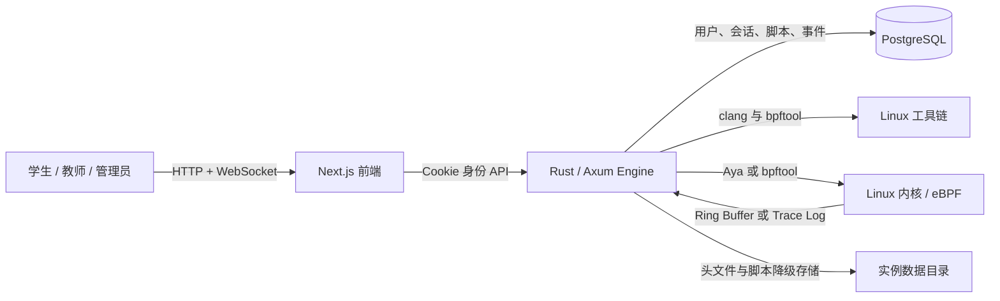
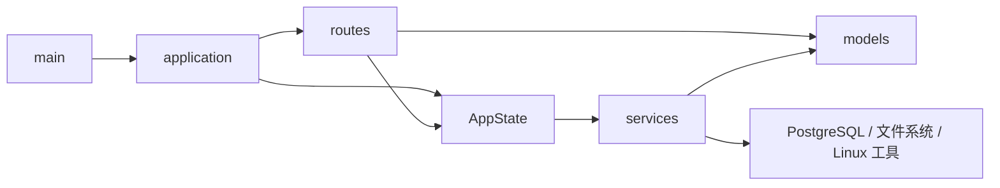
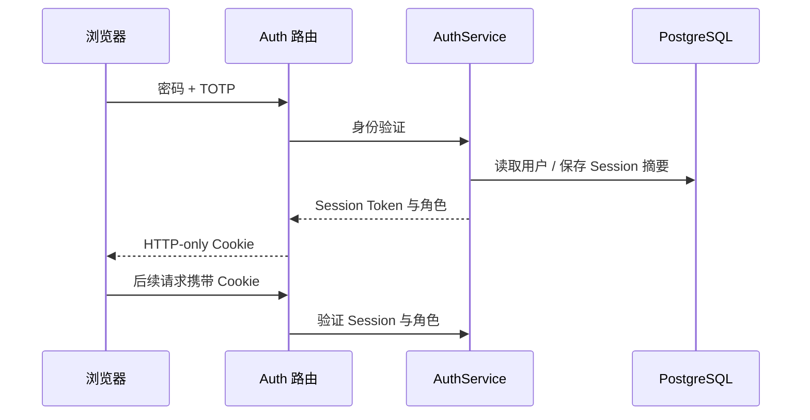
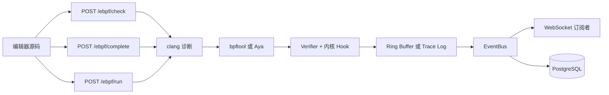

# 系统架构

本文说明 Cyanrex Lab 的运行边界、代码职责、数据流和扩展规则。项目定位是自部署的 eBPF
教学系统，适合可信工作站、教室服务器或受保护的局域网，不面向公网多租户场景。

## 1. 系统全景



浏览器是控制面，不直接执行任何内核特权操作。Engine 是执行面，负责身份、权限、编译、
加载、挂载、事件投递与持久化。PostgreSQL 保存持久数据，Linux 工具链和内核组成特权沙箱边界。

## 2. 仓库边界

| 路径 | 职责 | 定位 |
|---|---|---|
| `frontend/` | Next.js 页面、编辑器、界面状态与多语言 | 浏览器应用 |
| `engine/` | Axum API、业务服务、持久化与 eBPF 运行时 | 服务端行为 |
| `docs/` | 英文、中文教程和运维文档 | 课程文档源 |
| `frontend/public/course/` | `docs/` 的构建副本 | 由 `npm run sync:course` 生成 |
| `docker/` | Docker 与分发拓扑 | 容器部署 |
| `scripts/` | 启动、打包、审计、质量和性能脚本 | 运维流程 |
| `modules/` | 模块示例与约定 | 教学示例 |
| `sdk-js/` | 初期 JavaScript 客户端骨架 | 可选集成面 |

目前 `modules/` 下的目录是示例，Engine 尚不会动态发现这些目录；模块运行状态由
`ModuleManager` 保存在内存中。

## 3. 前端架构

```text
pages/                    页面路由与流程编排
src/components/           共享界面和导航组件
src/features/ebpf/        eBPF 编辑器状态与工作流
src/config/               运行端点和产品级设置
src/i18n/                 翻译目录与语言上下文
src/utils/                分析器、安全与页面状态工具
```

主要规则：

- 页面只编排交互和请求，内核相关逻辑必须留在 Engine。
- Engine 默认地址和 WebSocket 地址转换统一放在 `src/config/runtime.ts`，新页面不要直接读取
  `NEXT_PUBLIC_ENGINE_URL`。
- 身份使用 HTTP-only Session Cookie，需要身份的请求必须带 `credentials: "include"`。
- `SidebarLayout` 只负责前端导航可见性；最终权限始终由 Engine 判断。
- eBPF 编辑器行为放进 `src/features/ebpf/`，页面结构放在 `pages/ebpf.tsx`。
- `docs/` 是文档源；`frontend/public/course/` 是为 Docker 构建保留的同步副本。

## 4. Engine 架构

```text
main.rs           进程启动与 TCP 监听
lib.rs            公共模块与兼容性导出
application.rs    HTTP 路由、CORS 与权限层组合
state.rs          依赖构造和共享 AppState
metrics.rs        编译检查的进程内指标
config.rs         环境变量、进程与实例配置
routes/           HTTP/WebSocket 处理器和权限守卫
models/           请求、响应和领域数据结构
services/         身份、eBPF、事件、脚本、模块和头文件服务
migrations/       PostgreSQL 表结构模板
```

依赖方向如下：



`AppState` 是 Axum 的依赖组合根，只负责连接服务实例，不承载路由定义或基础设施算法。
路由负责转换 HTTP 输入输出，可复用行为必须进入服务层。

### 路由权限层

`application.rs` 按服务端真实权限组织路由：

| 层级 | 典型端点 | 服务端约束 |
|---|---|---|
| 公共 | `/health`、`/auth/login`、`/auth/me` | 无需 Session |
| 公共状态修改 | `/auth/logout` | CSRF 来源检查 |
| 已登录 | `/ebpf/*`、`/events*`、`/scripts*` | Session，写操作附加 CSRF |
| 教师或管理员 | 模块与头文件目录读取 | 角色守卫 |
| 管理员 | 模块修改、编译设置、命令分发 | 管理员守卫 |

新增端点必须准确放入其中一层。隐藏前端菜单不能替代 Engine 权限检查。

### 服务职责

| 服务 | 负责内容 |
|---|---|
| `AuthService` | 用户、密码摘要、TOTP、登录限速、Session 与角色 |
| `EbpfLoader` | clang 检查/补全、缓存、加载、挂载记录和 Aya Session |
| `EventBus` | 用户事件缓冲、未读数、广播、保留策略和异步落库 |
| `ScriptStore` | 用户脚本 CRUD 及数据库/文件降级 |
| `CHeaderModule` | 可信头文件目录、摘要校验和选中元数据 |
| `EnvironmentChecker` | 内核、工具链和运行环境检查 |
| `ModuleManager` | 内存中的教学模块生命周期 |
| `CommandDispatcher` | 把管理命令分发到对应服务 |

大型服务可以拆成私有子模块或 `include!` 片段，但调用者只依赖公开服务类型，不得跨层引用内部文件。

## 5. 核心数据流

### 身份流程



原始 Session Token 只进入浏览器 Cookie，持久化层只保存 SHA-256 摘要。密码使用 Argon2；
旧摘要校验只为迁移兼容保留。

### eBPF 执行流程



仅检查请求不会加载程序；运行请求必须通过身份和输入校验后才会编译、加载。`bpftool` 是兼容性
最广的路径，Aya 当前负责已支持的 tracepoint 路径。

### 持久化与降级

PostgreSQL 优先保存用户、Session、事件、事件设置和脚本。启用 `CYANREX_DB_FALLBACK` 后，
各服务可以独立降级：

- 身份降级到进程内存；
- 事件降级到有上限的用户内存缓冲；
- 脚本降级到 `CYANREX_DATA_DIR` 下按实例隔离的 JSON；
- 已下载头文件及选择状态始终使用文件系统。

降级可保证课堂在数据库短暂故障时继续运行，但内存用户、Session 和事件在 Engine 重启后会丢失。

## 6. 部署拓扑

| 模式 | 前端 | Engine | 数据库 | 实际观测内核 |
|---|---|---|---|---|
| Docker | 容器 | 特权容器 | 容器 | Linux 宿主机或 Docker VM |
| WSL2 | 本地 Node | 本地特权进程 | Docker | WSL2 内核 |
| Native Linux | 本地 Node | 本地特权进程 | Docker | 本机 Linux 内核 |

所有模式统一从 `start.sh` 启动。`CYANREX_INSTANCE_ID` 用于隔离本地数据、Compose 资源、
启动锁和默认卷名；多实例还必须使用不同的前端、Engine 和 PostgreSQL 主机端口。

Engine 容器需要内核能力、宿主 PID、bpffs、tracefs 和内核模块挂载，因此必须视为特权教学沙箱：

- 默认只绑定回环地址；
- 远程访问优先使用 SSH 隧道或 TLS 反向代理；
- 局域网访问必须显式配置 CORS 来源；
- 不接受不可信或匿名用户提交代码；
- 不要让无关业务与 Engine 共用特权运行环境。

## 7. 扩展规则

1. 请求、响应与领域结构进入 `engine/src/models/`。
2. 可复用行为和外部系统访问进入 `engine/src/services/`。
3. 路由只做提取、权限上下文、校验和响应映射。
4. 新端点在 `application.rs` 中注册到准确的权限层。
5. 行为修改前先在 `engine/tests/routes_tdd/` 增加回归测试。
6. 前端页面逻辑变复杂时，移入 `src/features/<feature>/`。
7. 用户文本先补英文目录，再覆盖其他支持语言。
8. 信任边界或部署拓扑变化时，同步修改架构和运维文档。

维护源码不得超过 600 行，文档不得超过 2000 行。CI 会检查文件长度、Rust 格式与测试、
前端构建、权限回归和安全审计。

## 8. 当前有意保留的限制

- 系统面向可信自部署教学环境，不面向公网多租户。
- Engine 是单进程；挂载、模块和降级状态不会在多个副本间共享。
- PostgreSQL 可以共享，但 Engine 横向扩容前必须先设计 eBPF 挂载所有权与协调机制。
- `sdk-js` 仍是骨架，尚未覆盖身份、CSRF 和全部 API。
- `modules/` 是示例边界，不是动态插件运行时。

这些是显式架构约束。若要移除某项限制，应同时提供协调模型、安全审计、迁移方案和回归测试。
