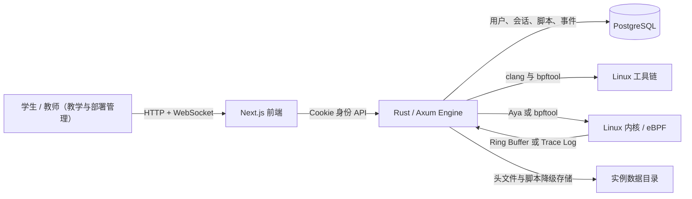
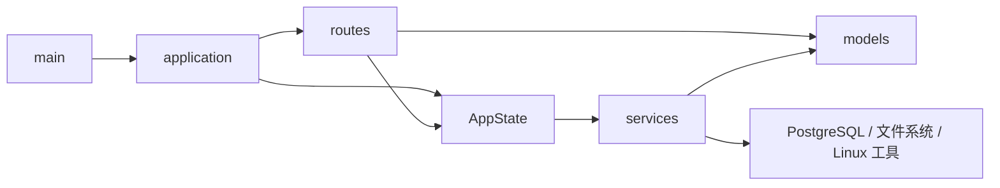
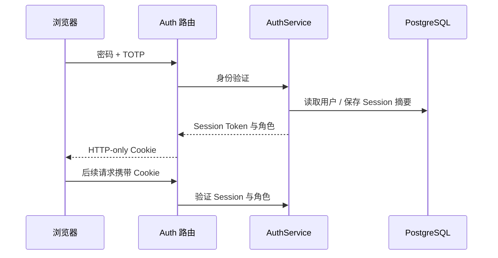
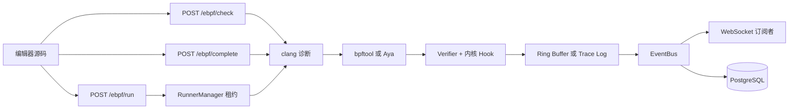

# 系统架构

本文说明 Cyanrex Lab 的运行边界、代码职责、数据流和扩展规则。项目定位是自部署的 eBPF
教学系统，适合可信工作站、教室服务器或受保护的局域网，不面向公网多租户场景。

## 1. 系统全景



浏览器是控制面，不直接执行任何内核特权操作。Engine 是执行面，负责身份、权限、编译、
加载、挂载、事件投递与持久化。PostgreSQL 保存持久数据，Linux 工具链和内核组成特权执行边界，
不是多学生安全沙箱。

### 教师权威与单人使用

教师是本实例的教学和部署权威：课堂审阅、模块/头文件、编译设置、Runner Agent 运维和管理终端
共用同一教师会话，不再需要切换管理员身份。单人使用时，初始化的部署账号默认就是教师，也能
直接做实验，无需注册或切换课堂模式；登录验证和重要操作确认仍然保留。

为兼容已有部署，默认用户名 `admin` 和 `CYANREX_ADMIN_*` 凭据配置保留；登录/会话返回的角色
改为 `teacher`。教师名单和旧管理员名单都授予完整教师权威。公开注册不能抢占这些预留用户名，
也不能选择角色；默认部署教师不能通过删号接口删除自己。开通和升级注意事项见[教师指南](teacher-guide.md)。

权威由当前 Engine 的服务端配置决定，不接受浏览器开关或远程 Agent 自报身份。学生自管的个人
实例中拥有教师身份，不代表获得另一课堂实例的教师权限。[局域网目标](classroom-isolation.md)
仍由教师控制教学与可信验收；本轮角色统一不等于已经实现无特权独立控制服务或受管 VM 生命周期。

### 接入入口（0.3.7）

教师工作站通过 Rust `cyanrex-release ssh plan/apply` 管理 Linux 目标机上已安装的离线包；
学生通过教师发布的 `/join` 链接和 Engine `/.well-known/cyanrex-classroom` 最小描述找到
教师。发现不等于认证，绑定学生用户名的教师邀请、已核实的 HTTPS 地址、独立接入协议/能力检查，
以及正常密码/TOTP 登录分别执行。`ClassroomService` 管理可选配置和有界临时邀请摘要，账号与
会话仍由 `AuthService` 管理。

SSH 凭据留在系统客户端，不进入 Engine/浏览器；没有新增 Runner 或特权执行模式。自动组播
发现、安装包上传、独立控制服务和 VM 生命周期尚未实现，详见[课堂接入指南](classroom-connection.md)。

## 2. 仓库边界

| 路径 | 职责 | 定位 |
|---|---|---|
| `frontend/` | Next.js 页面、编辑器、界面状态与多语言 | 浏览器应用 |
| `engine/` | Axum API、业务服务、持久化与 eBPF 运行时 | 服务端行为 |
| `docs/` | 英文、中文教程和运维文档 | 课程文档源 |
| `frontend/public/course/` | `docs/` 的构建副本 | 由 `npm run sync:course` 生成 |
| `docker/` | Docker 与分发拓扑 | 容器部署 |
| `scripts/` | 启动、打包、审计、质量和性能脚本 | 运维流程 |
| `modules/` | 版本化模块清单、目录项与协议边界 | 模块目录契约 |
| `sdk-js/` | 面向浏览器与 Node.js 的类型化 Engine HTTP 客户端 | 可选集成面 |

Engine 启动时会发现直接子目录中的合法 v1 `module.json`。`ModuleManager` 会拒绝格式错误、
过大、重复或名称与目录不一致的清单，并在内存中保存 start/stop 控制状态；发现过程不会加载
动态库、启动进程或执行模块目录中的文件。

## 3. 前端架构

```text
pages/                    页面路由与流程编排
src/components/           共享界面和导航组件
src/features/ebpf/        eBPF 编辑器状态与工作流
src/features/runner/      Runner Agent 清单与教师部署运维
src/features/settings/    设置页指标轮询、热点分析与面板
src/config/               运行端点和产品级设置
src/i18n/                 翻译目录与语言上下文
src/utils/                分析器、安全与页面状态工具
```

主要规则：

- 页面只编排交互和请求，内核相关逻辑必须留在 Engine。
- Engine 默认地址和 WebSocket 地址转换统一放在 `src/config/runtime.ts`，新页面不要直接读取
  `NEXT_PUBLIC_ENGINE_URL`。
- 前端 CSP 会从同一个 `NEXT_PUBLIC_ENGINE_URL` 提取并校验 HTTP(S) Origin，写入 `connect-src`，
  因而自部署时使用非默认 Engine 地址也不会被浏览器拦截。
- 身份使用 HTTP-only Session Cookie，需要身份的请求必须带 `credentials: "include"`。
- `SidebarLayout` 只负责前端导航可见性；最终权限始终由 Engine 判断。
- `useConfirmedAction` 负责绑定目标的界面确认、键盘焦点和重复点击保护。导航会丢弃待确认操作
  与过期的本地文件导入，但不能撤销已发给 Engine 的变更。进入实验保留草稿，加载模板需单独确认。
- eBPF 编辑器行为放进 `src/features/ebpf/`，页面结构放在 `pages/ebpf.tsx`。
- 设置页指标与 Agent 运维逻辑放在各自 feature 中，`pages/settings.tsx` 只协调事件/编译器设置并组合
  教师部署管理面板。
- `docs/` 是文档源；`frontend/public/course/` 是为 Docker 构建保留的同步副本。

内联编译诊断只在当前编辑器挂载期间保留有界的 8 秒缓存，用 Engine URL、目标、源码和头文件上下文
的完整组合区分，不跨编辑器共享请求或取消归属。输入变化时在防抖期隐藏旧标记，已取消的异步回调
不能写回界面或缓存。`compilerCheck.ts` 负责传输及整次请求期限：本地 20 秒、远程 35 秒（含提交）。
远程取消/过期显示不可用，而不是代码问题；清理仅尽力而为，不代表回滚，也不自动回退本地。
这只是浏览器生命周期隔离，不检测其他位置改变的 HttpOnly 会话，也不代替服务端权限。
复现与限制见[沿链路抓虫 03](functional-network-bug-hunt-03.md)。

语义补全等语言服务只作用于所属编辑器的当前模型，销毁编辑器时注销全部 6 个服务。
`semanticCompletion.ts` 独立保留 5 秒/18 条完整键缓存，整次请求限时 10 秒；模型版本、光标请求和
头文件刷新会使旧回调失效。服务失败仍提供静态片段，不运行代码，也不切换到 Agent。
`useSelectedHeaders` 负责后发优先、限时 10 秒的元数据读取，主动刷新会递增上下文版本，即使文件名
不变也会失效旧检查。失败时保留并明确标注上次成功列表，不伪装成空选择。
`useHeaderInjectionCheck` 复用本地 20 秒检查传输，阻止重复派发，源码/上下文变化或离开时丢弃旧结果。
检查和补全的用户归属、已选头文件仍由 Engine 获取；浏览器元数据不是原子编译快照。认证学生可读
已选元数据，只有教师可修改选择或下载头文件。详见[沿链路抓虫 04](functional-network-bug-hunt-04.md)；
诊断标记也改为写入所属编辑器模型。

`useRuntimeActions` 负责运行/卸载的同步互斥门、导航取消，以及绑定草稿、实验和运行设置的结果版本。
编辑只让旧输出失效，不取消已派发的内核操作。`runtimeRequest.ts` 校验响应，并把变更请求的浏览器
等待（含响应体读取）限制为 330 秒；这不是服务端事务期限，也不保证回滚。普通编译/校验失败仍显示
运行报告，传输结果不确定则保留确认框的失败视图。`useAttachmentInventory` 独立刷新当前用户挂载，
采用后发优先、20 秒限时读取。失败保留并明确标注旧列表，只有有效空响应才表示列表无挂载；运行完成
不等待这些补充读取。卸载必须收到明确的 `clean: true`，确认移除后停用结果中的 pin/调试会话。
详见[沿链路抓虫 05](functional-network-bug-hunt-05.md)。

断点观察绑定 Engine、调试会话和运行报告中归一化的已插桩行集合。上下文变化的首次渲染即隐藏旧命中
与缺口状态，不等待副作用重置订阅。只展示匹配的内核断点事件及声明过的正整数行号。
行高亮、快捷键与清理绑定明确的编辑器/文档，不跟随之后改变的共享引用；非法行号不会交给 Monaco
钳制成误导性高亮。F9/侧栏修改为下次显式运行准备，清空请求断点不会卸载已运行的探针。
共用事件恢复采用私有、禁止重定向的快照读取；异常实时帧提示可能缺失，但不因此重连。追踪解析拒绝
零行号以及 `47abc` 等数字前缀。这些是数据完整性/展示检查，不是事件来源认证或新增内核隔离。
详见[沿链路抓虫 06](functional-network-bug-hunt-06.md)。

## 4. Engine 架构

```text
main.rs           进程启动与 TCP 监听
lib.rs            公共模块与兼容性导出
application.rs    HTTP 路由、CORS 与权限层组合
state.rs          依赖构造和共享 AppState
metrics.rs        编译检查的进程内指标
config.rs         环境变量、进程与实例配置
routes/           HTTP/WebSocket 处理器和权限守卫
models/           请求、响应和领域数据结构
services/         身份、eBPF、事件、脚本、模块和头文件服务
migrations/       PostgreSQL 表结构模板
```

依赖方向如下：



`AppState` 是 Axum 的依赖组合根，只负责连接服务实例，不承载路由定义或基础设施算法。
路由负责转换 HTTP 输入输出，可复用行为必须进入服务层。

### 路由权限层

`application.rs` 按服务端真实权限组织路由：

| 层级 | 典型端点 | 服务端约束 |
|---|---|---|
| 公共 | `/health`、`/auth/login`、`/auth/me` | 无需 Session |
| 公共状态修改 | `/auth/logout` | CSRF 来源检查 |
| 已登录 | `/ebpf/*`、`/events*`、`/scripts*`、`/learning/labs` | Session，写操作附加 CSRF |
| 教师（旧 `staff` 层） | 模块/头文件读取、`/learning/teacher/overview` | 教师角色守卫 |
| 教师部署管理（旧 `admin` 层） | 模块修改、编译设置、命令分发、Runner 管理 | 同一教师角色守卫 |

新增端点必须准确放入其中一层。隐藏前端菜单不能替代 Engine 权限检查。

`staff` / `admin` 保留为稳定的 API/SDK 分类标识，不代表两级教师权威；这两类的 OpenAPI
`x-cyanrex-roles` 都列出 `admin`（旧兼容值）与 `teacher`。

### 服务职责

| 服务 | 负责内容 |
|---|---|
| `AuthService` | 用户、密码摘要、TOTP、登录限速、Session 与角色 |
| `EbpfLoader` | clang 检查/补全、缓存、加载、挂载记录和 Aya Session |
| `EventBus` | 用户历史与实时队列、共享惰性事件 JSON、未读数、保留策略和异步落库；兼容旧全局订阅接口 |
| `ScriptStore` | 用户脚本 CRUD 及数据库/文件降级 |
| `LearningStore` | 实验尝试、共享本地快照、有界最近记录选择、单次遍历进度聚合及数据库/文件降级 |
| `CHeaderModule` | 可信头文件目录、摘要校验和选中元数据 |
| `EnvironmentChecker` | 内核、工具链和运行环境检查 |
| `ModuleManager` | 版本化清单发现、目录校验与内存生命周期状态 |
| `CommandDispatcher` | 把管理命令分发到对应服务 |

大型服务可以拆成私有子模块或 `include!` 片段，但调用者只依赖公开服务类型，不得跨层引用内部文件。

## 5. 核心数据流

### 从历史提交继续

学习中心只把实验 ID 和提交 ID 带到编辑器。编辑器调用
`GET /learning/attempt?attempt_id=...`，服务端按当前 Session 所有者查询，教师/管理员也不能
通过该接口指定其他学生。返回原始提交与当前评语，并设置 `Cache-Control: no-store`；不存在和
他人记录统一返回 `404`，非法 ID 返回 `400`，存储错误返回 `500`。启用中的 PostgreSQL 按所有者
和 ID 绑定查询，失败不静默读取旧文件副本；本地沿用快照加载，记录、评语和存储格式不变。

编辑器先预览记录，明确确认后才替换草稿并恢复实验/模板上下文，清除旧结果与断点，但不运行、
挂载或卸载。之后手动运行沿用既有执行路径并新增尝试。界面状态绑定目标链接，取消和实验/记录
匹配检查拒绝过期响应，实验模板不会因导航而自动加载。保留/重试和模板不可用的行为见
[学生指南](student-guide.md)。

### 身份流程



原始 Session Token 只进入浏览器 Cookie，持久化层只保存 SHA-256 摘要。密码使用 Argon2；
旧摘要校验只为迁移兼容保留。

### eBPF 执行流程



仅检查请求不会加载程序；运行请求必须通过身份和输入校验后才会编译、加载。`bpftool` 是兼容性
最广的路径，Aya 当前负责已支持的 tracepoint 路径。

`RunnerManager` 为每次运行创建唯一租约，执行全局和单用户容量限制，并在成功、失败、超时或
任务取消时释放租约。用户可通过 `GET /runner/status` 查看当前容量；教师专用的
`GET /runner/overview` 还会列出活动租约的所有者和截止时间。本地 Runner 会明确报告
`isolation=shared_kernel`：配额属于资源控制，不是安全隔离边界。临时工作区和 bpffs pin 按实例
及匿名化用户命名空间分开，运行作用域结束后会删除临时编译文件。

运行请求把 `RunnerExecutionRequest` 交给 `RunnerDriver`，Manager 在分发前检查请求用户与租约
所有者一致。挂载清单、卸载以及 Aya 调试重试前的清理也使用选定驱动；驱动在自己的执行环境验证
卸载结果。清单和卸载都有超时上限，不要求短期执行容量租约仍然存活。后端不可用时，不会返回成功
的本机空清单或退回本机卸载。`LocalProcessRunnerDriver` 保留原有 `EbpfLoader` 和共享内核行为。

编译检查和语义补全也使用选定驱动，携带 Session 用户、源码、所选头文件元数据和光标位置。
每个 Runner Manager 独立提供 2 个检查、3 个补全名额，不占用运行租约；整个驱动调用分别最多
15 秒、8 秒，若 Runner 配置的超时更短则取更短值。容量不足返回 `429`，后端不可用或不支持返回
`503`，超时返回 `408`，不回退本地。诊断结果保持现有 HTTP/JSON 契约，未知缓存状态不记为未命中。
取消请求会释放名额并归还进行中统计；本地适配器按用户区分缓存，编译源码工作区使用私有权限并随
作用域结束清理。

这层接口仍未完整：挂载验证、事件流、环境探测和编译设置还有本机路径。所选头文件元数据仍包含
本机路径，远程驱动还需可验证的头文件包，不能把这些路径直接当作客体可读文件。后续隔离驱动必须
覆盖完整生命周期，并如实报告边界。未知 `CYANREX_RUNNER_MODE` 仍会让 Engine 启动失败，不会静默降级
到特权本地执行。[Linux 桌面/局域网目标架构](classroom-isolation.md)定义了环境归属和 VM 恢复要求；
目前尚未开启 VM 执行。

Runner 模式由 `CYANREX_RUNNER_MODE` 配置（当前为 `local_process`）；配额由
`CYANREX_RUNNER_MAX_CONCURRENT`（默认 `2`）、
`CYANREX_RUNNER_MAX_PER_USER`（默认 `1`）和 `CYANREX_RUNNER_TIMEOUT_SECS`（默认 `45`，范围
`5`～`300`）配置。不能只修改模式名称来暗示更强的隔离能力。

### Runner Agent 控制面 v1

可选的内存 Agent 注册表连接远程 VM 或容器编译节点，但不会让远程执行变成隐式行为。
`POST /runner/agent/register` 登记协议版本、真实隔离类型、容量、能力和标签；
`POST /runner/agent/heartbeat` 更新健康状态与空闲容量。节点超过 TTL 后显示为 `offline`，超过保留期
后自动删除。`GET /runner/agents` 仅允许教师读取节点清单，并明确返回控制面是否启用。设置页将它
与 `GET /runner/jobs` 组合为每 10 秒刷新的运维面板，且不展示源码或作业输出。注册表不会持久化，
Engine 重启后需要 Agent 重新注册。注册请求体上限为 64 KiB，注册表最多保存 256 个节点。

只有配置至少 32 个字符的 `CYANREX_RUNNER_AGENT_TOKEN` 后才会启用 Agent 接口；Bearer Token
仅在注册时使用。注册会一次性返回每节点独立的 256-bit 凭据，重新注册会轮换凭据。
`CYANREX_RUNNER_AGENT_TTL_SECS` 默认 30 秒，`CYANREX_RUNNER_AGENT_RETENTION_SECS` 默认 300 秒，
`CYANREX_RUNNER_AGENT_SIGNATURE_WINDOW_SECS` 默认 60 秒。

注册示例：

```bash
curl -sS -X POST http://127.0.0.1:8080/runner/agent/register \
  -H "Authorization: Bearer $CYANREX_RUNNER_AGENT_TOKEN" \
  -H 'Content-Type: application/json' \
  -d '{
    "agent_id":"lab-vm-01",
    "protocol_version":1,
    "agent_version":"0.3.7",
    "isolation":"virtual_machine",
    "max_concurrent":2,
    "capabilities":["bpftool","btf","ringbuf"],
    "labels":{"room":"a","arch":"x86_64"}
  }'
```

注册响应包含 `credential` 和 `signature_scheme=hmac-sha256-v1`，并设置
`Cache-Control: no-store`。后续所有 Agent 请求都携带以下 Header：

- `X-Cyanrex-Agent-Id`；
- `X-Cyanrex-Agent-Timestamp`：当前 Unix 秒；
- `X-Cyanrex-Agent-Nonce`：每次新生成的 16～64 字符标识；
- `X-Cyanrex-Agent-Signature`：小写十六进制 HMAC-SHA256。

HMAC Key 是注册返回的凭据字符串，规范化 UTF-8 输入为：

```text
CYANREX-RUNNER-V1\n
POST\n
/runner/agent/heartbeat\n
lab-vm-01\n
<unix-seconds>\n
<nonce>\n
<exact-body-sha256-lowercase-hex>
```

`POST /runner/agent/heartbeat`、`POST /runner/agent/jobs/claim`、
`POST /runner/agent/jobs/sync` 和 `POST /runner/agent/jobs/result` 都使用相同签名格式。计算摘要的
正文必须与实际发送字节完全一致。签名超过时效、正文被修改或 Nonce 被重复使用都会返回 `401`。

教师可以通过 `POST /runner/jobs/probe` 投递探针，通过 `POST /runner/jobs/compile-check` 显式投递
只编译作业，还可请求取消并查看队列。健康 Agent 按容量和能力领取作业，取得 256-bit Lease 和截止
时间，通过 `/sync` 获取取消请求，最后回传有大小限制的结果。内存队列最多保留 512 个作业，终态
保留 15 分钟。编译源码只出现在带签名的领取响应中，清单只记录字节数。

已登录的编辑器用户可通过 `GET /ebpf/check/backends` 获取脱敏后的合格节点子集。显式选择 Agent 后，
编辑器使用异步的 `POST /ebpf/check/remote`、同名状态 GET 和取消接口。队列按 Session 用户名绑定
作业，对其他用户隐藏，每个用户最多同时进行两个远程检查。检查默认留在本地；所选 Agent 不可用时
明确报错，不会静默回退。`/ebpf/run` 仍在本地执行。

用户绑定的检查未领取排队窗口为 35 秒，在下一次队列交互时清理；过期释放源码和用户活跃名额，
不修改已领取执行期限。教师管理的无用户归属任务保留原有排队/取消规则。Agent 领取按上报的
进行中加空闲容量计算总可用量，未完成租约只扣一次，并保留主动预留容量。执行前同步发现租约
丢失即拒绝执行/上报，客户端继续轮询；响应解码逐块执行 640 KiB 正文限制，包括无长度头响应。
这些边界不增加远程加载或执行中的持续取消监控。

独立的 `cyanrex-runner-agent` 二进制为 Linux、WSL2 和无特权容器实现了这套协议。它使用 Rustls
HTTPS 客户端，禁用重定向和环境代理，只在内存保存签发凭据，并在 Engine 状态丢失后自动重新注册。
探针只读取 `/proc/sys/kernel/osrelease`；可选编译模式以固定参数和资源限制调用 Clang，不经过 Shell、
不加载 eBPF、不返回目标文件。客户端和服务端都会拒绝 `shared_kernel` 的编译能力。部署方式见
[Runner Agent 使用指南](runner-agent.md)。

打包产物包含相同 Agent 二进制和显式启用的 `runner-agent` Compose Profile。独立管理脚本准备私有
Bootstrap Secret，并启动加固后的无特权编译容器；配套冒烟测试使用已配置的部署教师身份登录、发现脱敏
后端、提交用户私有编译作业、轮询并验证归一化结果。

Engine 重启或记录被回收后，Agent 必须重新注册；使用相同 ID 注册会替换旧记录。凭据错误返回
`401`，控制面未启用返回 `503`，元数据或容量无效返回 `400`，未注册节点的心跳返回 `404`，请求体
过大返回 `413`。

源码断点会在编译前加入不改变行号的 `bpf_printk` 探针。API 返回每次运行独立的调试会话标识，
以及已插桩和被拒绝的源码行。匹配的 Trace Log 会转换成 `ebpf.debug_breakpoint_hit` 事件，其他
调试会话的标记会被丢弃。如果插桩后的源码无法编译，加载器会使用未改写源码重试，避免调试功能
让原本可编译的实验直接失败。这类探针只观察执行，不会暂停内核程序。调试 tracepoint 时，如果
bpftool 能加载却不能挂载程序，系统会清理未激活的 pin 并通过 Aya 自动重试。

### 持久化与降级

PostgreSQL 优先保存用户、Session、事件、事件设置、脚本和学习尝试。启用 `CYANREX_DB_FALLBACK` 后，
各服务可以独立降级：

- 账号/会话读取、注册与登录可降级到进程内存；
- 事件降级到有上限的用户内存缓冲；
- 脚本降级到 `CYANREX_DATA_DIR` 下按实例隔离的 JSON；
- 学习尝试降级到 `CYANREX_DATA_DIR` 下按实例隔离的 JSON；
- 已下载头文件及选择状态始终使用文件系统。

降级可保证课堂在数据库短暂故障时继续运行，但内存用户、Session 和事件在 Engine 重启后会丢失。

配置认证持久化后，退出、改密和删账号不能只改内存就确认成功。未确认的存储写入返回 `503`
并保留 Cookie；账号与会话删除采用同一事务。如果此前的读取失败已锁定认证数据库降级，需
恢复存储并重启 Engine 后才能继续这些操作。主动采用纯内存模式的实例仍沿用易失行为。
重试与撤销限制详见[安全指南](security.md#会话与数据库故障)。

在 SQL 启用时开始的登录，会在同一事务中插入会话、复核已验证凭据，再发布缓存与 Cookie。
SQL 写入失败或登录期间账号被删除/重建时，不会静默改为内存写入成功；此前已进入的降级仍是易失的。

本地脚本沿用 JSON 数组格式。克隆存储实例共用写入准入锁，覆盖冷加载、同目录私有临时文件、
flush/原子 rename 与缓存发布；已交接请求取消后仍完成此序列，排队时取消则不变更数据。
仅缺失文件视为空；损坏、不可读或所有者不符的存档不覆盖，也不缓存为空。新 Unix 文件/目录采用
0600/0700 权限。这不提供 fsync 持久性或跨进程写锁。

事件筛选删除原地保留不匹配记录，不再从有界缓存重写 SQL 数据。历史与未读数按同一锁顺序更新，
存活记录保持已读状态。HTTP 删除在变更前拒绝非法值、未知字段与无效时间范围，SQL 与内存共用
冻结时间截点；不带筛选仍明确表示删除本人全部事件。异步事件持久化不因此具备事务、跨进程或崩溃恢复保证。

本地学习记录采用共享只读快照：读取不复制所有源码，新增共享未修改记录，评语只替换被编辑的
记录。首次加载的文件 I/O、UTF-8 校验和解析在阻塞工作线程执行，与提交共用同一写锁，交接后
请求取消不丢弃成功初始化；仅缺失文件视为空记录，其余错误可以重试。仍需完整输入字符串和
全部解码记录。最近页先做有界选择再复制返回载荷，进度以单次遍历聚合；阻塞工作线程以 64 KiB 缓冲流式
写入整份 JSON，flush、rename 后发布内存，请求取消后仍持有写锁完成提交。未新增 fsync、
崩溃恢复、跨进程协调、SQL 投影、HTTP 分页契约或保留策略。
历史、进度和教师读取现会把本地加载或选中的 PostgreSQL 模式/查询失败返回为通用 `500`，不再
投影成空记录或零进度；成功读取和存储错误均为 no-store。选中 SQL 后不会为这次读取静默转到
旧本地快照或关闭连接池，原有运行记录写入降级仍保留。本地提交排他创建同目录随机临时文件，
新建 Unix 文件/目录采用 0600/0700，失败后尝试清理临时文件；不更改既有父目录权限，数据路径
仍需可信所有权。详见[学习记录存储](learning-storage.md)。

### 事件流恢复

`/ws/events` 保持按用户发送原始 Event JSON。即使是 GET，握手也检查会话及 Origin/Referer。
订阅在握手完成前按会话用户建立；本人队列 lag 时发送 `1013` 关闭码，socket 发送有超时上限。
同一用户的连接共享不可变事件及惰性 JSON，最后一个订阅退出时清理队列。他人流量不能挤掉
该队列中的事件，但总内存随活跃用户和载荷增长，共享进程资源并未隔离；旧全局服务订阅接口仍兼容。
事件中心和断点面板共用有界重连及快照恢复逻辑，恢复后仍显示可能缺失的提示。
这只是最近历史视图，不是持久或恰好一次的重放协议。超时、客户端迁移、快照竞态与异步持久化
限制见[事件流恢复](event-stream.md)。

## 6. 部署拓扑

| 模式 | 前端 | Engine | 数据库 | 实际观测内核 |
|---|---|---|---|---|
| Docker | 容器 | 特权容器 | 容器 | Linux 宿主机或 Docker VM |
| WSL2 | 本地 Node | 本地特权进程 | Docker | WSL2 内核 |
| Native Linux | 本地 Node | 本地特权进程 | Docker | 本机 Linux 内核 |

所有模式统一从 `start.sh` 启动。`CYANREX_INSTANCE_ID` 用于隔离本地数据、Compose 资源、
启动锁和默认卷名；多实例还必须使用不同的前端、Engine 和 PostgreSQL 主机端口。

Engine 容器需要内核能力、宿主 PID、bpffs、tracefs 和内核模块挂载，因此必须视为特权教学沙箱：

- 默认只绑定回环地址；
- 远程访问优先使用 SSH 隧道或 TLS 反向代理；
- 局域网访问必须显式配置 CORS 来源；
- 不接受不可信或匿名用户提交代码；
- 不要让无关业务与 Engine 共用特权运行环境。

### 多学生局域网目标

规划默认 Linux 桌面机支持硬件虚拟化，独立课堂服务器不是必要条件。目标是把无特权教学控制服务与
学生独占 VM 分开；VM 可以运行在学生桌面或受管虚拟化服务器上。环境在实验期间保留，换用户前重建。
这是待实现的部署拓扑，不是现有本地 Engine 的隔离保证。具体要求和缺口见
[课堂隔离设计](classroom-isolation.md)。

## 7. 扩展规则

1. 请求、响应与领域结构进入 `engine/src/models/`。
2. 可复用行为和外部系统访问进入 `engine/src/services/`。
3. 路由只做提取、权限上下文、校验和响应映射。
4. 新端点在 `application.rs` 中注册到准确的权限层。
5. 行为修改前先在 `engine/tests/routes_tdd/` 增加回归测试。
6. 前端页面逻辑变复杂时，移入 `src/features/<feature>/`。
7. 用户文本先补英文目录，再覆盖其他支持语言。
8. 信任边界或部署拓扑变化时，同步修改架构和运维文档。
9. 路由或线上数据模型变化时，重新生成 OpenAPI 文档并同步维护组件 Schema。

维护源码不得超过 600 行，文档不得超过 2000 行。CI 会检查文件长度、Rust 格式与测试、
前端构建、权限回归和安全审计，并从新构建、新解压的离线发行包执行真实安装冒烟测试。

## 8. 当前有意保留的限制

- 系统面向可信自部署教学环境，不面向公网多租户。
- Engine 是单进程；挂载、模块和降级状态不会在多个副本间共享。
- PostgreSQL 可以共享，但 Engine 横向扩容前必须先设计 eBPF 挂载所有权与协调机制。
- `sdk-js` 保留稳定的人工分组接口，并为全部非 Agent 操作增加生成的 operationId 调用层。
  公共线上模型、操作输入/响应及运行时权限/传输元数据均由 OpenAPI 生成；CI 会拒绝路由、权限层、
  覆盖范围和生成代码漂移，并以冻结的 1.0 前基线阻止输入/输出破坏。包消费冒烟会验证产物形态；
  77 项 additive-only 命名空间基线和明确的弃用窗口会保护人工接口；Registry 发布与长期支持归属仍待确定。
- `modules/` 是动态发现的版本化目录，不是可执行插件运行时；start/stop 只修改单进程状态，
  未知模块名会被拒绝。

这些是显式架构约束。若要移除某项限制，应同时提供协调模型、安全审计、迁移方案和回归测试。
