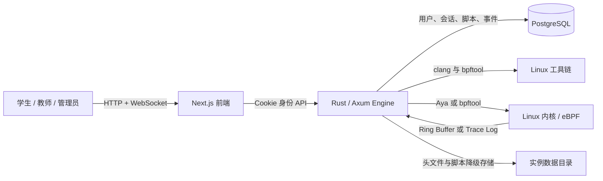
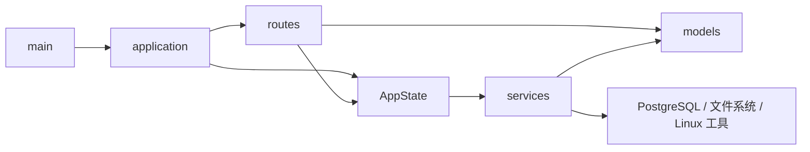
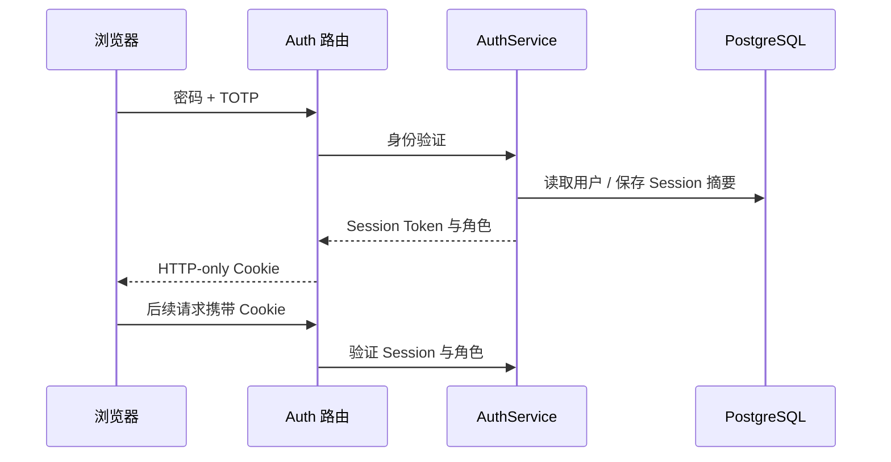
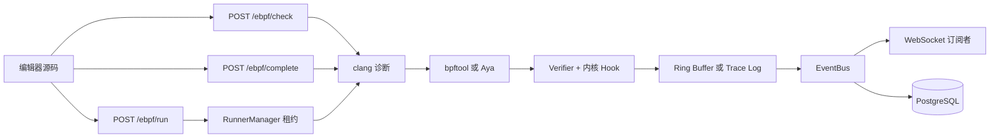

# 系统架构

本文说明 Cyanrex Lab 的运行边界、代码职责、数据流和扩展规则。项目定位是自部署的 eBPF
教学系统，适合可信工作站、教室服务器或受保护的局域网，不面向公网多租户场景。

## 1. 系统全景



浏览器是控制面，不直接执行任何内核特权操作。Engine 是执行面，负责身份、权限、编译、
加载、挂载、事件投递与持久化。PostgreSQL 保存持久数据，Linux 工具链和内核组成特权沙箱边界。

## 2. 仓库边界

| 路径 | 职责 | 定位 |
|---|---|---|
| `frontend/` | Next.js 页面、编辑器、界面状态与多语言 | 浏览器应用 |
| `engine/` | Axum API、业务服务、持久化与 eBPF 运行时 | 服务端行为 |
| `docs/` | 英文、中文教程和运维文档 | 课程文档源 |
| `frontend/public/course/` | `docs/` 的构建副本 | 由 `npm run sync:course` 生成 |
| `docker/` | Docker 与分发拓扑 | 容器部署 |
| `scripts/` | 启动、打包、审计、质量和性能脚本 | 运维流程 |
| `modules/` | 版本化模块清单、目录项与协议边界 | 模块目录契约 |
| `sdk-js/` | 面向浏览器与 Node.js 的类型化 Engine HTTP 客户端 | 可选集成面 |

Engine 启动时会发现直接子目录中的合法 v1 `module.json`。`ModuleManager` 会拒绝格式错误、
过大、重复或名称与目录不一致的清单，并在内存中保存 start/stop 控制状态；发现过程不会加载
动态库、启动进程或执行模块目录中的文件。

## 3. 前端架构

```text
pages/                    页面路由与流程编排
src/components/           共享界面和导航组件
src/features/ebpf/        eBPF 编辑器状态与工作流
src/features/runner/      Runner Agent 清单与管理员运维
src/features/settings/    设置页指标轮询、热点分析与面板
src/config/               运行端点和产品级设置
src/i18n/                 翻译目录与语言上下文
src/utils/                分析器、安全与页面状态工具
```

主要规则：

- 页面只编排交互和请求，内核相关逻辑必须留在 Engine。
- Engine 默认地址和 WebSocket 地址转换统一放在 `src/config/runtime.ts`，新页面不要直接读取
  `NEXT_PUBLIC_ENGINE_URL`。
- 前端 CSP 会从同一个 `NEXT_PUBLIC_ENGINE_URL` 提取并校验 HTTP(S) Origin，写入 `connect-src`，
  因而自部署时使用非默认 Engine 地址也不会被浏览器拦截。
- 身份使用 HTTP-only Session Cookie，需要身份的请求必须带 `credentials: "include"`。
- `SidebarLayout` 只负责前端导航可见性；最终权限始终由 Engine 判断。
- eBPF 编辑器行为放进 `src/features/ebpf/`，页面结构放在 `pages/ebpf.tsx`。
- 设置页指标与 Agent 运维逻辑放在各自 feature 中，`pages/settings.tsx` 只协调事件/编译器设置并组合
  管理员面板。
- `docs/` 是文档源；`frontend/public/course/` 是为 Docker 构建保留的同步副本。

## 4. Engine 架构

```text
main.rs           进程启动与 TCP 监听
lib.rs            公共模块与兼容性导出
application.rs    HTTP 路由、CORS 与权限层组合
state.rs          依赖构造和共享 AppState
metrics.rs        编译检查的进程内指标
config.rs         环境变量、进程与实例配置
routes/           HTTP/WebSocket 处理器和权限守卫
models/           请求、响应和领域数据结构
services/         身份、eBPF、事件、脚本、模块和头文件服务
migrations/       PostgreSQL 表结构模板
```

依赖方向如下：



`AppState` 是 Axum 的依赖组合根，只负责连接服务实例，不承载路由定义或基础设施算法。
路由负责转换 HTTP 输入输出，可复用行为必须进入服务层。

### 路由权限层

`application.rs` 按服务端真实权限组织路由：

| 层级 | 典型端点 | 服务端约束 |
|---|---|---|
| 公共 | `/health`、`/auth/login`、`/auth/me` | 无需 Session |
| 公共状态修改 | `/auth/logout` | CSRF 来源检查 |
| 已登录 | `/ebpf/*`、`/events*`、`/scripts*`、`/learning/labs` | Session，写操作附加 CSRF |
| 教师或管理员 | 模块/头文件读取、`/learning/teacher/overview` | 角色守卫 |
| 管理员 | 模块修改、编译设置、命令分发 | 管理员守卫 |

新增端点必须准确放入其中一层。隐藏前端菜单不能替代 Engine 权限检查。

### 服务职责

| 服务 | 负责内容 |
|---|---|
| `AuthService` | 用户、密码摘要、TOTP、登录限速、Session 与角色 |
| `EbpfLoader` | clang 检查/补全、缓存、加载、挂载记录和 Aya Session |
| `EventBus` | 用户事件缓冲、未读数、广播、保留策略和异步落库 |
| `ScriptStore` | 用户脚本 CRUD 及数据库/文件降级 |
| `LearningStore` | 实验尝试、自动验收、进度聚合及数据库/文件降级 |
| `CHeaderModule` | 可信头文件目录、摘要校验和选中元数据 |
| `EnvironmentChecker` | 内核、工具链和运行环境检查 |
| `ModuleManager` | 版本化清单发现、目录校验与内存生命周期状态 |
| `CommandDispatcher` | 把管理命令分发到对应服务 |

大型服务可以拆成私有子模块或 `include!` 片段，但调用者只依赖公开服务类型，不得跨层引用内部文件。

## 5. 核心数据流

### 身份流程



原始 Session Token 只进入浏览器 Cookie，持久化层只保存 SHA-256 摘要。密码使用 Argon2；
旧摘要校验只为迁移兼容保留。

### eBPF 执行流程



仅检查请求不会加载程序；运行请求必须通过身份和输入校验后才会编译、加载。`bpftool` 是兼容性
最广的路径，Aya 当前负责已支持的 tracepoint 路径。

`RunnerManager` 为每次运行创建唯一租约，执行全局和单用户容量限制，并在成功、失败、超时或
任务取消时释放租约。用户可通过 `GET /runner/status` 查看当前容量；管理员专用的
`GET /runner/overview` 还会列出活动租约的所有者和截止时间。本地 Runner 会明确报告
`isolation=shared_kernel`：配额属于资源控制，不是安全隔离边界。临时工作区和 bpffs pin 按实例
及匿名化用户命名空间分开，运行作用域结束后会删除临时编译文件。

路由不再直接调用 loader，而是把 `RunnerExecutionRequest` 交给 `RunnerDriver` 接口。
`LocalProcessRunnerDriver` 承载现有 `EbpfLoader` 路径；未来的 VM 或远程容器驱动必须实现相同
执行契约，并如实提供模式和隔离级别。未知 `CYANREX_RUNNER_MODE` 会让 Engine 启动失败，系统
不会静默降级到特权本地执行。

Runner 模式由 `CYANREX_RUNNER_MODE` 配置（当前为 `local_process`）；配额由
`CYANREX_RUNNER_MAX_CONCURRENT`（默认 `2`）、
`CYANREX_RUNNER_MAX_PER_USER`（默认 `1`）和 `CYANREX_RUNNER_TIMEOUT_SECS`（默认 `45`，范围
`5`～`300`）配置。不能只修改模式名称来暗示更强的隔离能力。

### Runner Agent 控制面 v1

可选的内存 Agent 注册表连接远程 VM 或容器编译节点，但不会让远程执行变成隐式行为。
`POST /runner/agent/register` 登记协议版本、真实隔离类型、容量、能力和标签；
`POST /runner/agent/heartbeat` 更新健康状态与空闲容量。节点超过 TTL 后显示为 `offline`，超过保留期
后自动删除。`GET /runner/agents` 仅允许管理员读取节点清单，并明确返回控制面是否启用。设置页将它
与 `GET /runner/jobs` 组合为每 10 秒刷新的运维面板，且不展示源码或作业输出。注册表不会持久化，
Engine 重启后需要 Agent 重新注册。注册请求体上限为 64 KiB，注册表最多保存 256 个节点。

只有配置至少 32 个字符的 `CYANREX_RUNNER_AGENT_TOKEN` 后才会启用 Agent 接口；Bearer Token
仅在注册时使用。注册会一次性返回每节点独立的 256-bit 凭据，重新注册会轮换凭据。
`CYANREX_RUNNER_AGENT_TTL_SECS` 默认 30 秒，`CYANREX_RUNNER_AGENT_RETENTION_SECS` 默认 300 秒，
`CYANREX_RUNNER_AGENT_SIGNATURE_WINDOW_SECS` 默认 60 秒。

注册示例：

```bash
curl -sS -X POST http://127.0.0.1:8080/runner/agent/register \
  -H "Authorization: Bearer $CYANREX_RUNNER_AGENT_TOKEN" \
  -H 'Content-Type: application/json' \
  -d '{
    "agent_id":"lab-vm-01",
    "protocol_version":1,
    "agent_version":"0.3.1",
    "isolation":"virtual_machine",
    "max_concurrent":2,
    "capabilities":["bpftool","btf","ringbuf"],
    "labels":{"room":"a","arch":"x86_64"}
  }'
```

注册响应包含 `credential` 和 `signature_scheme=hmac-sha256-v1`，并设置
`Cache-Control: no-store`。后续所有 Agent 请求都携带以下 Header：

- `X-Cyanrex-Agent-Id`；
- `X-Cyanrex-Agent-Timestamp`：当前 Unix 秒；
- `X-Cyanrex-Agent-Nonce`：每次新生成的 16～64 字符标识；
- `X-Cyanrex-Agent-Signature`：小写十六进制 HMAC-SHA256。

HMAC Key 是注册返回的凭据字符串，规范化 UTF-8 输入为：

```text
CYANREX-RUNNER-V1\n
POST\n
/runner/agent/heartbeat\n
lab-vm-01\n
<unix-seconds>\n
<nonce>\n
<exact-body-sha256-lowercase-hex>
```

`POST /runner/agent/heartbeat`、`POST /runner/agent/jobs/claim`、
`POST /runner/agent/jobs/sync` 和 `POST /runner/agent/jobs/result` 都使用相同签名格式。计算摘要的
正文必须与实际发送字节完全一致。签名超过时效、正文被修改或 Nonce 被重复使用都会返回 `401`。

管理员可以通过 `POST /runner/jobs/probe` 投递探针，通过 `POST /runner/jobs/compile-check` 显式投递
只编译作业，还可请求取消并查看队列。健康 Agent 按容量和能力领取作业，取得 256-bit Lease 和截止
时间，通过 `/sync` 获取取消请求，最后回传有大小限制的结果。内存队列最多保留 512 个作业，终态
保留 15 分钟。编译源码只出现在带签名的领取响应中，清单只记录字节数。

已登录的编辑器用户可通过 `GET /ebpf/check/backends` 获取脱敏后的合格节点子集。显式选择 Agent 后，
编辑器使用异步的 `POST /ebpf/check/remote`、同名状态 GET 和取消接口。队列按 Session 用户名绑定
作业，对其他用户隐藏，每个用户最多同时进行两个远程检查。检查默认留在本地；所选 Agent 不可用时
明确报错，不会静默回退。`/ebpf/run` 仍在本地执行。

独立的 `cyanrex-runner-agent` 二进制为 Linux、WSL2 和无特权容器实现了这套协议。它使用 Rustls
HTTPS 客户端，禁用重定向和环境代理，只在内存保存签发凭据，并在 Engine 状态丢失后自动重新注册。
探针只读取 `/proc/sys/kernel/osrelease`；可选编译模式以固定参数和资源限制调用 Clang，不经过 Shell、
不加载 eBPF、不返回目标文件。客户端和服务端都会拒绝 `shared_kernel` 的编译能力。部署方式见
[Runner Agent 使用指南](runner-agent.md)。

打包产物包含相同 Agent 二进制和显式启用的 `runner-agent` Compose Profile。独立管理脚本准备私有
Bootstrap Secret，并启动加固后的无特权编译容器；配套冒烟测试使用已配置管理员身份登录、发现脱敏
后端、提交用户私有编译作业、轮询并验证归一化结果。

Engine 重启或记录被回收后，Agent 必须重新注册；使用相同 ID 注册会替换旧记录。凭据错误返回
`401`，控制面未启用返回 `503`，元数据或容量无效返回 `400`，未注册节点的心跳返回 `404`，请求体
过大返回 `413`。

源码断点会在编译前加入不改变行号的 `bpf_printk` 探针。API 返回每次运行独立的调试会话标识，
以及已插桩和被拒绝的源码行。匹配的 Trace Log 会转换成 `ebpf.debug_breakpoint_hit` 事件，其他
调试会话的标记会被丢弃。如果插桩后的源码无法编译，加载器会使用未改写源码重试，避免调试功能
让原本可编译的实验直接失败。这类探针只观察执行，不会暂停内核程序。调试 tracepoint 时，如果
bpftool 能加载却不能挂载程序，系统会清理未激活的 pin 并通过 Aya 自动重试。

### 持久化与降级

PostgreSQL 优先保存用户、Session、事件、事件设置、脚本和学习尝试。启用 `CYANREX_DB_FALLBACK` 后，
各服务可以独立降级：

- 身份降级到进程内存；
- 事件降级到有上限的用户内存缓冲；
- 脚本降级到 `CYANREX_DATA_DIR` 下按实例隔离的 JSON；
- 学习尝试降级到 `CYANREX_DATA_DIR` 下按实例隔离的 JSON；
- 已下载头文件及选择状态始终使用文件系统。

降级可保证课堂在数据库短暂故障时继续运行，但内存用户、Session 和事件在 Engine 重启后会丢失。

## 6. 部署拓扑

| 模式 | 前端 | Engine | 数据库 | 实际观测内核 |
|---|---|---|---|---|
| Docker | 容器 | 特权容器 | 容器 | Linux 宿主机或 Docker VM |
| WSL2 | 本地 Node | 本地特权进程 | Docker | WSL2 内核 |
| Native Linux | 本地 Node | 本地特权进程 | Docker | 本机 Linux 内核 |

所有模式统一从 `start.sh` 启动。`CYANREX_INSTANCE_ID` 用于隔离本地数据、Compose 资源、
启动锁和默认卷名；多实例还必须使用不同的前端、Engine 和 PostgreSQL 主机端口。

Engine 容器需要内核能力、宿主 PID、bpffs、tracefs 和内核模块挂载，因此必须视为特权教学沙箱：

- 默认只绑定回环地址；
- 远程访问优先使用 SSH 隧道或 TLS 反向代理；
- 局域网访问必须显式配置 CORS 来源；
- 不接受不可信或匿名用户提交代码；
- 不要让无关业务与 Engine 共用特权运行环境。

## 7. 扩展规则

1. 请求、响应与领域结构进入 `engine/src/models/`。
2. 可复用行为和外部系统访问进入 `engine/src/services/`。
3. 路由只做提取、权限上下文、校验和响应映射。
4. 新端点在 `application.rs` 中注册到准确的权限层。
5. 行为修改前先在 `engine/tests/routes_tdd/` 增加回归测试。
6. 前端页面逻辑变复杂时，移入 `src/features/<feature>/`。
7. 用户文本先补英文目录，再覆盖其他支持语言。
8. 信任边界或部署拓扑变化时，同步修改架构和运维文档。
9. 路由或线上数据模型变化时，重新生成 OpenAPI 文档并同步维护组件 Schema。

维护源码不得超过 600 行，文档不得超过 2000 行。CI 会检查文件长度、Rust 格式与测试、
前端构建、权限回归和安全审计，并从新构建、新解压的离线发行包执行真实安装冒烟测试。

## 8. 当前有意保留的限制

- 系统面向可信自部署教学环境，不面向公网多租户。
- Engine 是单进程；挂载、模块和降级状态不会在多个副本间共享。
- PostgreSQL 可以共享，但 Engine 横向扩容前必须先设计 eBPF 挂载所有权与协调机制。
- `sdk-js` 保留稳定的人工分组接口，并为全部非 Agent 操作增加生成的 operationId 调用层。
  公共线上模型、操作输入/响应及运行时权限/传输元数据均由 OpenAPI 生成；CI 会拒绝路由、权限层、
  覆盖范围和生成代码漂移，并以冻结的 1.0 前基线阻止输入/输出破坏。包消费冒烟会验证产物形态；
  公开稳定性、弃用与发布策略仍待确定。
- `modules/` 是动态发现的版本化目录，不是可执行插件运行时；start/stop 只修改单进程状态，
  未知模块名会被拒绝。

这些是显式架构约束。若要移除某项限制，应同时提供协调模型、安全审计、迁移方案和回归测试。
