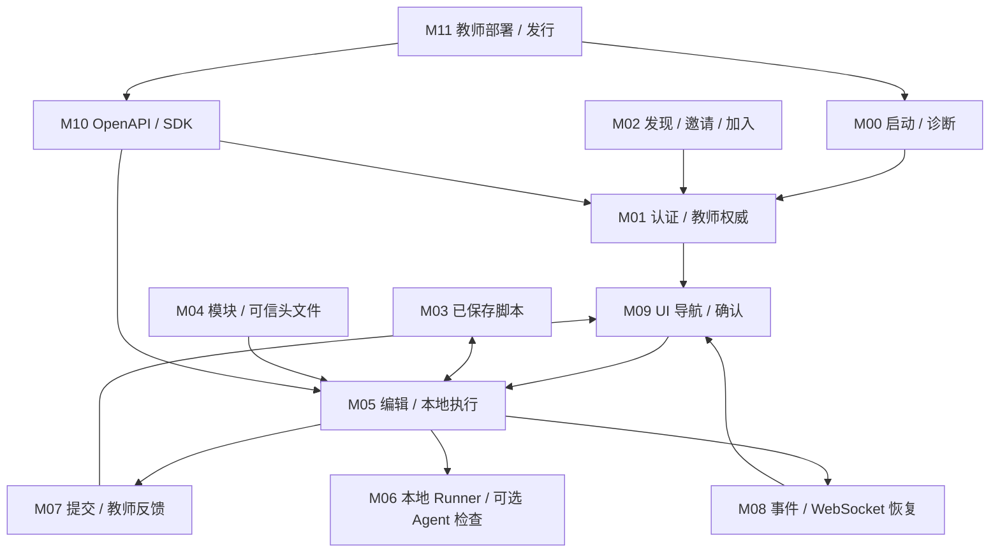
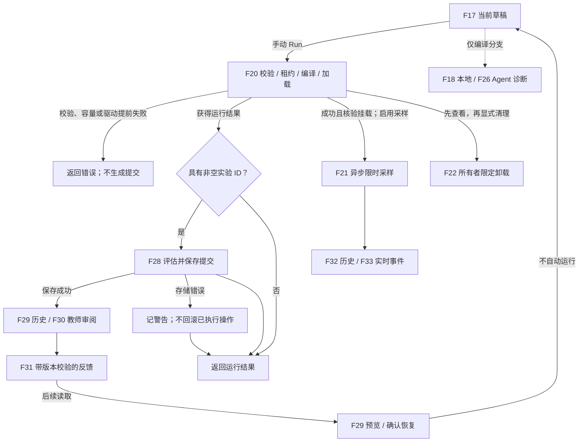

# 当前功能链路网络

[English](../en/functional-network.md) · [机器可读清单](../functional-network.json)

快照: **2026-09-13 · 0.3.8 · main@c26a529**. 完整源码提交: `c26a529aecc0ab64d0a1743be10972e5d8ac137b`.

这是一份**源码快照**，不是新一轮验收报告。枚举粒度是有限的用户可见功能链路与直接交接/依赖关系，不是全部内部函数、所有可能执行路径、已安装实例或真实局域网节点。

后续记录：[第 1 轮——学习与持久化](functional-network-bug-hunt-01.md) ·
[第 2 轮——Runner/Agent 生命周期](functional-network-bug-hunt-02.md) ·
[第 3 轮——浏览器编译诊断](functional-network-bug-hunt-03.md) ·
[第 4 轮——补全与手动头文件检查](functional-network-bug-hunt-04.md) ·
[第 5 轮——手动运行与挂载清理](functional-network-bug-hunt-05.md) ·
[第 6 轮——调试会话与事件恢复](functional-network-bug-hunt-06.md) ·
[第 7 轮——事件历史、导出与未读/删除操作](functional-network-bug-hunt-07.md) ·
[第 8 轮——事件保留与持久化顺序](functional-network-bug-hunt-08.md)。清单及其指纹保留为抓虫前基线，
漂移检查会如实报告后续修改的学习、Runner/Agent、浏览器、事件存储与检查入口，不把分轮结果当成全链路验收。

教师同时拥有教学与部署管理权；单人模式初始化自己的教师。`admin` 是兼容别名，`staff`/`admin` 路由组均要求教师权威。一个实例上的教师不会因此获得另一实例的教师权限。

**清单规模: 12 个模块 / 40 条功能链路 / 69 条有向连接 / 16 个页面 / 68 API / 48 个模板 / 5 个实验 / 2 个可加载模块清单.**

每个 API 只有一个主归属链路；共用关系通过连接和页面映射表达。JavaScript SDK 覆盖 63 个操作，另 5 个属于 Agent 协议。快照指纹覆盖 135 个明确引用的源码/证据文件，并非整个仓库。全部链路的验证标签均表示已枚举源码，不代表本轮动态执行过。

## 1. 网络总览



源码链接相对于仓库。Mermaid 图可在支持 Mermaid 的 Markdown 阅读器中查看；当前项目内课程阅读器会显示图的代码，并不会渲染成图。

### 本地运行及其非原子分支



记录创建与实时采样是独立副作用。到达记录阶段的编译/加载失败可以生成失败提交；校验/配额/驱动提前返回则不会。不带实验 ID 的运行不生成学习提交。后续教师反馈需要再次读取，没有专用推送。

## 2. 逐条功能链路

模块 ID 沿用已有[测试网络划分](testing-network.md)；F ID 表示产品功能链路，不是测试用例。以下源码链接及 JSON 指纹清单用于追溯。

### M00 · 基础与诊断

#### F01 · 启动与健康检查

链路: 启动器 → 配置校验 → AppState → 路由 → 健康检查.

边界 / 失败分支: 模式、清单或配置非法会阻止启动；健康响应不证明内核可运行。

源码: [start.sh](../../start.sh) · [src/state.rs](../../engine/src/state.rs) · [src/application.rs](../../engine/src/application.rs) · [routes/health.rs](../../engine/src/routes/health.rs)

#### F02 · 环境就绪诊断

链路: 帮助页 → 工具链/内核检查 + 用户 Runner 状态 → 报告.

边界 / 失败分支: 只读诊断，不自动安装工具或修复权限。

源码: [pages/helper.tsx](../../frontend/pages/helper.tsx) · [routes/helper.rs](../../engine/src/routes/helper.rs) · [services/environment_checker.rs](../../engine/src/services/environment_checker.rs)

#### F03 · 编译策略与性能指标

链路: 设置页 → 常驻缓存/按需模式 + 检查/补全指标 → 有界轮询.

边界 / 失败分支: 编译模式是实例级运行时状态；指标不是全链路分布式追踪。

源码: [pages/settings.tsx](../../frontend/pages/settings.tsx) · [routes/settings.rs](../../engine/src/routes/settings.rs) · [src/metrics.rs](../../engine/src/metrics.rs)

### M01 · 认证与账户生命周期

#### F04 · 自主注册

链路: 注册页 → 服务端策略/密码校验 → AuthService → TOTP 绑定信息.

边界 / 失败分支: 受注册开关限制；不能自选教师身份，注册不自动登录。

源码: [pages/register.tsx](../../frontend/pages/register.tsx) · [routes/auth.rs](../../engine/src/routes/auth.rs) · [auth_service/service.inc.rs](../../engine/src/services/auth_service/service.inc.rs)

#### F05 · TOTP 初始化

链路: OTP 设置页 → 初始化开关 → 密码验证 → 二维码/密钥.

边界 / 失败分支: 初始化需显式启用，不是任意凭据重置；本清单不收集敏感响应。

源码: [pages/otp-setup.tsx](../../frontend/pages/otp-setup.tsx) · [routes/auth.rs](../../engine/src/routes/auth.rs)

#### F06 · 登录与会话权威

链路: 密码 + TOTP → 限流/验证 → 会话持久化 → Cookie → me/路由鉴权.

边界 / 失败分支: 教师身份由服务端决定，单人默认教师；活跃 SQL 登录必须确认会话写入后才发 Cookie。

源码: [routes/auth.rs](../../engine/src/routes/auth.rs) · [routes/auth_session.rs](../../engine/src/routes/auth_session.rs) · [auth_service/sessions.inc.rs](../../engine/src/services/auth_service/sessions.inc.rs)

#### F07 · 退出登录

链路: 退出 → Origin 检查 → 撤销会话 → 清 Cookie → 登录页.

边界 / 失败分支: 存储变更未确认不得报成功；退出不会卸载内核程序。

源码: [utils/authSession.ts](../../frontend/src/utils/authSession.ts) · [routes/auth.rs](../../engine/src/routes/auth.rs) · [auth_service/sessions.inc.rs](../../engine/src/services/auth_service/sessions.inc.rs)

#### F08 · 修改密码

链路: 账户确认 → 当前密码 + OTP → 条件式持久化凭据更新 → 缓存.

边界 / 失败分支: 存储失败拒绝确认变更；当前修改密码不会撤销既有会话。

源码: [pages/account.tsx](../../frontend/pages/account.tsx) · [auth_service/account_mutations.inc.rs](../../engine/src/services/auth_service/account_mutations.inc.rs)

#### F09 · 删除账户

链路: 危险操作确认 → 密码 + OTP → 删除账户及会话 → 清 Cookie.

边界 / 失败分支: 拒绝删除默认教师/最后账户。删除认证数据不是脚本、提交、事件或内核挂载的跨服务清理。

源码: [pages/account.tsx](../../frontend/pages/account.tsx) · [routes/auth.rs](../../engine/src/routes/auth.rs) · [auth_service/account_mutations.inc.rs](../../engine/src/services/auth_service/account_mutations.inc.rs)

### M02 · 课堂接入

#### F10 · 发现并确认教师

链路: 教师链接 → well-known 文档 → 来源/课堂/协议/能力校验 → 确认.

边界 / 失败分支: 发现需启用；没有局域网扫描/mDNS。浏览器端非回环接入要求 HTTPS。

源码: [pages/join.tsx](../../frontend/pages/join.tsx) · [classroom/connection.js](../../frontend/src/features/classroom/connection.js) · [routes/classroom.rs](../../engine/src/routes/classroom.rs)

#### F11 · 签发与撤销邀请

链路: 教学页 → 绑定学生名的邀请 → 一次性令牌 → 列表/撤销.

边界 / 失败分支: 短期邀请摘要存内存；拒绝教师保留名；撤销邀请不撤销已建立账户/会话。

源码: [classroom/InvitationPanel.tsx](../../frontend/src/features/classroom/InvitationPanel.tsx) · [routes/classroom.rs](../../engine/src/routes/classroom.rs) · [services/classroom.rs](../../engine/src/services/classroom.rs)

#### F12 · 学生加入课堂

链路: 确认身份 + 邀请 + 用户名/密码 → 核销 → 创建账户 → 保存 TOTP → 正常登录.

边界 / 失败分支: 先核销再注册；冲突/失败不返还邀请。不自动登录、提权、注册 Agent，也没有两服务整体回滚。

源码: [pages/join.tsx](../../frontend/pages/join.tsx) · [routes/classroom.rs](../../engine/src/routes/classroom.rs) · [services/classroom.rs](../../engine/src/services/classroom.rs)

### M03 · 脚本存储

#### F13 · 已保存脚本生命周期

链路: 编辑器 → 列表/保存/删除 → 按所有者隔离的 ScriptStore → SQL 或本地 JSON → 显式载入草稿.

边界 / 失败分支: 保存不是执行。本地持久化完成后才发布缓存；损坏快照不被覆盖。

源码: [ebpf/useEbpfPageController.ts](../../frontend/src/features/ebpf/useEbpfPageController.ts) · [routes/scripts.rs](../../engine/src/routes/scripts.rs) · [services/script_store.rs](../../engine/src/services/script_store.rs) · [script_store/local.rs](../../engine/src/services/script_store/local.rs)

### M04 · 模块与头文件管理

#### F14 · 模块目录与生命周期

链路: 启动时发现 manifest → 模块清单 → start/stop 状态.

边界 / 失败分支: 内置两个 manifest；生命周期只改内存状态，不启动进程，也不作为 eBPF 执行授权开关。

源码: [routes/modules.rs](../../engine/src/routes/modules.rs) · [services/module_manager.rs](../../engine/src/services/module_manager.rs) · [modules/README.md](../../modules/README.md)

#### F15 · 结构化终端命令

链路: 终端解析 → 类型化命令 → 分发器 → 模块操作或跳转编辑器.

边界 / 失败分支: 不是 Shell；run_experiment 只返回编辑器路径，不执行代码。

源码: [pages/terminal.tsx](../../frontend/pages/terminal.tsx) · [terminal/command.ts](../../frontend/src/features/terminal/command.ts) · [services/command_dispatcher.rs](../../engine/src/services/command_dispatcher.rs)

#### F16 · 可信 C 头文件

链路: 目录 → 校验下载/选择/删除 → 已选元数据 → 本地检查/补全/运行注入.

边界 / 失败分支: 允许列表和摘要验证先于发布；选择为实例共享，不会自动传输到远程 Agent。

源码: [pages/modules.tsx](../../frontend/pages/modules.tsx) · [routes/c_headers.rs](../../engine/src/routes/c_headers.rs) · [services/c_header_module.rs](../../engine/src/services/c_header_module.rs) · [ebpf_loader/compiler_workspace.rs](../../engine/src/services/ebpf_loader/compiler_workspace.rs)

### M05 · 编辑器与本地 eBPF 链路

#### F17 · 模板、导入与编辑草稿

链路: 48 个模板/本地文件/会话草稿 → 预览或选择 → 确认替换 → 编辑器.

边界 / 失败分支: 切换实验、模板或源码不会隐式执行；过期导入与未确认导航受保护。

源码: [ebpf/useEbpfSafetyActions.ts](../../frontend/src/features/ebpf/useEbpfSafetyActions.ts) · [ebpf/useEbpfPageController.ts](../../frontend/src/features/ebpf/useEbpfPageController.ts) · [utils/pageState.ts](../../frontend/src/utils/pageState.ts) · [ebpf/template_catalog.inc.rs](../../engine/src/routes/ebpf/template_catalog.inc.rs)

#### F18 · 本地仅编译诊断

链路: 编辑器防抖/手动检查 → 源码校验 → Runner 检查许可/驱动 → clang → 诊断.

边界 / 失败分支: 不加载内核；容量、超时、后端不可用显式返回。本地静态提示仅作辅助。

源码: [ebpf/useCompilerDiagnostics.ts](../../frontend/src/features/ebpf/useCompilerDiagnostics.ts) · [ebpf/check.inc.rs](../../engine/src/routes/ebpf/check.inc.rs) · [services/runner_manager.rs](../../engine/src/services/runner_manager.rs) · [ebpf_loader/check.inc.rs](../../engine/src/services/ebpf_loader/check.inc.rs)

#### F19 · 语义补全

链路: Monaco 光标/源码 → 补全许可/驱动 → clang 建议 → 编辑器.

边界 / 失败分支: 独立且有界的补全容量；选择远程诊断不会迁移语义补全。

源码: [utils/cEbpfIntelligence.ts](../../frontend/src/utils/cEbpfIntelligence.ts) · [ebpf/completion.inc.rs](../../engine/src/routes/ebpf/completion.inc.rs) · [ebpf_loader/completion.inc.rs](../../engine/src/services/ebpf_loader/completion.inc.rs)

#### F20 · 本地内核执行

链路: 手动运行 → 源码校验 → 所有者租约 → 编译 → bpftool/Aya 加载 → 挂载核验 → 结果.

边界 / 失败分支: Linux 共享内核；编译成功、加载成功和挂载已核验是不同状态。部分程序类型需要独立挂载目标。

源码: [ebpf/handlers.inc.rs](../../engine/src/routes/ebpf/handlers.inc.rs) · [services/runner_driver.rs](../../engine/src/services/runner_driver.rs) · [ebpf_loader/core.inc.rs](../../engine/src/services/ebpf_loader/core.inc.rs) · [ebpf_loader/aya.inc.rs](../../engine/src/services/ebpf_loader/aya.inc.rs)

#### F21 · 调试探针与内核采样

链路: 可选调试行 → 插桩 → 核验挂载 → trace/ringbuf 采样 → EventBus → 断点/事件视图.

边界 / 失败分支: 追踪探针不暂停内核。符合条件的 bpftool tracepoint 运行在挂载不受支持时可触发受保护的 Aya 重试；采样有时限且异步。

源码: [ebpf_loader/debug.inc.rs](../../engine/src/services/ebpf_loader/debug.inc.rs) · [ebpf/stream.inc.rs](../../engine/src/routes/ebpf/stream.inc.rs) · [ebpf/ringbuf.inc.rs](../../engine/src/routes/ebpf/ringbuf.inc.rs) · [ebpf/useBreakpointHitStream.ts](../../frontend/src/features/ebpf/useBreakpointHitStream.ts)

#### F22 · 挂载清单与卸载

链路: 刷新所有者挂载清单 → 检查精确 pin/详情 → 确认卸载 → 驱动清理/核验.

边界 / 失败分支: 不依赖活跃运行容量；越权或驱动不可用不能伪装成本地清理成功。

源码: [ebpf/detachTarget.ts](../../frontend/src/features/ebpf/detachTarget.ts) · [ebpf/attachments.inc.rs](../../engine/src/routes/ebpf/attachments.inc.rs) · [services/runner_driver.rs](../../engine/src/services/runner_driver.rs)

### M06 · Runner 与 Agent 作业

#### F23 · Runner 容量与所有权

链路: 状态/总览 → 全局及用户租约计数 → 所有者核验后驱动分发 → RAII 释放.

边界 / 失败分支: 当前执行模式为 local_process。配额是资源控制而非隔离；租约释放不等于内核卸载。

源码: [routes/runner.rs](../../engine/src/routes/runner.rs) · [services/runner_manager.rs](../../engine/src/services/runner_manager.rs) · [services/runner_driver.rs](../../engine/src/services/runner_driver.rs)

#### F24 · Agent 注册与存活状态

链路: 引导 Bearer → 注册/轮换凭据 → HMAC 心跳 → 健康/过期注册表 → 清单.

边界 / 失败分支: 未配置时关闭；时间戳、nonce、身份和正文绑定拒绝重放。Agent 身份不是浏览器教师会话。

源码: [routes/runner_agent.rs](../../engine/src/routes/runner_agent.rs) · [services/runner_agent_registry.rs](../../engine/src/services/runner_agent_registry.rs) · [services/runner_agent_authenticator.rs](../../engine/src/services/runner_agent_authenticator.rs) · [services/runner_agent_client.rs](../../engine/src/services/runner_agent_client.rs)

#### F25 · Agent 作业生命周期

链路: 教师探测/编译提交 → 队列 → 签名领取与租约 → 隔离执行器 → 同步/结果或取消/过期.

边界 / 失败分支: 作业在内存中；租约身份拒绝过期结果；编译作业只返回报告，不加载内核或返回可执行目标文件。

源码: [routes/runner_job.rs](../../engine/src/routes/runner_job.rs) · [services/runner_job_queue.rs](../../engine/src/services/runner_job_queue.rs) · [services/runner_agent_executor.rs](../../engine/src/services/runner_agent_executor.rs) · [bin/cyanrex-runner-agent.rs](../../engine/src/bin/cyanrex-runner-agent.rs)

#### F26 · 远程编译诊断

链路: 选择合格后端 → 按所有者绑定的作业提交 → Agent 编译报告 → 轮询/诊断/取消.

边界 / 失败分支: 仅接受健康、非 shared_kernel 且支持 clang_check 的 Agent。没有远程运行、远程补全、自动头文件复制或静默本地重试。

源码: [ebpf/useCompileBackends.ts](../../frontend/src/features/ebpf/useCompileBackends.ts) · [ebpf/useCompilerDiagnostics.ts](../../frontend/src/features/ebpf/useCompilerDiagnostics.ts) · [ebpf/remote_check.inc.rs](../../engine/src/routes/ebpf/remote_check.inc.rs)

### M07 · 学习与教师反馈

#### F27 · 课程与实验导航

链路: 学习中心 → 五个实验定义/进度 + 本地化 Markdown → 显式跳转编辑器.

边界 / 失败分支: 课程文件是公开静态资源；导航本身不载入模板，也不运行实验。

源码: [learn/index.tsx](../../frontend/pages/learn/index.tsx) · [learn/[...slug].tsx](../../frontend/pages/learn/[...slug].tsx) · [services/learning_catalog.rs](../../engine/src/services/learning_catalog.rs) · [scripts/sync-course-docs.mjs](../../frontend/scripts/sync-course-docs.mjs)

#### F28 · 评估并记录运行

链路: 返回的运行结果 + 实验/源码/挂载证据 → 结构化评估 → LearningStore → 学习事件.

边界 / 失败分支: 仅带实验 ID 且到达 record_learning_run 的运行被记录。校验/配额/驱动提前返回跳过记录；持久化失败只记警告，不撤销执行。

源码: [ebpf/learning.inc.rs](../../engine/src/routes/ebpf/learning.inc.rs) · [services/learning_catalog.rs](../../engine/src/services/learning_catalog.rs) · [learning_store/attempt.rs](../../engine/src/services/learning_store/attempt.rs) · [services/learning_source.rs](../../engine/src/services/learning_source.rs)

#### F29 · 提交历史与恢复

链路: 历史 → 所有者绑定的提交查询 → 源码/反馈预览 → 确认恢复草稿 → 可选的新手动运行.

边界 / 失败分支: 外部所有者/不存在的记录统一 404；恢复历史不运行也不卸载；SQL 读取失败不以陈旧本地成功代替。

源码: [learning/AttemptResumePanel.tsx](../../frontend/src/features/learning/AttemptResumePanel.tsx) · [learning/resumeAttempt.ts](../../frontend/src/features/learning/resumeAttempt.ts) · [routes/learning.rs](../../engine/src/routes/learning.rs) · [learning_store/queries.rs](../../engine/src/services/learning_store/queries.rs)

#### F30 · 教师总览与审阅

链路: 学习快照 → 学生过滤总览 → 所选学生近期提交 → 审阅.

边界 / 失败分支: 独立教师 API；普通学生接口即使教师调用也绑定自身。总览不是完整账户目录。

源码: [pages/teaching.tsx](../../frontend/pages/teaching.tsx) · [routes/learning.rs](../../engine/src/routes/learning.rs) · [learning_store/queries.rs](../../engine/src/services/learning_store/queries.rs)

#### F31 · 带版本校验的教师反馈

链路: 审阅草稿 + 期望版本 → 反馈 CAS → 持久化版本 → 学生读取当前反馈.

边界 / 失败分支: 版本冲突返回 409，不静默覆盖。学生通过后续读取看到反馈，没有专用反馈推送通道。

源码: [learning/TeacherFeedback.tsx](../../frontend/src/features/learning/TeacherFeedback.tsx) · [routes/learning.rs](../../engine/src/routes/learning.rs) · [learning_store/feedback.rs](../../engine/src/services/learning_store/feedback.rs)

### M08 · 事件与恢复

#### F32 · 事件历史与导出

链路: 所有者/分类/级别/时间筛选 → 有界事件查询 → 展示或 JSON/CSV 导出.

边界 / 失败分支: SQL 与有界内存是不同存储路径；导出历史不是完整、持久的执行审计。

源码: [pages/events.tsx](../../frontend/pages/events.tsx) · [routes/events.rs](../../engine/src/routes/events.rs) · [services/event_bus_filter.rs](../../engine/src/services/event_bus_filter.rs) · [services/event_bus_db.rs](../../engine/src/services/event_bus_db.rs)

#### F33 · 实时事件传送与恢复

链路: EventBus 扇出 → 会话/Origin 校验的 WebSocket → 防重叠快照恢复/退避.

边界 / 失败分支: 落后时以 1013 关闭且慢发送有时限；恢复仅在保留历史内尽力进行，不是持久重放或恰好一次传送。

源码: [events/stream.rs](../../engine/src/routes/events/stream.rs) · [event_bus/subscriptions.rs](../../engine/src/services/event_bus/subscriptions.rs) · [events/eventStream.ts](../../frontend/src/features/events/eventStream.ts)

#### F34 · 未读状态

链路: 发布/已读标记 → 未读数量 → 侧栏标记 → 标为已读.

边界 / 失败分支: 按所有者隔离；标为已读不删除保留事件。

源码: [components/SidebarLayout.tsx](../../frontend/src/components/SidebarLayout.tsx) · [routes/events.rs](../../engine/src/routes/events.rs) · [services/event_bus.rs](../../engine/src/services/event_bus.rs)

#### F35 · 限定范围的事件删除

链路: 审阅精确筛选范围 → 危险确认 → 严格解析 → 删除匹配项 → 刷新.

边界 / 失败分支: 非法筛选返回 400，不扩大成全删；未匹配项及其已读状态保留。

源码: [events/deleteScope.ts](../../frontend/src/features/events/deleteScope.ts) · [pages/events.tsx](../../frontend/pages/events.tsx) · [routes/events.rs](../../engine/src/routes/events.rs) · [event_bus/deletion.rs](../../engine/src/services/event_bus/deletion.rs)

#### F36 · 事件保留策略

链路: 读写自身最大记录数 + drop_oldest/drop_new → 保留策略 → 后续历史/发布行为.

边界 / 失败分支: 设置页仅教师可见，但此 API 对已登录用户按自身开放；内存保留有界，不是归档存储。

源码: [pages/settings.tsx](../../frontend/pages/settings.tsx) · [routes/settings.rs](../../engine/src/routes/settings.rs) · [services/event_bus_policy.rs](../../engine/src/services/event_bus_policy.rs)

### M09 · UI 导航与操作安全

#### F37 · 导航、确认与本地状态

链路: 感知会话的界面外壳 → 按角色导航 → 绑定目标的确认 → 请求 → 本地草稿/筛选/语言状态.

边界 / 失败分支: 客户端控制补充而不替代服务端鉴权；导航可清未确认操作，不能撤回已发出的工作。Dashboard 当前是引导页，不主动轮询健康。

源码: [components/SidebarLayout.tsx](../../frontend/src/components/SidebarLayout.tsx) · [components/useConfirmedAction.tsx](../../frontend/src/components/useConfirmedAction.tsx) · [utils/pageState.ts](../../frontend/src/utils/pageState.ts) · [i18n/context.tsx](../../frontend/src/i18n/context.tsx) · [pages/dashboard.tsx](../../frontend/pages/dashboard.tsx)

### M10 · API 契约与 SDK

#### F38 · API 契约与 SDK 消费者

链路: Axum 路由/权限 → OpenAPI → 生成类型/63 个操作 → SDK Cookie/Origin/错误 → Engine.

边界 / 失败分支: 68 个 API 含 SDK 之外的 5 个 Agent 接口；前端 fetch hooks 是独立消费者，不应画成必经 SDK。

源码: [scripts/openapi-contract.mjs](../../scripts/openapi-contract.mjs) · [openapi/openapi.json](../../engine/openapi/openapi.json) · [src/index.ts](../../sdk-js/src/index.ts) · [generated/operations.ts](../../sdk-js/src/generated/operations.ts)

### M11 · 部署与发行工具

#### F39 · 经确认的 SSH 部署

链路: SSH plan → 审阅精确目标/主机密钥 → apply → 校验预装包 → 允许的远端动作.

边界 / 失败分支: 当前 SSH 流程管理已经安装的 Linux 离线包；没有包上传、裸机初始化或自动 TLS 配置。

源码: [cyanrex-release/ssh_cli.rs](../../engine/src/bin/cyanrex-release/ssh_cli.rs) · [en/classroom-connection.md](../../docs/en/classroom-connection.md)

#### F40 · 构建、验收与发行证据

链路: 质量/契约 → 离线包 → 元数据/校验和验证 → 安全解包/安装冒烟 → 候选包绑定内核证据.

边界 / 失败分支: 校验和绑定字节，不证明发行者身份。CI 定义或历史报告不能证明当前部署或新的内核验收。

源码: [scripts/quality-gate.sh](../../scripts/quality-gate.sh) · [scripts/package-distribution.sh](../../scripts/package-distribution.sh) · [cyanrex-release/candidate.rs](../../engine/src/bin/cyanrex-release/candidate.rs) · [cyanrex-release/package.rs](../../engine/src/bin/cyanrex-release/package.rs) · [workflows/release-validation.yml](../../.github/workflows/release-validation.yml)

## 3. 链路之间的直接连接

连接表示一种关系，不等于自动顺序执行。`manual-handoff`、`conditional-*`、`confirmation`、`read-model` 不能理解为无条件调用。认证和 UI 操作安全横切多个模块；完整路由权限以 API 表为准。

| ID | 起点 → 终点 | 关系 | 传递状态 / 条件 |
|---|---|---|---|
| E01 | F40 → F39 | prerequisite | 已校验且预装的发行包 |
| E02 | F39 → F01 | control | 经审阅的 up/down/status 动作 |
| E03 | F01 → F06 | initialization | 种子本地教师并初始化认证 |
| E04 | F01 → F14 | initialization | 校验并发现 manifest |
| E05 | F01 → F24 | initialization | 可选 Agent 注册表配置 |
| E06 | F01 → F10 | initialization | 可选课堂发现配置 |
| E07 | F02 → F23 | read | 环境报告中的用户容量 |
| E08 | F02 → F20 | advisory | 就绪报告供后续手动运行参考 |
| E09 | F11 → F10 | handoff | 教师分发邀请入口链接 |
| E10 | F10 → F12 | prerequisite | 已确认教师身份及兼容协议 |
| E11 | F11 → F12 | authorization | 绑定学生的一次性邀请 |
| E12 | F12 → F06 | manual-handoff | 保存入学 TOTP 后正常登录 |
| E13 | F04 → F06 | manual-handoff | 保存注册 TOTP 后正常登录 |
| E14 | F05 → F06 | manual-handoff | 初始化 TOTP 后正常登录 |
| E15 | F06 → F37 | authorization | 服务端会话与角色进入 UI 外壳 |
| E16 | F37 → F07 | control | 具有进行中/错误保护的退出 |
| E17 | F37 → F08 | confirmation | 审阅密码修改 |
| E18 | F37 → F09 | confirmation | 审阅账户删除 |
| E19 | F27 → F17 | manual-handoff | 实验上下文及显式选择的模板 |
| E20 | F13 → F17 | manual-handoff | 载入选定的已保存脚本 |
| E21 | F29 → F17 | manual-handoff | 恢复已审阅的历史源码 |
| E22 | F17 → F13 | write | 显式保存/删除动作 |
| E23 | F17 → F18 | request | 防抖或手动本地诊断 |
| E24 | F17 → F19 | request | 光标触发的语义补全 |
| E25 | F17 → F26 | conditional-request | 在显式选定 Agent 上诊断 |
| E26 | F17 → F20 | manual-handoff | 显式 Run；检查不触发运行 |
| E27 | F16 → F18 | dependency | 已选头文件进入本地诊断 |
| E28 | F16 → F19 | dependency | 已选头文件进入本地补全 |
| E29 | F16 → F20 | dependency | 已选头文件进入本地编译/加载 |
| E30 | F03 → F18 | configuration | 常驻诊断缓存策略 |
| E31 | F03 → F19 | configuration | 常驻补全缓存策略 |
| E32 | F18 → F03 | observation | 检查耗时/缓存/拒绝计数 |
| E33 | F19 → F03 | observation | 补全耗时/缓存/拒绝计数 |
| E34 | F18 → F23 | admission | 独立检查许可与驱动时限 |
| E35 | F19 → F23 | admission | 独立补全许可与驱动时限 |
| E36 | F20 → F23 | admission | 所有者绑定的执行租约 |
| E37 | F22 → F23 | dependency | 同一已选驱动，无需执行租约 |
| E38 | F20 → F21 | conditional-async | 挂载核验成功且启用调试/采样 |
| E39 | F20 → F22 | state | 挂载可供查看；清理须显式执行 |
| E40 | F20 → F28 | conditional-write | 具有实验 ID 且运行到达记录阶段 |
| E41 | F20 → F32 | publication | 平台生命周期事件 |
| E42 | F21 → F32 | publication | 保留历史中的内核/调试采样 |
| E43 | F21 → F33 | publication | 按所有者隔离的实时采样 |
| E44 | F28 → F32 | publication | 存储成功后的学习尝试/完成事件 |
| E45 | F28 → F27 | read-model | 提交参与实验进度聚合 |
| E46 | F28 → F29 | read-model | 持久化提交供历史读取 |
| E47 | F28 → F30 | read-model | 学生提交参与教师总览 |
| E48 | F30 → F31 | manual-handoff | 选定学生提交及期望版本 |
| E49 | F31 → F29 | read-model | 后续历史读取包含当前反馈 |
| E50 | F24 → F25 | authorization | Agent 身份、能力与新鲜度 |
| E51 | F24 → F26 | discovery | 合格健康的远程编译器列表 |
| E52 | F26 → F25 | request | 所有者绑定的编译作业，不是远程运行 |
| E53 | F25 → F26 | result | 终态编译报告或失败/取消 |
| E54 | F33 → F32 | recovery | 重连/落后时获取快照 |
| E55 | F32 → F34 | control | 事件页将所见流/历史标为已读 |
| E56 | F33 → F34 | control | 实时到达更新已读/徽标流程 |
| E57 | F35 → F32 | mutation | 删除匹配历史并刷新视图 |
| E58 | F35 → F34 | mutation | 协调未读状态，不更改未匹配项 |
| E59 | F36 → F32 | configuration | 保留/溢出策略影响保留历史 |
| E60 | F36 → F34 | configuration | 保留记录影响未读数量 |
| E61 | F37 → F35 | confirmation | 固定已审阅的删除范围 |
| E62 | F37 → F22 | confirmation | 固定精确审阅的挂载目标 |
| E63 | F37 → F13 | confirmation | 保护破坏性的脚本操作 |
| E64 | F15 → F14 | dispatch | 类型化模块列表/启动/停止命令 |
| E65 | F15 → F17 | manual-handoff | run_experiment 只跳转编辑器 |
| E66 | F38 → F06 | client | SDK Cookie/Origin/会话传输 |
| E67 | F38 → F20 | client | SDK 运行调用使用相同受保护 API |
| E68 | F38 → F33 | client | SDK 构造供认证连接使用的 WebSocket URL |
| E69 | F40 → F38 | verification | 路由/OpenAPI/SDK 漂移与消费者检查 |


## 4. 持久化与生命周期边界

### D01 · 认证

F04, F05, F06, F07, F08, F09, F12 → PostgreSQL users/sessions；显式内存配置/降级路径.

原始会话令牌只放 HttpOnly Cookie，SQL 存摘要。活跃 SQL 登录需要确认插入；配置了持久化的账户变更拒绝未确认写入。现有降级不提供跨进程撤销协调。

源码: [auth_service/service.inc.rs](../../engine/src/services/auth_service/service.inc.rs) · [auth_service/sessions.inc.rs](../../engine/src/services/auth_service/sessions.inc.rs) · [auth_service/account_mutations.inc.rs](../../engine/src/services/auth_service/account_mutations.inc.rs)

### D02 · 脚本

F13 → PostgreSQL user_scripts 或实例本地私有 JSON.

按所有者操作；本地准入 → 加载 → 私有临时文件/写入/rename → 发布缓存。没有跨进程文件锁，单靠 rename 不保证掉电持久性。

源码: [services/script_store.rs](../../engine/src/services/script_store.rs) · [script_store/local.rs](../../engine/src/services/script_store/local.rs)

### D03 · 提交与反馈

F27, F28, F29, F30, F31 → PostgreSQL learning_attempts 或本地共享 JSON 快照.

本地写入串行化与反馈版本协调单进程。提交持久化、内核副作用、事件发布不是一个事务。

源码: [services/learning_store.rs](../../engine/src/services/learning_store.rs) · [learning_store/persistence.rs](../../engine/src/services/learning_store/persistence.rs) · [learning_store/feedback.rs](../../engine/src/services/learning_store/feedback.rs)

### D04 · 事件历史与未读

F20, F21, F28, F32, F33, F34, F35, F36 → 按所有者有界内存、订阅，以及经持久化 worker 写入的 PostgreSQL event_records/event_user_settings.

实时发布不是 SQL 提交回执。溢出、落后、删除与保留策略限制历史；本清单不证明队列/重启/故障切换一致性。

源码: [services/event_bus.rs](../../engine/src/services/event_bus.rs) · [services/event_bus_db.rs](../../engine/src/services/event_bus_db.rs) · [event_bus/event_bus_schema.rs](../../engine/src/services/event_bus/event_bus_schema.rs) · [event_bus/subscriptions.rs](../../engine/src/services/event_bus/subscriptions.rs)

### D05 · 头文件与编译文件

F16, F18, F19, F20 → 可信下载/选择元数据；临时所有者/实例工作目录.

已验证头文件为实例共享。本地工作区/缓存与 Agent 隔离编译文件系统是不同环境。

源码: [services/c_header_module.rs](../../engine/src/services/c_header_module.rs) · [ebpf_loader/compiler_workspace.rs](../../engine/src/services/ebpf_loader/compiler_workspace.rs) · [services/runner_agent_executor.rs](../../engine/src/services/runner_agent_executor.rs)

### D06 · 临时控制状态

F03, F10, F11, F14, F23, F24, F25, F26 → 进程内邀请、模块状态、Runner 租约、Agent 凭据/nonce/作业、编译模式/缓存与指标.

重启不等于恢复这些控制对象；没有多 Engine 调度器/注册表协调。

源码: [src/state.rs](../../engine/src/state.rs) · [services/classroom.rs](../../engine/src/services/classroom.rs) · [services/runner_agent_registry.rs](../../engine/src/services/runner_agent_registry.rs) · [services/runner_job_queue.rs](../../engine/src/services/runner_job_queue.rs) · [services/module_manager.rs](../../engine/src/services/module_manager.rs)

### D07 · 浏览器状态

F17, F29, F37 → sessionStorage 草稿/筛选/报告；localStorage 语言；单独管理的 HttpOnly 会话 Cookie.

浏览器缓存不是服务端提交或秘密保险箱；确认恢复会替换当前草稿，但不执行它。

源码: [utils/pageState.ts](../../frontend/src/utils/pageState.ts) · [i18n/context.tsx](../../frontend/src/i18n/context.tsx) · [learning/AttemptResumePanel.tsx](../../frontend/src/features/learning/AttemptResumePanel.tsx)

### D08 · 内核资源

F20, F21, F22, F23 → 本地 Linux 内核、bpffs 所有者/实例 pin、Aya 持有的 link/map.

HTTP 成功返回、采样到期、租约释放、退出和模块停止不等于显式 detach。命名空间/配额不能生成独立内核。

源码: [services/ebpf_loader.rs](../../engine/src/services/ebpf_loader.rs) · [ebpf_loader/attach.inc.rs](../../engine/src/services/ebpf_loader/attach.inc.rs) · [ebpf_loader/aya.inc.rs](../../engine/src/services/ebpf_loader/aya.inc.rs) · [ebpf/attachments.inc.rs](../../engine/src/routes/ebpf/attachments.inc.rs)

## 5. 全部前端页面入口

16 个入口不计 `_app.tsx` 和框架生成的 404/error 页面。使用 SidebarLayout 的页面还共享 F06/F07/F34/F37。静态课程资源公开，但课程阅读 UI 要求会话。`/dashboard` 目前是引导页；`/modules` 是 C 头文件管理页，模块生命周期通过 Terminal/API 暴露。

| 页面 / 源码 | UI 权限 | 功能链路 |
|---|---|---|
| [`/account`](../../frontend/pages/account.tsx) | authenticated | F08, F09 |
| [`/dashboard`](../../frontend/pages/dashboard.tsx) | authenticated | F37 |
| [`/ebpf`](../../frontend/pages/ebpf.tsx) | authenticated | F13, F16, F17, F18, F19, F20, F21, F22, F26, F29 |
| [`/events`](../../frontend/pages/events.tsx) | authenticated | F32, F33, F34, F35 |
| [`/helper`](../../frontend/pages/helper.tsx) | authenticated | F02, F23 |
| [`/`](../../frontend/pages/index.tsx) | public | F37 |
| [`/join`](../../frontend/pages/join.tsx) | public | F10, F12 |
| [`/learn/[...slug]`](../../frontend/pages/learn/[...slug].tsx) | authenticated | F27 |
| [`/learn`](../../frontend/pages/learn/index.tsx) | authenticated | F27, F29 |
| [`/login`](../../frontend/pages/login.tsx) | public | F06 |
| [`/modules`](../../frontend/pages/modules.tsx) | teacher | F16 |
| [`/otp-setup`](../../frontend/pages/otp-setup.tsx) | public | F05 |
| [`/register`](../../frontend/pages/register.tsx) | public | F04 |
| [`/settings`](../../frontend/pages/settings.tsx) | teacher | F03, F24, F25, F36 |
| [`/teaching`](../../frontend/pages/teaching.tsx) | teacher | F11, F30, F31 |
| [`/terminal`](../../frontend/pages/terminal.tsx) | teacher | F14, F15 |


## 6. 全部 Engine API 操作

下表权限值保留路由/OpenAPI 原始标签。`staff` 与 `admin` 都代表教师权威，不是两级管理者。`authenticated` 写操作检查 Origin/Referer CSRF；WebSocket GET 也检查 Origin。`optional-session-csrf` 不要求登录，但仍执行 CSRF 策略。Agent 引导使用独立 Bearer 凭据，其余四个 Agent 操作使用签名请求。公开注册/初始化接口仍受开关限制。CORS 不是认证。

| 操作 | 路由权限 | 主归属链路 |
|---|---|---|
| `GET /` | public | F01 |
| `GET /.well-known/cyanrex-classroom` | public | F10 |
| `GET /auth/me` | public | F06 |
| `GET /classroom/invitations` | admin | F11 |
| `GET /ebpf/attachments` | authenticated | F22 |
| `GET /ebpf/attachments/details` | authenticated | F22 |
| `GET /ebpf/check/backends` | authenticated | F26 |
| `GET /ebpf/check/remote` | authenticated | F26 |
| `GET /ebpf/templates` | authenticated | F17 |
| `GET /events` | authenticated | F32 |
| `GET /events/export` | authenticated | F32 |
| `GET /events/unread-count` | authenticated | F34 |
| `GET /health` | public | F01 |
| `GET /helper/environment` | authenticated | F02 |
| `GET /learning/attempt` | authenticated | F29 |
| `GET /learning/attempts` | authenticated | F29 |
| `GET /learning/labs` | authenticated | F27 |
| `GET /learning/teacher/attempts` | staff | F30 |
| `GET /learning/teacher/overview` | staff | F30 |
| `GET /modules` | staff | F14 |
| `GET /modules/c-headers/catalog` | staff | F16 |
| `GET /modules/c-headers/selected-metadata` | authenticated | F16 |
| `GET /openapi.json` | public | F38 |
| `GET /runner/agents` | admin | F24 |
| `GET /runner/jobs` | admin | F25 |
| `GET /runner/overview` | admin | F23 |
| `GET /runner/status` | authenticated | F23 |
| `GET /scripts` | authenticated | F13 |
| `GET /settings/compiler` | admin | F03 |
| `GET /settings/events` | authenticated | F36 |
| `GET /settings/performance` | admin | F03 |
| `GET /ws/events` | authenticated | F33 |
| `POST /auth/delete` | authenticated | F09 |
| `POST /auth/login` | public | F06 |
| `POST /auth/logout` | optional-session-csrf | F07 |
| `POST /auth/password/change` | authenticated | F08 |
| `POST /auth/register` | public | F04 |
| `POST /auth/totp/bootstrap` | public | F05 |
| `POST /classroom/invitations` | admin | F11 |
| `POST /classroom/invitations/revoke` | admin | F11 |
| `POST /classroom/join` | optional-session-csrf | F12 |
| `POST /command` | admin | F15 |
| `POST /ebpf/check` | authenticated | F18 |
| `POST /ebpf/check/remote` | authenticated | F26 |
| `POST /ebpf/check/remote/cancel` | authenticated | F26 |
| `POST /ebpf/complete` | authenticated | F19 |
| `POST /ebpf/detach` | authenticated | F22 |
| `POST /ebpf/run` | authenticated | F20 |
| `POST /events/delete` | authenticated | F35 |
| `POST /events/mark-read` | authenticated | F34 |
| `POST /learning/teacher/feedback` | staff | F31 |
| `POST /modules/c-headers/delete` | admin | F16 |
| `POST /modules/c-headers/download` | admin | F16 |
| `POST /modules/c-headers/select` | admin | F16 |
| `POST /modules/start` | admin | F14 |
| `POST /modules/stop` | admin | F14 |
| `POST /runner/agent/heartbeat` | runner-agent-signed | F24 |
| `POST /runner/agent/jobs/claim` | runner-agent-signed | F25 |
| `POST /runner/agent/jobs/result` | runner-agent-signed | F25 |
| `POST /runner/agent/jobs/sync` | runner-agent-signed | F25 |
| `POST /runner/agent/register` | runner-agent-bootstrap | F24 |
| `POST /runner/jobs/cancel` | admin | F25 |
| `POST /runner/jobs/compile-check` | admin | F25 |
| `POST /runner/jobs/probe` | admin | F25 |
| `POST /scripts/delete` | authenticated | F13 |
| `POST /scripts/save` | authenticated | F13 |
| `POST /settings/compiler` | admin | F03 |
| `POST /settings/events` | authenticated | F36 |


权威来源: [application.rs](../../engine/src/application.rs), [auth_session.rs](../../engine/src/routes/auth_session.rs), [OpenAPI](../../engine/openapi/openapi.json). HEAD/OPTIONS 协议处理、静态文件与 Next.js 框架路由不另计为 Engine 操作。

## 7. 内置目录

这里列出内置源码目录，不是对运行中 Engine 的查询。实例可能配置不同模块目录，也可能拥有不同头文件/Agent。模块 manifest 版本与项目发行版本分别维护。

### 模块

| 清单 | 版本 | 声明能力 |
|---|---|---|
| [module-ebpf](../../modules/module-ebpf/module.json) | 0.3.1 | `ebpf.attach`, `ebpf.detach`, `ebpf.events` |
| [module-network](../../modules/module-network/module.json) | 0.3.1 | `network.events`, `event.publish` |


[module-protocol](../../modules/module-protocol/README.md) 仅有约定文档，没有 manifest 不会被发现。目录生命周期不启动模块进程。

### 实验

| ID | 要求模板 | 要求核验挂载 |
|---|---|---|
| [01-first-program](labs/01-first-program.md) | `xdp-pass` | 否 |
| [02-trace-execve](labs/02-trace-execve.md) | `tracepoint-sys-enter` | 是 |
| [03-map-counter](labs/03-map-counter.md) | `ringbuf-hi-freq-sampler` | 是 |
| [04-ring-buffer](labs/04-ring-buffer.md) | `ringbuf-skeleton` | 是 |
| [05-verifier-debugging](labs/05-verifier-debugging.md) | 无固定模板 | 否 |


### 全部 48 个模板

[templates.inc.rs](../../engine/src/routes/ebpf/templates.inc.rs)

`xdp-pass` · `tracepoint-sys-enter` · `tracepoint-execve-counter` · `kprobe-openat-counter` · `kprobe-openat-argv` · `kretprobe-openat-ret` · `kprobe-connect-counter` · `kretprobe-connect-ret` · `ringbuf-skeleton` · `xdp-packet-counter` · `xdp-tcp4-counter` · `xdp-icmp-pass-scope` · `ringbuf-hi-freq-sampler` · `ringbuf-syscall-beacon` · `ringbuf-process-beacon`

[templates_learning.inc.rs](../../engine/src/routes/ebpf/templates_learning.inc.rs)

`xdp-ipv4-protocol-meter` · `xdp-large-packet-counter` · `kprobe-openat-by-uid` · `kretprobe-read-latency-beacon` · `ringbuf-openat-latency-beacon` · `xdp-dns-udp4-meter` · `xdp-ipv4-frag-sampler` · `kprobe-sendto-bytes-band` · `kretprobe-connect-latency-beacon` · `tracepoint-openat-sample-beacon`

[templates_learning_plus.inc.rs](../../engine/src/routes/ebpf/templates_learning_plus.inc.rs)

`xdp-ttl-meter` · `xdp-tcp-rst-beacon` · `kprobe-write-fd-band` · `kretprobe-write-latency-beacon` · `tracepoint-sys_enter_read-sample-beacon`

[templates_learning_plus2.inc.rs](../../engine/src/routes/ebpf/templates_learning_plus2.inc.rs)

`xdp-ipv4-tos-meter` · `xdp-udp-large-payload-meter` · `kprobe-close-by-uid` · `kretprobe-close-latency-beacon` · `tracepoint-sched-process-exec-beacon`

[templates_learning_plus3.inc.rs](../../engine/src/routes/ebpf/templates_learning_plus3.inc.rs)

`xdp-icmp-type-meter` · `kprobe-mmap-len-band` · `kretprobe-accept-latency-beacon` · `ringbuf-sched-switch-beacon` · `tracepoint-sys-enter-nanosleep-beacon`

[templates_more.inc.rs](../../engine/src/routes/ebpf/templates_more.inc.rs)

`ringbuf-process-fork-beacon` · `xdp-dns-block-sample` · `kretprobe-openat-fail-alert` · `xdp-tcp-sample-beacon` · `xdp-tcp-syn-beacon` · `kretprobe-connect-latency-alert` · `tracepoint-execve-sample-beacon` · `xdp-icmpv4-sample-beacon`

## 8. 特别重要的未连接部分与非保证

1. 远程诊断没有连通远程内核运行、远程语义补全或教师已选头文件复制。
2. 浏览器/特权 Engine 分层已实现；独立隔离的教师控制服务、每学生 VM 生命周期尚未实现。
3. 服务发现指教师发布链接并由学生确认，不是自动 LAN/mDNS 发现或证书签发。
4. SSH 管理预装包，不上传或执行首次安装；它与学生加入、Agent 引导是三条不同的认证链。
5. 模块 start/stop 只改变内存目录状态；module-protocol 没有 manifest，能力声明本身也不构成网络采集服务。
6. 修改密码当前不撤销既有会话。删除认证账户不等于清除全项目数据；默认教师与最后账户受保护。
7. 运行成功、挂载核验、采样活跃、提交已存、事件已保留、教师已审阅是不同状态。
8. Runner 租约释放、采样窗口到期、退出登录、目录模块停止均不意味着内核已卸载。
9. 内核执行、邀请核销/创建账户、提交记录与事件发布没有共享事务。
10. WebSocket 仅在保留历史范围内尽力恢复，不是持久审计日志、可重放游标或恰好一次事件流。
11. 邀请、Agent 注册表/作业、模块状态、指标和缓存不是持久化的多 Engine 控制状态。
12. 公开资源与导航不是安全边界；服务端会话、所有者、教师、Agent 校验才是权威。


## 9. 证据与维护

本轮校验清单结构、路由/权限/SDK 对齐、页面覆盖、目录 ID 与源码指纹。**不执行** PostgreSQL、真实教师/学生局域网流程、SSH 部署、内核挂载/卸载或浏览器到 Engine 的验收。历史 [2026-09-09 修复验证](../../reports/acceptance/2026-09-09-boundary-fixes/result.json) 与[测试网络](testing-network.md)是独立证据，不将其版本或覆盖局限改写成本快照的结果。

不启动或修改服务的复核命令：

```bash
node scripts/check-functional-network.mjs
node --test scripts/tests/functionalNetwork.test.mjs
node frontend/scripts/sync-course-docs.mjs --check
```

校验器只读：比较当前版本、Engine/OpenAPI/SDK 契约、所有页面入口和声明目录 ID，再核验引用、数量、API 唯一归属及 135 份源码的 SHA-256。源码变化表示**需要重新审阅**，不一定是产品缺陷。Git 提交标记历史源码基线，纯文档提交不要求它等于 HEAD。此检查不证明行为、安全性或全仓库覆盖。

更新快照时先审阅行为变化，同时修改中英文链路与 JSON，重枚举受影响连接/目录，再更新日期、版本与源码指纹。不要只替换哈希来压掉漂移警告。历史验收报告保持不变。最后运行 `node frontend/scripts/sync-course-docs.mjs` 同步已提交的课程副本。
