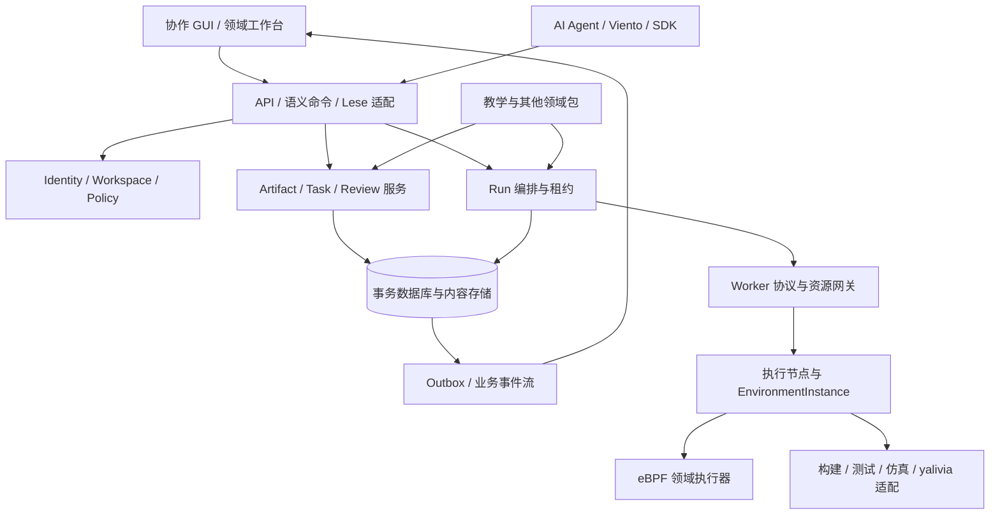

# Cyanrex 下一代架构书

状态：讨论与施工基线草案 v0.4 · 日期：2026-09-27

目标仓库：`Team-silvortex/cyanrex-lab` · 本轮不重置 Cyanrex 软件版本线。

产品定位：面向人类、AI Agent 与计算资源的工作协作软件，作为 Nuis OS 工作协作环境的前身。

## 0. 范围、依据与关键决定

本书基于 `Team-silvortex/cyanrex-lab` 的 `main` 快照：`f36f2bdcd4732f6eb78a1631520f9e8143f5cb4d`，提交日期 2026-09-25，版本 0.4.3。核查包括架构与状态文档、Rust 路由/服务/领域结构、SQL 迁移、Runner 与 Agent 协议、模块清单、SDK 稳定策略及前端依赖/功能边界。此次为静态核查，没有启动特权 Engine、访问已有数据库或重跑应用测试。

新定位来自本次用户明确要求：把 eBPF 教学系统的通用能力提升为 Identity、Workspace、Artifact、Task、Run、Review、Event、Capability、Agent 等协作模型。教学模式继续作为首个正式领域包，既有工作流不因重命名而消失。

本书中的目标模型、模块、API 路径、协议及阶段编号均为提案。Lese、yalivia、ns-nova 与其他 Nuis 工具链本轮未单独核查；集成点表达所需契约，不代表已有接口或实现。

建议确立六项决定：

1. **Workspace 成为协作与授权边界，身份不再绑定终身 teacher/student 角色。**
2. **Artifact、Task、Run、Review 分开建模。** 工作目标、内容版本、一次执行和一次判断不能合并成一个 attempt。
3. **AI Agent 与执行节点分开。** 现有 Runner Agent 是节点执行客户端，不自动等同于具有规划能力的 AI。
4. **通用控制面保持无特权，领域执行由独立执行环境承担。** 首期保留显式 legacy 本地模式，逐步完成实际进程分离。
5. **核心状态与业务事件可持久恢复。** 现有事件中心继续作为遥测能力，不能直接充当可靠工作流日志。
6. **先做模块化单体，再按运行与隔离需要拆进程。** 首期不引入分布式微服务或要求 Nuis OS 已完成。

### 0.1 Linux 施工起点与交付边界

本书是下一代施工草案，与描述当前实现的 [系统架构](architecture.md)、[项目状态](project-status.md) 和 [验收指南](acceptance.md) 并存。本次仅新增架构文档与入口，不变更现有程序、数据库、账号权限或运行部署。

后续施工记录：[ADR-001 / C0-C-M1](collaboration-foundation.md)已落下首批独立 Rust 类型与旧权限离线预览。
这不改变本书初次核查的固定版本证据；在线身份、存储与授权切换尚未实施，产品继续继承 `0.4.3` 版本序列。
[ADR-002 / C1-A](collaboration-identity-store.md)继续实现独立 PostgreSQL 身份注册表及生命周期退役测试，
仍未接入在线认证或自动迁移。
[ADR-003 / C1-B](collaboration-access-store.md)继续增加成员/显式部署策略持久化、修订保护和权限预览，
在线账号生命周期、授权切换和操作事务边界仍待完成。
上述准备层收录于源码版本 `0.4.4`，不改变本书冻结的 `0.4.3` 核查证据，也不自动迁移在线实例。
0.4.5 收录的 [ADR-004 / C1-C](collaboration-policy-audit.md)继续加入带操作者的策略命令、事务审计和
幂等回执；仍未接入在线身份权威或执行现用数据库升级。
0.4.5 收录的 [ADR-005 / C1-D](collaboration-identity-lifecycle.md)补齐带操作者的身份绑定/退役审计，
在身份 Schema 2 封锁旧写入口；现有账号代次来源和 Session 撤销的在线统一事务仍待接入。
0.4.6 收录的 [ADR-006 / C1-E](collaboration-auth-source.md)新增显式空源安装、稳定账号代次和严格
持久会话适配器；不迁移已有账号或切换在线 AuthService。
后续 [ADR-007 / C1-F](collaboration-session-commands.md)将当前会话与注册表绑定/策略命令放入
同一事务。0.4.7 收录的 [ADR-008 / C1-G](collaboration-account-deletion.md)增加受限删除/退役联动，
[ADR-009 / C1-H](collaboration-password-change.md)增加自助改密和全部会话撤销原子事务；
[ADR-010 / C1-I](collaboration-bootstrap.md)继续补齐全新空命名空间的首个账号、空间、管理权和审计
原子引导。[ADR-011 / C1-J](collaboration-provisioning.md)继续提供只读预检、目标确认、显式执行与
私有 TOTP 交付的本地 CLI。[ADR-012 / C1-K](collaboration-reconciliation.md)继续补全来源、
注册表与完整审计链的有界只读对账，不把快照当成恢复或重试许可。恢复与凭据审计、实际迁移和
在线切换仍待完成。

建议 Linux 侧按以下顺序启动：

1. 从 C0/C-M1 开始，核对实际分支与部署模式，冻结身份、权限、数据来源、SDK/API 和运行资源基线。已有工作区改动单独保留，不覆盖数据库或自动重建环境。
2. 先形成 Principal/Workspace、稳定 ID、权限映射和单一写入权威的 ADR；用现有教师、学生、管理员样例验证新语义，不先批量替换名称。
3. 备份并在独立测试库验证恢复后，再做 C-M2 的 attempt 离线迁移。使用覆盖失败、成功后再失败、多修订评语与重复源码的夹具；只发布脱敏对账证据，不将真实学生数据或凭据写入仓库。
4. 推进 C1/C2 与旧 API 的兼容读路径，权限负向测试必须覆盖同空间私有内容和跨空间隔离。上线切换写入须另行制定维护窗口、增量对账和回退方案，不能直接在现用库试迁移。
5. C-M4 先用无内核加载的只编译 Run 验证持久化、租约、取消和恢复，再扩展通用执行；不因新模型出现就把现有 Runner Agent 当成 AI Agent 或开放任意远程代码。
6. 每个阶段分别报告实际交付、数据/权限差异、测试证据和未通过项。真实内核与特权执行验收在专用环境进行，不拿教学或生产实例试清理、重置或故障注入。

施工范围以明确选定的阶段为限。本书不是删除旧表、扩大权限、停服、运行特权迁移或自动发布的授权。配套设计与构建边界见 [Viento Studio 下一代架构书](https://github.com/Team-silvortex/viento-studio/blob/main/docs/NEXT_ARCHITECTURE.zh-CN.md)。

## 1. 当前架构与能力核查

### 1.1 运行拓扑和模块边界

现有系统由 Next.js/React 前端、Rust/Axum Engine、PostgreSQL、本地 Linux 编译/内核工具、可选远程编译 Agent 组成。浏览器负责交互，Engine 同时承担认证、授权、持久化、业务和特权 eBPF 执行。源码层有控制/执行接口边界，但运行拓扑尚未完成无特权控制服务与特权执行服务分离。[C1][c-architecture] [C2][c-state]

| 模块 | 当前已核实能力 | 下一代归宿 |
|---|---|---|
| `frontend/` | 工作台、Monaco、学习/教学、事件、设置、结构化终端、四语界面 | 通用协作 Shell + eBPF/教学领域工作台 |
| `application.rs`、`routes/` | 按公共、认证、教师和 Agent 协议组织路由；Session/CSRF/角色守卫 | 传输适配与授权上下文，保留旧端点适配器 |
| `AuthService`、`ClassroomService` | 密码/TOTP、Cookie 会话、教师权威、邀请与接入发现 | Identity、Membership、Invite、Policy 服务 |
| `LearningStore`、`learning_catalog` | 五个内置实验、尝试、进度、自动反馈、教师评语、历史提交恢复 | 教学领域包 + Task/Run/Review 投影 |
| `ScriptStore` | 用户源码脚本与数据库/文件存储 | Artifact 与版本管理入口 |
| `EventBus` | 用户事件历史、实时队列、保留策略、未读/导出/删除、持久化 | 遥测/通知通道；可靠业务事件另建事务边界 |
| `RunnerManager`、`RunnerDriver` | 本地执行租约、配额、超时、诊断/补全、挂载查询与卸载接口 | 调度/租约服务 + eBPF 执行适配器 |
| Agent Registry/Queue/Client | 签名注册、心跳、领取、租约同步、取消、结果；探针和编译检查 | ComputeNode、WorkerSession、JobLease 与持久任务队列 |
| `ModuleManager`、`CommandDispatcher` | 声明目录发现、内存 start/stop、有限管理命令 | 扩展目录与通用语义动作注册表 |
| `sdk-js/`、OpenAPI | 类型化客户端、生成操作层、契约漂移与兼容性检查 | 继续作为正式兼容面；增量增加通用 API |

现有 CommandDispatcher 只有列出模块、启动/停止模块、进入实验四类命令；`RunExperiment` 返回 eBPF 工作区路径，不直接执行程序。模块 start/stop 只改变内存状态，清单发现不会运行模块代码。两者是通用化的基础，但目前不是通用自动化总线或可执行插件系统。[C3][c-command] [C4][c-modules]

### 1.2 当前数据模型及耦合点

| 当前实体 | 当前关键字段/事实 | 局限 |
|---|---|---|
| User/Session | `users.username` 主键；密码摘要、TOTP；Session 所属 username | 显示/登录名与持久所有者耦合，缺少通用 Principal ID |
| AuthRole | `Admin/Teacher/Student`；旧 admin 等价教师部署权威 | 角色由实例配置决定，缺少 Workspace 作用域 |
| LabDefinition | `id/position/title/summary/doc_slug/template_id`，实验规则在服务代码中 | 课程目录、任务模板与验收规则耦合 |
| LabAttempt | ID、username、lab/template、源码及摘要、执行成功/阶段、挂载证据、completed、自动反馈、评语 | 同时承载输入快照、运行结果与审阅 |
| TeacherFeedback | reviewer、comment、revision、updated_at | 已有乐观版本；当前保存的是最新评语，不等于完整修订历史 |
| UserScript | ID、username、title、script、创建/更新时间 | 可变内容记录，尚无独立不可变 ArtifactRevision |
| Event | username、时间、来源、类型、kernel/platform、严重性、颜色、payload | 公开事件无 event ID/游标；数据库虽有 BIGSERIAL，线上恢复契约未暴露它 |
| RunnerLease | runner_id、username、backend、开始/截止时间 | 是容量/执行租约，不能代表长寿命挂载归属 |
| RunnerAgent | agent_id、版本、隔离声明、能力、容量、健康、心跳 | 当前注册表在内存；能力自报不能替代实际隔离验证 |
| RunnerJob | job_id、kind、状态、目标/执行 agent、可选 owner、源码、结果、租约/期限 | 内存队列，重启不能可靠恢复正在执行的工作 |

这些模型可直接在领域结构和 SQL 迁移中交叉核对。现有数据库有用户、会话、事件、脚本、学习尝试及评语列；没有通用 Workspace/Task/Artifact/Review 表。[C5][c-learning-model] [C6][c-event-model] [C7][c-runner-job] [C8][c-migrations]

### 1.3 已有能力与禁止混淆的边界

- 本地 eBPF 工作台已有 Clang 检查/补全、bpftool 与部分 Aya tracepoint 路径、挂载管理和事件观察；源码断点是观测探针，不暂停内核程序。
- 本地 Runner 明确为 `shared_kernel`；配额、按用户命名空间和目录隔离不等于独立内核沙箱。
- 独立 Runner Agent 已支持 `control_probe` 和可选的只编译 `ebpf_compile_check`；不会远程加载 eBPF，不返回目标文件。`/ebpf/run` 仍在本机执行。
- RunnerDriver 已抽出执行、检查、补全、清单和 detach，但挂载验证、事件流、环境探测和编译设置仍有本机耦合，不能认为换一个 driver 就完成远程迁移。
- EventBus 有用户隔离、有界队列和历史恢复，但目前不是持久游标重放，也不是 exactly-once 协议。
- Engine 仍是单进程；挂载、模块、注册表、队列及部分降级状态不跨副本共享。已有数据库故障降级策略依服务/操作而异，不能一概当作可靠持久化。
- SDK/OpenAPI 是可用的内部契约；文档记录 63 个非 Agent 操作、77 项受保护命名路径。公共 Registry 发布、长期支持及制品验收不能由“源码版本为 0.4.3”推导。[C1][c-architecture] [C9][c-runner-agent] [C10][c-status]

## 2. 愿景、核心工作流与非目标

用户进入 Workspace，能够知道“谁在做什么、用哪份内容、在哪执行、产生了什么、谁确认过、下一步需要谁”。人类可以直接完成任务，也可授权 AI 分解工作、提出修改、调用计算资源和提交结果。

核心交互是：**建立协作空间 → 发布/引用内容 → 定义任务与验收 → 分配给人或 Agent → 在合适环境运行 → 留存证据 → 审阅 → 继续迭代。** Task 可以纯人工完成；Artifact 可以没有 Task；Run 可以有多个输入输出；这些关系不应被教学场景固定死。

Nuis OS 未来可把身份、资源与工具服务接入这些边界。现阶段 Cyanrex 作为可独立部署的软件交付，用普通浏览器和现有 Linux 计算节点即可工作。

非目标：

- 不在首期实现完整操作系统、通用云调度平台或企业聊天产品的全部功能。
- 不在通用内核写死 teacher/student、lab、eBPF、评分规则或课堂布局。
- 不因拥有 Agent 注册和能力字符串就承诺可以执行任意程序或提供多租户隔离。
- 不要求所有工作都通过 AI 完成，也不让 AI 对自己的输出默认拥有最终批准权。
- 不承诺任意分布式外部动作只执行一次、取消即回滚，或系统重启后自动恢复所有物理环境。

## 3. 核心抽象及关系

| 抽象 | 定义 | 关键边界 |
|---|---|---|
| Identity / Principal | 能被认证、授权和归责的主体；human、agent、service、machine | 稳定 ID 与登录名、显示名、认证提供方分离 |
| Workspace | 成员、策略、工作与内容的协作边界 | 同一主体可在不同空间具有不同授权 |
| Membership / Grant | 成员关系与具体动作/资源授权 | 全局部署权限独立于空间内工作角色 |
| Artifact / ArtifactRevision | 稳定内容身份和不可变版本；可为文档、源码、设计快照、数据、产物、报告 | 访问控制作用于逻辑内容；摘要不是访问凭据 |
| Task / TaskDefinition | 工作目标实例和可复用流程/验收定义 | 一个任务可有零到多个 Run，不等于一次运行 |
| Run | 固定输入、环境要求和执行契约的一次执行记录 | 重试产生新 Run，记录 `retryOf`，不改写历史 |
| Review | 某主体对确切版本/执行证据作出的判断 | 人工、规则和 AI 评估分开标识 |
| Event | 可关联到主体、空间、对象和原因的事实 | 业务事实、审计、遥测和通知具有不同保留策略 |
| CapabilityDefinition | 动作或技术能力的类型化定义 | 区分“允许做”与“能够做” |
| Agent | 以 Principal 身份工作、具有工具/委派策略的自动化参与者 | Agent 配置与一次工作会话分开，不固有管理员权限 |
| ComputeNode / WorkerSession | 提供算力/设备/工具链的节点与其当前连接 | Worker 运行任务；机器连通不证明环境可用或隔离达标 |
| EnvironmentInstance | 分配给工作负载的具体执行环境 | 所有者、生命周期、隔离和清理证据可追踪 |
| Lease / RuntimeResource | 短期执行权，以及运行后仍存活的资源 | Run 结束不代表挂载、容器、设备占用已经释放 |

特别区分两种 Capability：`Grant(action, scope, conditions)` 表示被允许的动作；`CapabilityOffer(name, version, limits, evidence)` 表示执行环境具备的技术能力。只有同时满足授权和技术条件才允许派发，不能根据节点声称 `ebpf.attach` 就给它或调用者授权。

## 4. 模块分层与部署边界



| 模块 | 拥有的数据与行为 | 明确不拥有 |
|---|---|---|
| Identity & Policy | Principal、认证关联、Membership、Grant、委派 | 源码执行、领域验收细节 |
| Artifact Service | 元数据、不可变版本、关系、可见性、内容保留 | Task 状态或执行调度 |
| Work Service | TaskDefinition、Task、依赖、分配、验收策略 | 节点内部运行生命周期 |
| Review Service | Review、版本条件、审阅者权限、判断来源 | 静默改写被审阅内容 |
| Execution Control | Run、资源选择、租约、取消、恢复与状态核对 | 直接在控制进程执行内核代码 |
| Worker Gateway | 节点身份、心跳、领取、结果、资源协议 | 根据 Agent 自报授予 Workspace 权限 |
| Domain Packages | 教学/eBPF/构建/研究等专属模型、视图、验证器 | 任意修改核心表、绕过核心授权 |
| Events & Projections | 业务事件投递、通知、读模型、搜索和遥测适配 | 用有损遥测推导已提交业务事实 |
| Integration Layer | Viento、Lese、yalivia、ns-nova、Nuis 适配 | 一套重复的身份/任务事实库 |

首期继续使用 Rust/Axum、Next.js 与 PostgreSQL，先在 `models/services/routes` 内抽出边界。可以保留一个通用服务进程；需要特权的执行器另起受管进程/环境。旧 Engine 一体模式必须标记为 legacy 可信本机模式，不能通过模块改名声称它已变成无特权控制面。

## 5. 关键数据模型与约束

### 5.1 最小核心表/记录

下表是目标 Schema 草案，不是对现有数据库的描述。

| 记录 | 关键字段 |
|---|---|
| `Principal` | `id, kind, displayName, status, createdAt` |
| `IdentityBinding` | `principalId, issuer, subject, legacyUsername?` |
| `Workspace` | `id, name, kind, policyVersion, revision, createdBy` |
| `Membership` | `workspaceId, principalId, roleRefs, status` |
| `CapabilityGrant` | `id, principalId, workspaceId?, actions, resourceScope, conditions, expiresAt?, delegatedBy?` |
| `Artifact` | `id, workspaceId, kind, title, ownerId, visibility, headRevisionId, revision` |
| `ArtifactRevision` | `id, artifactId, parentRefs, contentRef, digest, mediaType, schemaRef, createdBy, provenance` |
| `TaskDefinition` | `id, version, packageRef, inputSchema, outputSchema, workflow, acceptancePolicy` |
| `Task` | `id, workspaceId, definitionRef?, title, descriptionRef?, assigneeRefs, dependencies, inputRefs, status, revision` |
| `Run` | `id, workspaceId, taskId?, requestedBy, onBehalfOf?, agentSessionId?, inputRevisionRefs, executionSpec, environmentRef?, state, stateVersion, retryOf?, outputRevisionRefs` |
| `Review` | `id, workspaceId, targetRefs, reviewerId, reviewerKind, verdict, commentRef?, evidenceRefs, policyVersion, revision, supersedes?` |
| `AgentProfile` | `id, principalId, operatorId, adapterRef, toolPolicyRef, budgetPolicy, modelConfigRef?` |
| `AgentSession` | `id, agentId, workspaceId, taskId?, delegationRef, contextRefs, status, usage, startedAt, endedAt?` |
| `ComputeNode` | `id, machinePrincipalId, approvedOffers, labels, enrollmentPolicy` |
| `WorkerSession` | `id, nodeId, protocolVersion, credentialRef, epoch, health, reportedOffers, lastHeartbeat, expiresAt` |
| `EnvironmentInstance` | `id, nodeId, ownerRef, isolationKind, verifiedProperties, imageOrToolchainDigest, lifecycle, resetEvidenceRef?` |
| `RunLease` | `id, runId, workerSessionId, fencingToken, expiresAt, state` |
| `RuntimeResource` | `id, runId, environmentId, ownerId, kind, runtimeHandle, state, cleanupEvidenceRef?` |
| `EventEnvelope` | `eventId, schemaVersion, workspaceId, aggregateRef, aggregateRevision, actorId, type, occurredAt, recordedAt, correlationId, causationId, payloadRef?` |

时间字段只记录实际已知事实；导入旧记录时未知的开始时间、结束时间、执行节点或工具链版本保持 unknown，并记录来源，不能补造运行历史。

### 5.2 数据不变量

- 持久所有权使用 Principal ID；`username` 作为兼容身份映射继续保留。会话认证方案可先不变，不为引入 ID 强迫所有用户更换密码或 TOTP。
- 核心资源必须有 Workspace 或明确的实例级作用域。跨空间引用需要专门 Grant，不因为知道 UUID 就能访问。
- ArtifactRevision 发布后不可原地修改；编辑形成新版本。内容 blob 可按摘要去重，但权限不能跟着全局 blob 共享。
- Run 固定输入 revision、执行器版本与环境需求；结果输出也注册为 ArtifactRevision。自动检查成功与人工业务批准分别记录。
- Review 绑定具体版本。输入变化后可保留旧 Review，但不能把它展示为对新版本的批准。
- Task 状态、Run 状态、Review 判断各自独立。一个 Run 失败可以重试；Task 是否完成由其验收策略决定。
- Run 状态转换以 `stateVersion` 与有效 lease epoch 比较更新；租约失效的旧 Worker 不能提交有效结果。

### 5.3 持久化与恢复

核心事实采用关系模型与事务，扩展字段使用有命名空间、有 Schema 的 JSON，不把整个系统做成无类型 JSON 容器。Artifact 元数据进数据库，内容放版本化文件/对象存储；先上传并校验内容，再在事务中发布引用，未发布内容按独立策略清理。

Task/Run/Review 变更与 outbox 在同一数据库事务提交。Dispatcher 把已提交 outbox 发布到持久事件流；消费者按 eventId 去重。首期不要求完整事件溯源，也不要求从遥测反演业务表。

新通用核心在持久库不可用时应拒绝需要可靠承诺的写入，并显示未确认/不可用状态；不能返回成功后退回易失队列。旧模式的文件/内存降级可继续运行在显式 legacy 配置内，但跨过迁移边界前必须先导出、对账，不允许两套后端同时各自成为权威来源。

Agent 密钥、认证材料与秘密配置放在独立 Secret Provider/宿主安全存储，业务记录只有引用；历史 Session 摘要与账户数据沿用既有认证边界。核心空间模型落地前，不进行无关认证系统重写。

## 6. 运行、协作与交互流程

### 6.1 一条通用协作链路

以“修改一个 Viento 世界并比较两套求解参数”为例：

1. 人类发布 World 快照为 ArtifactRevision，创建 Task，声明验收指标与可使用的计算环境。
2. 将任务分配给人类或 AI Agent；AgentSession 取得限于该空间、输入和动作集合的委派。
3. Agent 提交修改提案或新 ArtifactRevision，创建两个固定输入的 Run，选择合格 Provider。
4. Scheduler 校验权限、预算、能力、容量与隔离要求；Worker 领取租约，在 EnvironmentInstance 执行。
5. 输出数据、日志摘要和报告注册为 ArtifactRevision；Run 完成，留下环境、工具链与输入来源。
6. 规则检查生成自动 Review；人类按策略审阅差异与证据，批准准确版本。
7. Task 更新为 accepted，或生成下一轮工作。Viento 根据已批准 ChangeSet 自行提交设计修改。

没有执行步骤的人工写作或设计评审，可以直接走 Artifact → Review → Task；框架不能要求用户创建一条假的 Run 才能完成工作。

### 6.2 Task 与 Run 状态机

Task 的基础状态建议为 `draft/ready/in_progress/blocked/in_review/accepted/cancelled`，领域包可以定义显示名和受控工作流扩展。完成策略版本写入 Task，不因模板升级而静默改变旧任务的验收标准。

```text
Run: requested → queued → leased → running → succeeded | failed
                        ↘ cancel_requested → cancelled
     queued → cancelled | expired
     leased/running → reconciling → 已核实终态 | unknown
```

取消是请求，只有执行环境确认停止或核对到结束，才能报告 cancelled。网络失联、租约过期和浏览器退出不证明程序停止；可能仍有外部效果时进入 reconciling/unknown。重试必须产生新 Run，带 `retryOf` 与幂等业务键；不可重试动作需要人工或策略确认其旧执行结果。

租约与 fencing token 用来拒绝旧 Worker 的迟到更新，不提供物理执行 exactly-once。执行器若支持幂等外部写入，应把同一 effect key 传到真正产生副作用的系统；不支持时必须如实记录不确定结果。

### 6.3 执行资源与长寿命状态

通用调度不只依据“在线/有空位”，还要匹配已批准的技术能力、输入格式、工具链、隔离等级、Workspace 可见性和预算。节点自报的标签用于发现，环境准入所需的属性必须经相应部署或验证流程确认。

短期 RunLease 和长期 RuntimeResource 分开。例如 eBPF 加载成功后，程序/link/pin 可能继续存活；完成 Run 或释放并发名额不能丢掉它们的所有者与 detach 路径。EnvironmentInstance 从 `allocated → preparing → ready → in_use → draining → resetting → ready/destroyed` 转换；清理未确认时进入 quarantine，不自动转交下一位使用者。

现有 RunnerDriver 需要继续补齐 `inspectEnvironment/prepareInputs/execute/observe/listResources/cleanup/resetEvidence` 等生命周期能力，才能支撑通用远程执行。这些是目标协议职责，不是要求在同一个 trait 一次性增加所有方法。当前所选头文件的宿主路径需要变成可校验输入包，不能直接传给远端使用。[C11][c-runner-driver]

### 6.4 Review 与反馈

Review 来源分为 human、rule、agent。自动验证器记录规则版本、输入摘要与证据；AI 意见记录 AgentSession 和内容来源。领域策略决定哪些来源可以满足验收，AI 默认不能凭自评完成需要人工批准的任务。

评语编辑采用新修订，保留 `supersedes` 和审阅时目标。修改评语前检查 expected revision，继续继承现有教师反馈的冲突保护。高层 GUI 可以显示“当前评语”，底层保留变化历史；导入旧系统只有最后一版时，标注历史不可得。

### 6.5 Event、遥测与重连

| 通道 | 例子 | 持久性与恢复 |
|---|---|---|
| Domain Event | TaskAssigned、RunCompleted、ReviewSubmitted | 随业务事务 outbox，持久投递与游标重放 |
| Audit Event | 权限授予、委派、资源批准 | 追加记录，删除/脱敏由明确管理策略控制 |
| Telemetry | 内核事件、stdout、采样指标 | 有界缓存/批量存储，允许采样和丢弃并报告缺口 |
| Notification | 未读、待审阅、提及 | 从业务事件生成，可重建，可按用户读取 |

事件传输使用 `eventId` 去重和单独的 `streamOffset` 恢复。偏移在已提交事件进入持久流时按流顺序分配，不直接拿可能先分配后提交的数据库主键当作无缺口提交游标。只保证声明的流内或聚合内顺序，不承诺所有 Workspace 全局有序。

客户端先获得带 watermark 的快照，再订阅 watermark 之后的流；游标过期返回 `cursor_expired` 并要求重新取快照。消费者必须容忍重复投递。旧 `/ws/events` 保持兼容，新增业务流独立版本化；用户清空遥测历史不能删除任务状态依据或审阅审计。

### 6.6 语义 GUI 与操作确认

协作界面以 Workspace 概览、Artifacts、Tasks、Runs、Reviews、Agents & Resources、Events 为核心；教学包把它们组织为学习/教师视图。终端页可以继续作为结构化命令界面，不必转换成系统 Shell。

每个动作暴露 `actionId/targetRef/inputSchema/preconditions/effects/requiredGrant/operationId`。人类按钮、键盘、SDK 和 AI 经过同一应用服务。提交后 UI 区分“请求已接收”“状态已确认”“结果不确定”；导航只取消等待，不伪装为撤销服务端操作，继承现有前端的有效保护。

## 7. 插件、模板与扩展机制

### 7.1 领域包

把 eBPF Teaching Pack 定义为首个领域包，组合：课程/实验 TaskDefinition、模板源码 Artifact、验收规则、eBPF 执行器需求、教师/学生角色预设、编辑器和评审视图。通用内核只看到 Task、Artifact、Run、Review 与能力条件。

| 扩展点 | 声明内容 | 约束 |
|---|---|---|
| Artifact Kind | Schema、预览器、差异查看器、索引字段 | 未识别类型保留可下载内容，不能损坏对象 |
| Task Template | 输入输出、步骤、验收、角色需求 | 实例锁定定义版本 |
| Review Provider | 规则、工具或人工表单 | 结果标记来源，不自行扩大批准权 |
| Execution Provider | 作业类型、输入输出、资源要求、取消与清理语义 | 在明确执行边界运行，不在 HTTP handler 随意起进程 |
| UI/Action Extension | 工作台视图、语义动作及上下文 | 通过公共应用服务访问数据 |
| Integration Connector | 外部身份、内容、计算服务或 Nuis 服务 | 凭据隔离、协议版本与失败状态明确 |

### 7.2 从现有模块目录演进

保留 module manifest v1 作为声明目录兼容层。新增 v2 时才声明 `extensionPoints/requiredGrants/executionBoundary/compatibility/migrations`；不能把旧 `capabilities` 列表直接解释成可执行权限或动态库入口。Package version、协议 version 与 Artifact/Task schema version 分开治理。

第一阶段领域包可以是内置模块加声明文件，无需马上实现第三方动态加载。外部代码扩展后续优先用独立进程或受限执行环境，通过版本化协议交互。插件自己的持久数据放命名空间表或扩展记录，经核心授权访问；插件升级由显式迁移处理。

模板修改只影响新实例，已有 Task 通过显式升级选择采用新规则。未知扩展保持原始数据与兼容读视图；迁移工具不得因为卸载插件删除历史 Run 和 Artifact。

### 7.3 SDK/API 兼容

保留现有 namespace、operationId 和成功/错误形态，旧 `learning/*`、`scripts/*`、`ebpf/*`、`runner/*` 由兼容层映射。新增通用端点可采用 `/api/v2/workspaces`、`artifacts`、`tasks`、`runs`、`reviews`、`agents`，具体路径由 API ADR 确认。

复用 OpenAPI → TypeScript 模型/操作 → 契约检查的流程。破坏性变化必须独立版本与明确迁移说明，不能以“目前还没到 1.0”为理由绕过已有兼容基线。

初次核查的 SDK 稳定政策中，“保留完整后续 minor”文字与“0.4.x 弃用、0.5.0 可删除”示例存在解释空间。[C12][c-sdk-stability]
[ADR-001](collaboration-foundation.md)施工已统一为更保守窗口：`0.4.x` 弃用后保留整个 `0.5.x`，最早在明确审查的 `0.6.0` 删除；不在普通质量检查中重写基线。

## 8. AI、Lese、yalivia、ns-nova 与 Nuis 集成

| 集成对象 | Cyanrex 的职责 | 外部能力的接入方式 |
|---|---|---|
| AI Agent | Agent 身份、委派、Task、上下文引用、工具授权、预算、Run 与审阅来源 | Agent Adapter 接模型/规划器；模型选择与厂商不写死到核心 |
| Lese | 暴露协作对象、合法动作、字段语义、前置条件、影响与操作结果 | Semantic Adapter 映射公共应用命令，不绕过授权层 |
| yalivia | 把长寿命运行会话视为 RuntimeResource，追踪拥有者、版本、状态、操作记录 | Runtime Provider 负责真实会话与热替换；Cyanrex 负责任务和归责 |
| ns-nova | 提供协作关系、时间线、状态与语义动作 | 可视化/空间协作前端共享相同身份和操作协议 |
| Viento Studio | 接收 World 快照/ChangeSet、安排构建与验证、保存结果和 Review | Artifact/Execution/Review 契约；模型编辑仍由 Viento 内核裁决 |
| Nuis OS / 工具链 | 管理工作空间、工作事实与跨参与者协调 | 对接身份、环境、包、编译、设备、计算等服务；当前可用普通 Provider 替代 |

AI Agent 是受委派的参与者，不作为秘密的全局管理员。记录 `requestedBy/onBehalfOf/agentSessionId/executedBy`，区分提议者、授权者和实际执行节点。工具返回的内容与仓库文档是输入数据，不能自行修改委派范围；外部文字提出的动作仍需经过正式命令与权限校验。

预算可限制 token/费用/运行时间/并发/资源配额，超出后进入等待或失败状态，由策略决定。跨任务复用 Agent 时重新解析委派，不能继承上一位用户的 Workspace 上下文和凭据。单次委派撤销后，立即阻止新动作，已派发的外部动作进入取消/核对流程。

### 8.1 与 Viento 的边界契约

截至本书日期，Viento 已完成到 `Team-silvortex/viento-studio` 的仓库所有权转移与更名，同一仓库的身份和提交历史保留；新产品版本线从 `0.0.1` 开始，版本对接仍待独立提交及发布验收，官方实例数据另行完整核验。不是新建仓库复制代码，也不因此重置 Cyanrex 的版本线。本次 Cyanrex 变更仅包含本架构书及文档入口，不修改应用实现或持久数据。

双方共享 `PrincipalRef/WorkspaceRef/ArtifactRef/ActionDescriptor/ExecutionRequest/ExecutionReceipt/EventEnvelope` 的版本化 Schema，而不共享数据库或同时拥有同一任务状态。

Viento 负责 World 语义、设计 revision 和 Build lowering；Cyanrex 负责协作授权、Task/Run、执行节点和 Review。一个 BuildRecord 可引用多条 Run；每条执行请求只交给一个调度所有者。Cyanrex 回传输出与诊断，Viento 决定如何映射到设计对象。

Workspaces 通过显式绑定关联，不假设 Viento 项目 UUID 就是 Cyanrex 空间 UUID。Artifact 发布锁定 revision/digest，Review 指向准确版本，回写采用 ChangeSet。引用要包含 authority/instance，避免多实例局部 ID 冲突；协议需声明幂等键、关联 ID、支持的能力和未知字段策略。

## 9. 从教学系统迁移的兼容策略

### 9.1 旧概念映射表

| 旧概念 | 新概念 | 保留规则与注意点 |
|---|---|---|
| user / username | Human Principal + IdentityBinding | 分配稳定 ID；旧 username 映射保持可查询，现有登录继续有效 |
| teacher / legacy admin | 教学 Workspace 的角色预设 + 显式部署管理 Grant | 保留现有实例内权威，不扩大到新空间/新节点；通用角色不自动带实例部署权 |
| student | Workspace contributor/learner 角色预设 | 仍只能访问自己提交和被分享内容；不能因同属空间暴露同学脚本 |
| 单课堂实例 | 一个 legacy teaching Workspace | 旧路由缺少 workspaceId 时解析到固定映射，拒绝用户伪造其他作用域 |
| Classroom invite | Workspace Invite | 保留绑定用户名、有效期、单次使用、认证独立的语义 |
| lab | 版本化 TaskDefinition + 课程 Artifact | 原 lab ID 保存为 externalRef，模板与验收版本显式记录 |
| student × lab 的进度 | 每参与者一个 Task 实例 | 多次 attempt 归于同一 Task，不为每次尝试重复创建工作目标 |
| attempt.source/source_sha256 | 输入 ArtifactRevision | 内容和摘要逐字节核对，不覆盖同一逻辑脚本的其他版本 |
| attempt 执行字段 | Run + 领域结果/evidence | 原 attempt ID 映射到 Run；保留 stage、挂载、run_success，不捏造缺失环境/时间 |
| attempt.completed/feedback | 自动 Review + 教学进度投影 | 保留“曾通过即完成、首次通过时间”的旧聚合语义 |
| teacher_feedback | Human Review 的导入版本 | 保留 reviewer/comment/revision/time；不伪造已经丢失的历史评语 |
| UserScript | 私有 Artifact，当前内容为首个已知版本 | 不宣称恢复了不存在的旧版本；所有者与共享规则不改变 |
| RunnerManager/RunnerLease | Run admission、JobLease 与 Local Provider | 现有容量与超时语义保留，长期挂载另建 RuntimeResource |
| Runner Agent | ComputeNode + Machine Principal + WorkerSession | 沿用旧 agent_id 作为外部 ID；不转换成 AI AgentProfile |
| RunnerJob | 技术 Run/Job | 管理探针可无 Task；无 owner 的旧管理作业保留来源，不假定某位用户发起 |
| kernel/platform event | Legacy Telemetry Event | 原 payload 与作用域保留；不能自动升级为可信审计事实 |
| modules / command | 声明包目录 / 兼容语义动作 | 旧 start/stop 与 RunExperiment 行为保持，不突然执行代码 |

旧进度聚合会保留所有尝试中最早一次完成时间；随后失败不会抹掉已完成状态。通用 Task 模型可支持不同策略，但教学兼容投影必须保持这一行为。[C13][c-learning-queries]

### 9.2 权限迁移必须单独验证

先导出“主体 × 资源类别 × 动作”的旧权限矩阵，再逐项核对新 Grant。教师能查看学生尝试不意味着能查看所有私人 Artifact；同一 Workspace 成员也不能默认互读全部内容。维护学习历史恢复接口的原所有者限制，以及教师审阅接口的单独授权。

旧 teacher/admin 已拥有本实例部署权，因此兼容迁移应生成限于该原实例的部署 Grant，并在迁移报告列出。后续新增 Workspace 的 owner/teacher 不能自动获得这一授权。公开注册仍不能自行选择高权限角色。

### 9.3 迁移施工顺序

1. **盘点与快照：** 冻结版本和权限矩阵，确认每类数据实际位于 PostgreSQL、文件还是易失内存；记录缺失/不一致，不自动选择“较新那份”。
2. **扩展 Schema：** 新建 Principal/Workspace/Artifact 等表及 `legacy_id_map`，旧表不删。身份映射有唯一约束，并保存来源实例。
3. **离线回填：** 在临时库/迁移副本回填，按记录数、所有者、源码摘要、评语修订、进度结果对账。重复运行不重复分配身份。
4. **影子读取：** 生产读路径暂不变，用脱敏差异报告比较旧 API 与新兼容投影；不在此时双启动任务。
5. **切换写入权威：** 第一版优先使用短维护窗口暂停旧写入，补最终增量并核验；切到“所有新旧 API → 新核心 → 兼容投影”的单一写入路径。确需在线迁移时再设计事务 outbox/增量捕获，不使用尽力双写。
6. **运行态交接：** 切换前 drain 队列、核对进行中 Run 和现存挂载；不能复制 lease token 就让新旧 Engine 同时指挥同一工作。保留环境映射与核对记录。
7. **逐步替换界面：** 新增通用导航；学习、教师、eBPF 与旧 SDK 继续工作。使用真实非教学工作流验证新内核。
8. **退役旧存储：** 完成兼容窗口与回退演练后，再停止旧表写入/保留历史导出；删除另行决策。

### 9.4 回退与历史事件

新核心尚未接收写入前可直接切回旧服务。接收新写入后，回退必须先停止派发、核对运行态并回放可逆数据转换；旧模型无法表达的 Agent、复杂任务和多版本 Review 保留在新库/导出中，不能声称全量无损降级。

旧事件导入使用 `sourceInstance + databaseRowId`，或 `snapshotDigest + originalRecordIndex` 形成稳定导入身份。不要只按内容哈希去重，因为两条内容相同的内核事件可能都是真实发生。历史缺少 causation/actor 证据时保留 unknown 和 `legacy_import` 标记；迁移事件本身记录迁移者，不能把迁移者当作原事件操作者。

## 10. 分阶段施工路线与首批里程碑

阶段按可验证依赖推进，不给未知人力与部署条件强加日历日期。C0–C3 可不依赖 Viento 或 Nuis OS；C4 开始建立跨产品真实协作闭环。

| 阶段 | 交付内容 | 完成标准 |
|---|---|---|
| C0：冻结基线 | 数据/权限/API 盘点、迁移夹具、核心术语 ADR | 明确旧角色权威、所有者查询、降级来源、运行资源与兼容窗口 |
| C1：Identity/Workspace | Principal ID、Membership、Policy、legacy workspace adapter | 旧登录/教师/学生流程可用；跨空间负向测试通过；旧权限没有扩大 |
| C2：Artifact/Task/Review | 内容版本、任务定义与实例、Review；教学兼容映射 | 旧 attempt 可完整恢复为输入、Run 记录和 Review；进度与评语结果一致 |
| C3：可靠执行与事件 | 持久 Run/Job/Lease、事务 outbox、重连游标、恢复核对 | 控制进程重启后不丢工作事实；重复提交不重复创建 Run；旧 lease 结果被拒绝 |
| C4：首个通用协作版本 | 非教学工作流、AgentProfile/Session、Viento 适配 | 人类建任务、Agent 提案、Worker 执行、人类审阅形成一条证据完整链路 |
| C5：完整执行边界 | 无特权控制面、通用 Worker、EnvironmentInstance、资源清理 | eBPF 完整生命周期在正确执行环境完成；清理失败禁止复用；远程不可用不回落特权本机 |
| C6：Nuis 生态接入 | Lese 正式语义接口、yalivia 会话、ns-nova 视图、Nuis 身份/工具链 | 更换前端或执行器不改变工作事实与权限，跨端恢复和审阅仍有效 |

**建议第一批施工单：**

| 编号 | 工作项 | 可审查验收物 |
|---|---|---|
| C-M1 | 定义核心 ID、ArtifactRef、EventEnvelope 与 Principal/Workspace 模型 | 一份 Schema/权限 ADR；用现有教师、学生、管理员样例验证映射 |
| C-M2 | 完成一次离线 attempt 迁移 | 包含失败、通过后再失败、有评语、多修订、同源码重复提交；ID/摘要/进度/所有权对账无差异 |
| C-M3 | 让旧 learning API 读新模型的兼容投影 | 旧 SDK 和前端不改调用仍能列表、审阅、反馈、恢复；他人恢复查询仍拒绝 |
| C-M4 | 持久化第一类通用 Run：只编译检查 | 提交、领取、结果及取消均可恢复；重启/迟到/重复/取消不确定用例有明确结果 |
| C-M5 | 实现一个非教学“修改文档并审阅”工作流 | 两个人类或人类+Agent 对指定版本协作，无 lab_id、teacher/student 硬依赖 |
| C-M6 | 联通一份 Viento 构建快照 | Artifact → Task → Run → 输出 → Review → Viento 对象定位，所有步骤可追溯 |

C-M5 是通用化验收：若删除教学词汇后仍无法表达任务、内容和审阅，就说明只是更换标签，领域依赖尚未移出核心。C-M4 在开放任意远程执行之前完成，先用现有只编译能力验证可靠性。

验证继续复用 Rust 路由/权限回归、真实 PostgreSQL 集成、Runner 协议测试、OpenAPI/SDK 兼容检查和前端异步状态回归。新增测试针对真实跨层风险：迁移幂等、隐私不扩大、事务中断、租约代次、事件重放缺口、长期资源残留。真实内核、局域网和离线发行包验收仍分别执行，不能用 mock 或单元测试替代。

## 11. 风险、取舍与启动决策

| 风险 | 具体影响 | 处理与推进门槛 |
|---|---|---|
| 仅把 teacher/student 改名 | 通用任务仍依赖 lab 和 username | 用非教学工作流和多 Workspace 权限验收 |
| 工作空间迁移扩大可见性 | 学生互读源码、教师看到额外私人内容 | 冻结旧权限矩阵，逐项生成 Grant，执行负向访问用例 |
| 将节点 Agent 当 AI | 权限、归责、容量与规划会话混乱 | Principal/AgentProfile/WorkerSession/Environment 分开 |
| 依赖易失队列 | 重启后丢失运行状态、重复执行 | 核心持久状态、outbox、幂等键、租约代次与核对流程 |
| 把 EventBus 当可靠日志 | 遥测丢弃或用户删除破坏任务事实 | 分业务事件与遥测；独立保留和恢复策略 |
| 只抽 Runner execute | 远端执行后仍在本地查挂载或清理 | 完整生命周期契约与真实目标验证后才开放远程 eBPF |
| 过早开放任意代码 | 通用协作服务继承共享内核风险 | 控制面无特权；明确环境隔离与恢复能力；首期仅可信自部署 |
| 双写或双调度 | 数据分叉、重复副作用、权限绕过 | 单一写入权威，一个 Run 一个调度所有者 |
| 核心过于抽象 | 每个页面都需复杂配置，旧教学体验倒退 | 内置教学包保留默认工作流；第二领域验证后再扩展抽象 |
| AI 自我扩大授权或自我批准 | 无法可信归责或验收 | 委派交集、来源记录、预算及审阅策略在核心执行 |
| SDK 契约被迁移破坏 | 旧客户端不能使用或悄悄改变权限 | 双版本/兼容层、固定基线、明确弃用窗口 |

首轮必须定案的 ADR：Principal 与 username 映射；Workspace 可见性及实例部署权；Task/Run/Review 状态机；ArtifactRevision 存储与保留；新核心故障策略；事件流提交顺序；Worker 凭据/租约恢复；旧数据写入切换和回退边界。

推荐启动切口是“**稳定身份与工作空间 → 迁移一组真实 attempt → 通用 Artifact/Task/Review → 持久只编译 Run**”。它覆盖最关键的数据与生命周期变化，同时保留现有教学产品作为持续可用的兼容面。

## 12. 固定版本证据索引

本节的实现证据链接固定到此次核查提交；当前指南及配套架构书的导航链接随主线更新，不用作已实现能力的证据。文档中引用的既有测试和验收属于仓库记录，本次没有重新执行，也没有变更运行中的部署。

- [C1：运行拓扑、权限、事件、Runner 和当前限制][c-architecture]
- [C2：AppState 与实际服务组合][c-state]；[路由和权限层][c-application]
- [C3：命令分发实际实现][c-command]
- [C4：模块清单与非执行边界][c-modules]
- [C5：Lab/Attempt/TeacherFeedback 数据模型][c-learning-model]
- [C6：公开 Event 结构][c-event-model]
- [C7：RunnerJob 结构][c-runner-job]；[内存队列实现][c-job-queue]
- [C8：当前 SQL 迁移目录][c-migrations]
- [C9：Runner Agent 当前支持范围与协议][c-runner-agent]
- [C10：0.4.3 能力与验收状态][c-status]
- [C11：RunnerDriver 与 LocalProcessRunnerDriver][c-runner-driver]
- [C12：SDK 稳定性政策][c-sdk-stability]
- [C13：学习进度实际聚合语义][c-learning-queries]
- [现有认证角色数据模型][c-auth-model]；[用户脚本模型][c-script-model]；[内存 Agent 注册表][c-agent-registry]

[c-architecture]: https://github.com/Team-silvortex/cyanrex-lab/blob/f36f2bdcd4732f6eb78a1631520f9e8143f5cb4d/docs/zh-CN/architecture.md
[c-state]: https://github.com/Team-silvortex/cyanrex-lab/blob/f36f2bdcd4732f6eb78a1631520f9e8143f5cb4d/engine/src/state.rs
[c-application]: https://github.com/Team-silvortex/cyanrex-lab/blob/f36f2bdcd4732f6eb78a1631520f9e8143f5cb4d/engine/src/application.rs
[c-command]: https://github.com/Team-silvortex/cyanrex-lab/blob/f36f2bdcd4732f6eb78a1631520f9e8143f5cb4d/engine/src/services/command_dispatcher.rs
[c-modules]: https://github.com/Team-silvortex/cyanrex-lab/blob/f36f2bdcd4732f6eb78a1631520f9e8143f5cb4d/modules/module-protocol/README.md
[c-learning-model]: https://github.com/Team-silvortex/cyanrex-lab/blob/f36f2bdcd4732f6eb78a1631520f9e8143f5cb4d/engine/src/models/learning.rs
[c-event-model]: https://github.com/Team-silvortex/cyanrex-lab/blob/f36f2bdcd4732f6eb78a1631520f9e8143f5cb4d/engine/src/models/event.rs
[c-runner-job]: https://github.com/Team-silvortex/cyanrex-lab/blob/f36f2bdcd4732f6eb78a1631520f9e8143f5cb4d/engine/src/models/runner_job.rs
[c-job-queue]: https://github.com/Team-silvortex/cyanrex-lab/blob/f36f2bdcd4732f6eb78a1631520f9e8143f5cb4d/engine/src/services/runner_job_queue.rs
[c-migrations]: https://github.com/Team-silvortex/cyanrex-lab/tree/f36f2bdcd4732f6eb78a1631520f9e8143f5cb4d/engine/migrations
[c-runner-agent]: https://github.com/Team-silvortex/cyanrex-lab/blob/f36f2bdcd4732f6eb78a1631520f9e8143f5cb4d/docs/zh-CN/runner-agent.md
[c-status]: https://github.com/Team-silvortex/cyanrex-lab/blob/f36f2bdcd4732f6eb78a1631520f9e8143f5cb4d/docs/zh-CN/project-status.md
[c-runner-driver]: https://github.com/Team-silvortex/cyanrex-lab/blob/f36f2bdcd4732f6eb78a1631520f9e8143f5cb4d/engine/src/services/runner_driver.rs
[c-sdk-stability]: https://github.com/Team-silvortex/cyanrex-lab/blob/f36f2bdcd4732f6eb78a1631520f9e8143f5cb4d/sdk-js/STABILITY.md
[c-learning-queries]: https://github.com/Team-silvortex/cyanrex-lab/blob/f36f2bdcd4732f6eb78a1631520f9e8143f5cb4d/engine/src/services/learning_store/queries.rs
[c-auth-model]: https://github.com/Team-silvortex/cyanrex-lab/blob/f36f2bdcd4732f6eb78a1631520f9e8143f5cb4d/engine/src/models/auth.rs
[c-script-model]: https://github.com/Team-silvortex/cyanrex-lab/blob/f36f2bdcd4732f6eb78a1631520f9e8143f5cb4d/engine/src/models/script.rs
[c-agent-registry]: https://github.com/Team-silvortex/cyanrex-lab/blob/f36f2bdcd4732f6eb78a1631520f9e8143f5cb4d/engine/src/services/runner_agent_registry.rs
